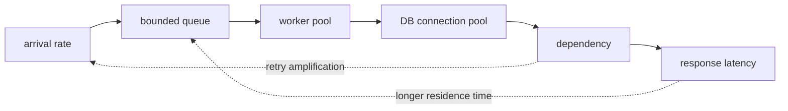

# Concurrency, Queue, Runtime and Capacity

<!-- source: https://sre.google/sre-book/addressing-cascading-failures/ | checked: 2026-09-03 -->
<!-- source: https://docs.oracle.com/en/java/javase/17/gctuning/ | checked: 2026-09-03 -->

When requests are slow, increasing the number of workers may increase throughput, but DB connection, heap, and downstream may be exhausted first. Capacity planning is not about CPU ratio alone, but about viewing arrival rate, request retention time, concurrent tasks, queue and dependency upper limit as one flow.

## Terms introduced in this chapter

| word | Meaning in this chapter | Why it matters / when to use it |
|---|---|---|
| concurrency | Number of tasks started at the same time and not yet finished | Set limits on in-flight work so resource usage and queue growth remain controllable. |
| throughput | Number of tasks successfully completed per unit of time | Measure completed useful work when comparing capacity or performance changes. |
| queue | A collection of tasks waiting to be executed | Buffer temporary differences between arrival and processing rates, with a bounded backlog policy. |
| backpressure | Control that slows or rejects upstream input when downstream is saturated | Keep overload from growing without bound by slowing or rejecting input at a defined boundary. |
| saturation | A state in which useful throughput does not increase even when a resource receives more work. | Identify when adding work no longer improves throughput and starts increasing delay or failure. |
| GC pause | The amount of time application progress is affected while the runtime searches for memory to reclaim. | Explain latency spikes that average CPU or throughput measurements can hide. |

1. Measure arrival, latency, and in-flight together under normal load.
2. Decide where to accept and where to reject overload.

## Understand the model first

At steady state, the average number of concurrent operations can be roughly thought of as the product of the arrival rate and average dwell time. If 100 cases come in per second and each case stays for an average of 0.2 seconds, then an average of 20 cases are in progress. However, capacity is not determined solely by average. As tail latency, burst, retries and slow dependencies increase dwell time, in-flight increases rapidly.



## Put four upper limits in one vote

| boundary | value to limit | saturation signal | protective action |
|---|---|---|---|
| ingress | Request rate/concurrency by tenant | reject ratio, queue age | rate limit·load shed |
| worker | active task·queue length | runnable, event-loop lag | bounded queue·deadline |
| DB | connection·transaction time | pool wait, lock wait | query budget·pool cap |
| dependency | in-flight·retry | timeout, slow-call ratio | circuit breaker·fallback |

If there are 200 workers and 20 DB connections, the rest do not work but wait. Even if the DB pool is increased to 200, if the DB CPU·lock·I/O cannot handle it, the total residence time will only increase. `max concurrency` should be associated with the smallest safe upper limit of each layer.

```yaml
capacity_contract:
  request_deadline_ms: 800
  max_in_flight: 80
  queue_capacity: 40
  queue_max_age_ms: 120
  db_pool_max: 24
  dependency_attempts: 2
  overload_response: 503
```

These values ​​are examples and not recommended defaults. Measure the saturation point with actual workload, and set the overall deadline and retry attempt in [traffic failure budget ](#doc=traffic-resilience-request-budget).

## A queue is a time budget, not memory.

Unlimited queues appear to absorb instantaneous bursts, but they also store requests that have already passed their deadline. Look at the queue length as well as the age of the task that has been waiting the longest. Requests that cannot be completed with the remaining budget can be rejected before consuming workers and dependencies to maintain the overall success rate.

Google SRE's explanation of cascading failure considers overload as a common cause and suggests load testing, fast rejection, load shedding, and graceful degradation as defenses. The important thing is to find the actual failure mode through load testing, not just the CPU threshold. If you do not run the degraded path regularly, it may break for the first time when a failure occurs.

## Connect runtime signals to business signals

Java HotSpot provides several garbage collectors to suit your needs, and throughput and latency goals may vary. Before changing the GC name, look at allocation rate, live set, heap occupancy, pause, CPU, and request latency on the same time axis.

| observation | possible interpretation | Counterexample to check |
|---|---|---|
| Heap usage repeats like a sawtooth | Could be normal recovery cycle | Do pause and latency increase together? |
| allocation rate surges | Payload·buffer·logging changes | Is this explained only by increased traffic? |
| Old objects keep growing | cache·listener·queue retention | Does the workload remain even after termination? |
| CPU 100%, throughput stagnant | GC·serialization·busy loop | What are the actual hot paths in the profile? |
| Increased event-loop lag | blocking call or long callback | Is it the same section in thread dump/span? |

GC pause and thread numbers are candidates, not causes. [Observability and SRE](#doc=observability-sre-signals) connect user SLI, trace and resource saturation, and [AIOps diagnostics](#doc=aiops-diagnosis-pipeline) should use this time correlation only as an evidence candidate.

## Load experiment design

1. First define the successful work unit and latency percentile.
2. After warm-up, separate load, step increase, and burst are executed.
3. Record client timeout and server deadline.
4. Queue age, in-flight, pool wait, GC and dependency indicators are collected together.
5. Record the initial saturation point and subsequent failure mode.
6. Amplification is measured by comparing retry with and without retry on.
7. Verify that important tenants and tasks are protected in rejected/degraded mode.

## Completion criteria

- Arrival rate, residence time, and concurrent tasks were placed in the same capacity model.
- The upper limit of ingress, worker, DB and dependency were divided.
- We set standards to eliminate unlimited queues and unlimited retries.
- Runtime metrics were interpreted by linking them with user results.

## Explain it in your own words

- If latency is doubled, why does in-flight increase at the same arrival rate?
- Why is it not always the right answer to set workers and DB pools to the same size?
- When can queue age be dangerous even if the queue length is short?
- Why do I need to fix the workload and allocation profile before GC tuning?
