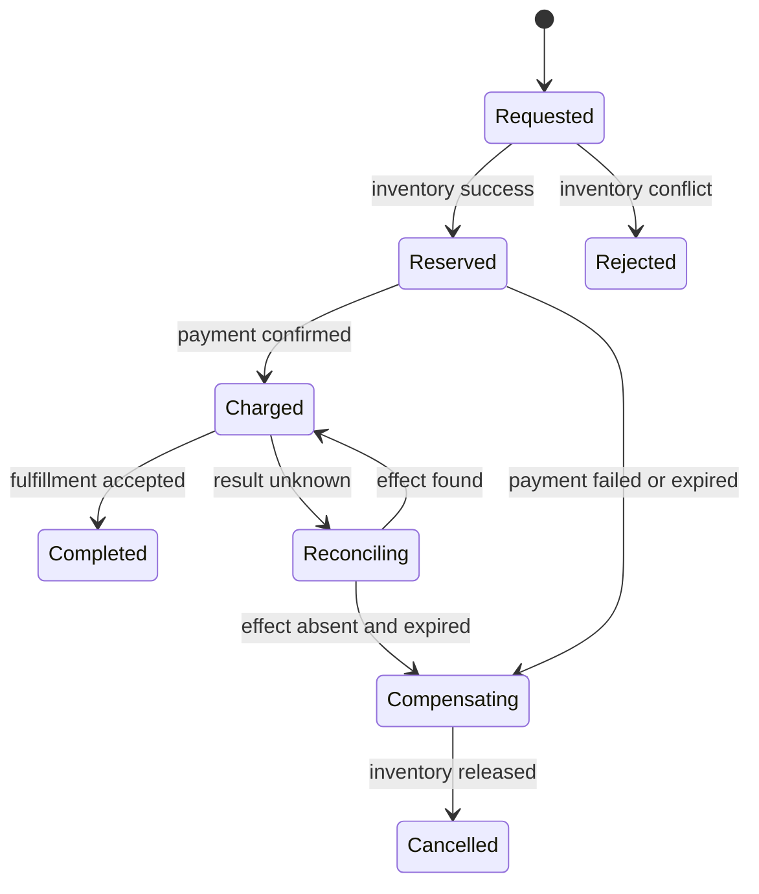

# Partial failures and distributed workflows

<!-- source: https://kafka.apache.org/40/design/design/ | checked: 2026-09-03 -->
<!-- source: https://sre.google/sre-book/managing-critical-state/ | checked: 2026-09-03 -->

If there is more than one process and network, the actual state cannot be known simply by saying “the call failed.” The request may be reflected but the response may disappear, or the event may be processed but the offset commit may fail. Distributed workflows are not a magic solution that eliminates uncertainty, but a design that converges uncertainty through stable identifiers, state transitions, and reconciliation.

## Terms introduced in this chapter

| word | Meaning in this chapter | Why it matters / when to use it |
|---|---|---|
| partial failure | Only some components fail and the overall results are not immediately known. | Design recovery for ambiguous multi-system outcomes instead of assuming all components fail together. **Concrete situation (illustrative):** Payment succeeds but inventory confirmation times out. → Inspect each system's durable state separately. → Reconcile or compensate without assuming both operations failed. |
| delivery | Rules by which messages are passed between broker and consumer | State which losses or duplicates consumers must handle instead of equating receipt with completion. **Concrete situation (illustrative):** A consumer receives the same event after restart. → Apply the documented delivery contract and deduplication rule. → Check business effects rather than receipt counts alone. |
| deduplication | Avoid repeating work effects by remembering stable identifiers that have already been processed | Prevent retained or retried event copies from producing duplicate business effects. **Concrete situation (illustrative):** A retained event is replayed twice. → Use its stable identity to detect repeated processing. → Verify the business total changes only as intended. |
| fencing token | A monotonically increasing generation value that rejects late writes from old owners. | Reject delayed writes from an expired owner after another executor acquires ownership. **Concrete situation (illustrative):** An expired worker resumes after a new owner starts. → Require the sink to validate fencing generations. → Test that the old worker's delayed write is rejected. |
| compensation | Follow-up work that undoes or offsets the effects that have already been completed | Repair completed external effects when a larger workflow cannot finish as intended. **Concrete situation (illustrative):** Payment completed but shipment cannot be created. → Execute the approved business compensation workflow. → Verify its outcome and retain both original and compensating records. |
| reconciliation | Repeat to converge the difference by rereading the desired state and the actual state | Recover from uncertain acknowledgments by checking actual state before repeating or repairing work. **Concrete situation (illustrative):** A controller loses the response to a successful update. → Reread desired and actual state. → Repeat only the work still needed for convergence. |

1. Adds response loss and redundant delivery at all network boundaries.
2. Next, design an identifier and state transition to retrieve the results.

## Understand the model first

Kafka's idempotent producers and transactions can reduce duplication and bundle offset and output topic records at specific log·partition·producer boundaries. This does not guarantee that the payment DB, external API, and email are executed only once. The broker guarantee should not be interpreted as a business guarantee.



## Write the failure table first

| boundary | When it was cut off | observation | Safe next move |
|---|---|---|---|
| client → API | After commit but before response | client timeout | Search results with the same request key |
| DB → outbox relay | After publish but before mark | Event can be reissued | Consumer event ID dedupe |
| consumer → DB | After commit but before offset | Re-receive message | Record inbox and task write in the same transaction |
| service → payment | After approval but before response | result unknown | Search by payment operation ID |
| lease owner → resource | Delayed write after lease expiration | Looks like two owners | Write rejection with low fencing token |
| saga step | Failed after completing some steps | Partial effect remaining | Compensation or person escalation by status |

## Record inbox and work effects together

If the consumer prevents duplication only with an in-memory set, the same event is processed again after restart. Stable `event_id` is recorded in transactions such as business changes.

```sql
BEGIN;

WITH accepted AS (
  INSERT INTO consumer_inbox (consumer_name, event_id)
  VALUES ('fulfillment', 'evt-981')
  ON CONFLICT (consumer_name, event_id) DO NOTHING
  RETURNING event_id
)
UPDATE orders
SET fulfillment_state = 'QUEUED'
WHERE order_id = 'order-204'
  AND fulfillment_state = 'NEW'
  AND EXISTS (SELECT 1 FROM accepted);

COMMIT;
```

The inbox requires a unique key on `(consumer_name, event_id)`. This fragment assumes the target order already exists and is eligible; a real consumer must distinguish an already completed transition from an absent or invalid order and roll back or quarantine according to that contract. The executable [duplicate-event lab](#doc=messaging-duplicate-dlq) tests a fixed existing business row.

If the dedupe retention period is shorter than the producer replay period, old events can produce effects again. ID range, preservation/deletion, and reprocessing runbook are contracted together. For detailed broker selection and DLQ, connect to [Messaging and Event Infrastructure ](#doc=messaging-roadmap).

## lease and fencing

A lease causes ownership to be lost over time, but it may not physically prevent the suspended old owner from waking up late and writing. The lock service must issue a larger token for each new owner and reject writes whose resource is smaller than the last token.

```json
{
  "operationId": "reprice-shop-a-204",
  "owner": "worker-7",
  "fencingToken": 418,
  "expectedRevision": 12,
  "targetRevision": 13
}
```

Just leaving this JSON in the log does not result in fencing. The DB or resource that actually receives the write must atomically compare the token·revision precondition.

## Compensation is not rollback

External payments, message transmission, and delivery requests do not disappear with DB rollback. Compensation is a new work task that cancels out the original effect. If the refund fails or delivery has already started, it will not automatically return to the previous state. Put retryable, terminal, result-unknown and human-review states in the state machine.

| situation | automatic behavior | evidence needed |
|---|---|---|
| Before request | Create a new operation | idempotency key uniqueness |
| In progress | poll until deadline | owner·attempt·updated time |
| result unknown | Blind retry prohibited | External operation search results |
| Compensating | bounded retry | Link original effect ID and reward ID |
| person review | automatic transition stop | All receipts and current status |
| complete | Do not redo | User results and dependency results |

This pattern is equivalent to [AIOps Self-Healing State Machine](#doc=aiops-remediation-state-machine). AIOps action is also not a single command, but a distributed operation with plan, approval, execution, reconciliation, and outcome verification.

## Design review sequence

1. Attach a stable operation/event ID to each side effect.
2. All points for which no response has been received are marked as candidates for `unknown`, not `failed`.
3. Align producer replay and consumer dedupe retention periods.
4. Revision·fencing is enforced on writes whose ownership changes.
5. Failure and duplication of compensation are also handled as separate operations.
6. The final status is confirmed by the work results, not by whether the message has been processed.
7. Connect trace·event·operation ID to [AIOps evidence graph](#doc=aiops-foundations-evidence-graph).

## Completion criteria

- Partial failure and unknown outcome were modeled as steady states.
- The scope of outbox, inbox and broker warranties was divided.
- A fencing enforcement location was established to block stale owners.
- The conditions for termination and escalation of compensation and reconciliation were written down.

## Explain it in your own words

- Why doesn't at-least-once delivery necessarily mean it creates duplication of work?
- Why can't the broker transaction make the external payment API exactly-once?
- What late writes are possible when there is only a lease and no fencing?
- Why is querying preferred over retry when the result is unknown?
