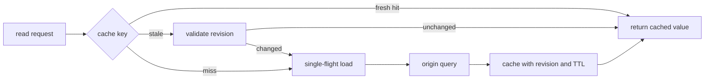

# Cache/data flow and performance evidence

<!-- source: https://www.rfc-editor.org/rfc/rfc9111.html | checked: 2026-09-03 -->
<!-- source: https://www.postgresql.org/docs/current/using-explain.html | checked: 2026-09-03 -->

Caches reduce slow computations and transfers, but create new state, freshness, and invalidation boundaries. If you just increase the hit ratio, you may miss old values, tenant mixes, and stampedes. Performance improvement must be proven with before and after results after fixing the user workload, source of truth, and allowed stale window.

## Terms introduced in this chapter

| word | Meaning in this chapter |
|---|---|
| cache key | Identification information to retrieve stored responses or values |
| freshness | Period and conditions for reuse without re-burying the original |
| validator | An ETag-like value that conditionally checks if the stored value is still valid. |
| invalidation | Removing and updating cache entries that should no longer be reused after changing the original |
| stampede | A phenomenon in which many requests start calculating the original at the same time on the same miss. |
| benchmark | Before-and-after measurements on a fixed workload and environment |

1. First, determine the source of truth and the allowable stale window.
2. Then design the cache key, population, invalidation and failure policies.

## Understand the model first

RFC 9111's HTTP cache uses method and target URI as basic keys and limits reuse of stored responses according to `Vary`, freshness, validator, and directive. Application cache cannot avoid the same question. A failure contract is needed to determine which request dimension goes into the key, when it is stale, and to provide stale when there is no origin.



## cache contract

| item | Order inquiry example | Problems that arise when missing |
|---|---|---|
| Source of truth | PostgreSQL order row | Treating a cache as an irreplaceable original |
| key | tenant + order ID + representation version | Tenant data mixed/old format conflict |
| freshness | 60 seconds for completed orders, 2 seconds for in-progress orders | TTL independent of business status |
| validator | order revision or ETag | Resend the entire value · lost update |
| invalidation | committed order ID event | Rolled back writes clear the cache |
| miss control | single-flight by key | The hot key presses the origin at the same time |
| failure mode | Progress status prohibits stale, completion status allows restrictions. | Random old values ​​exposed on failure |

```yaml
cache_policy:
  namespace: order-summary-v3
  key: "tenant:{tenantId}:order:{orderId}"
  source_of_truth: postgres.orders
  ttl_seconds:
    active: 2
    terminal: 60
  validator: order_revision
  stale_if_origin_unavailable_seconds: 0
  fill: single_flight
```

This is an implementation example, and the stale allowable values ​​for financial and authority data must be determined in a business contract. HTTP directives such as `no-store`, `private`, and `must-revalidate` do not automatically match the application cache policy just because they have similar names.

## Between Write and Invalidate

If you clear the cache before DB writing, only valid values ​​will disappear after transaction rollback, which may increase load. If an invalidation event is sent after DB commit, a stale window will appear during delivery delay. The aggregate ID and revision can be included in the outbox event and the consumer can be designed to ignore old revision invalidation.

| case | Status visible to cache | defense |
|---|---|---|
| Same key simultaneous miss | N origin queries | single-flight·request coalescing |
| old invalidation late arrival | Risk of deleting new values | Monotonic revision comparison |
| cache total failure | Concentrate load on origin | origin load shed·gradual bypass |
| hot key focus | One shard·connection saturation | Consider preserving meaning in local cache/key distribution |
| Change schema after deploy | old entry decode failed | versioned namespace·dual read limitation |

[Redis and DynamoDB](#doc=nosql-roadmap) deal with specific operations of TTL, hot key, and storage model. Here we examine whether the product settings are linked to the API freshness contract.

## Create proof of performance

Cache success is not determined based on average response time alone. Measured under the same dataset, query mix, concurrency, and warm-up conditions.

```json
{
  "scenario": "order-summary-read-v3",
  "datasetRevision": "orders-fixture-20260903-a",
  "requestMix": {"active": 0.3, "terminal": 0.7},
  "concurrency": 40,
  "durationSeconds": 300,
  "result": {
    "successRatio": 0.999,
    "p95Ms": 84,
    "p99Ms": 171,
    "cacheHitRatio": 0.81,
    "staleViolationCount": 0,
    "originQps": 19
  }
}
```

PostgreSQL `EXPLAIN` shows the execution plan chosen by the planner, and `EXPLAIN ANALYZE` executes the actual statement. Do not use it carelessly in writing statements or heavy queries. Check query plan, rows estimate, buffer·I/O, and lock wait in [PostgreSQL operation ](#doc=postgresql-lock-restore) and connect with request ID such as application span.

## Review order

1. Fix user results and source of truth.
2. Check if the key requires tenant, permission, locale, and representation version.
3. Determines freshness and stale allowance for each active/terminal state.
4. Design origin protection in case of fill, invalidation and cache failure.
5. Rather than measuring the average, p95·p99, errors, stale violations, and origin loads are measured together.
6. Separate cache off, cold, warm and failure modes.
7. The change results are left as deploy·cache revision in [AIOps incident bundle](#doc=aiops-foundations-contract-lab).

## Completion criteria

- I wrote down the cache source of truth, key, freshness and invalidation owner.
- Designed to protect the origin of miss stampede and cache failures.
- We linked query and cache metrics to user results.
- Reproducible workload and correctness gate were included in the performance results.

## Explain it in your own words

- What are two cases in which a hit ratio of 99% can give incorrect results?
- What competition should we consider when using TTL and invalidation together?
- Why shouldn't `EXPLAIN ANALYZE` be run carelessly in production writes?
- Why can a simple bypass turn into an origin failure when a cache failure occurs?
