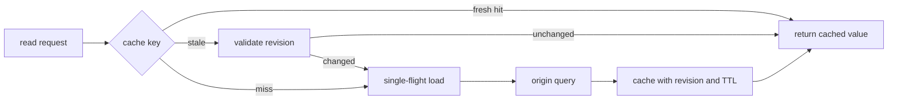

# 캐시·데이터 흐름과 성능 증거

<!-- source: https://www.rfc-editor.org/rfc/rfc9111.html | checked: 2026-09-03 -->
<!-- source: https://www.postgresql.org/docs/current/using-explain.html | checked: 2026-09-03 -->

캐시는 느린 계산과 전송을 줄이지만 새로운 상태, freshness와 무효화 경계를 만든다. hit ratio만 높이면 오래된 값, tenant 혼합과 stampede를 놓칠 수 있다. 성능 개선은 사용자 workload, 정본과 허용된 stale window를 고정한 뒤 전후 결과로 증명해야 한다.

## 이 장에서 처음 쓰는 말

| 말 | 이 장에서의 뜻 |
|---|---|
| cache key | 저장된 응답이나 값을 다시 찾는 식별 정보 |
| freshness | 원본에 다시 묻지 않고 재사용해도 되는 기간·조건 |
| validator | 저장 값이 아직 유효한지 조건부 확인하는 ETag 같은 값 |
| invalidation | 원본 변경 뒤 더 이상 재사용하면 안 되는 cache entry를 제거·갱신하는 일 |
| stampede | 같은 miss에서 많은 요청이 동시에 원본 계산을 시작하는 현상 |
| benchmark | 고정한 workload와 환경에서 전후를 비교하는 측정 |

1. 먼저 정본과 허용 가능한 stale window를 정한다.
2. 그다음 cache key, 채움, 무효화와 실패 정책을 설계한다.

## 먼저 이해하기

RFC 9111의 HTTP cache는 method와 target URI를 기본 key로 사용하고 `Vary`, freshness, validator와 directive에 따라 저장 응답 재사용을 제한한다. application cache도 같은 질문을 피할 수 없다. 어떤 요청 차원이 key에 들어가며, 언제 stale이고, origin이 없을 때 stale을 제공할지 실패 계약이 필요하다.



## cache contract

| 항목 | 주문 조회 예시 | 빠지면 생기는 문제 |
|---|---|---|
| 정본 | PostgreSQL order row | cache를 복구 불가능한 원본처럼 취급 |
| key | tenant + order ID + representation version | tenant data 혼합·구형 형식 충돌 |
| freshness | 완료 주문 60초, 진행 중 주문 2초 | 업무 상태와 무관한 TTL |
| validator | order revision 또는 ETag | 값 전체를 다시 전송·lost update |
| invalidation | commit된 order ID event | rollback된 write가 cache를 지움 |
| miss control | key별 single-flight | hot key가 origin을 동시에 압박 |
| failure mode | 진행 상태는 stale 금지, 완료 상태는 제한 허용 | 장애 때 임의의 오래된 값 노출 |

```yaml
cache_policy:
  namespace: order-summary-v3
  key: "tenant:{tenantId}:order:{orderId}"
  source_of_truth: postgres.orders
  ttl_seconds:
    active: 2
    terminal: 60
  validator: order_revision
  stale_if_origin_unavailable_seconds: 0
  fill: single_flight
```

이는 구현 예시이며 금융·권한 데이터의 stale 허용값은 업무 계약으로 결정해야 한다. `no-store`, `private`, `must-revalidate` 같은 HTTP directive도 이름이 비슷하다고 application cache 정책과 자동으로 같아지지 않는다.

## 쓰기와 무효화 사이

DB write 전에 cache를 지우면 transaction rollback 뒤 유효한 값만 사라져 부하가 늘 수 있다. DB commit 뒤 무효화 event를 보내면 전달 지연 동안 stale window가 생긴다. outbox event에 aggregate ID와 revision을 담고 consumer가 old revision invalidation을 무시하도록 설계할 수 있다.

| 사건 | cache가 볼 수 있는 상태 | 방어 |
|---|---|---|
| 같은 key 동시 miss | origin query N개 | single-flight·request coalescing |
| old invalidation 늦게 도착 | 새 값을 삭제할 위험 | monotonic revision 비교 |
| cache 전체 장애 | origin으로 부하 집중 | origin load shed·점진 bypass |
| hot key 집중 | 한 shard·connection 포화 | local cache·key 분산은 의미 보존 검토 |
| deploy 뒤 schema 변경 | old entry decode 실패 | versioned namespace·dual read 제한 |

[Redis와 DynamoDB](#doc=nosql-roadmap)는 TTL, hot key와 저장 모델의 구체 동작을 다룬다. 여기서는 그 제품 설정이 API freshness 계약과 연결되는지를 검토한다.

## 성능 증거 만들기

평균 응답 시간만으로 cache 성공을 판정하지 않는다. 동일한 dataset, query mix, concurrency와 warm-up 조건에서 측정한다.

```json
{
  "scenario": "order-summary-read-v3",
  "datasetRevision": "orders-fixture-20260903-a",
  "requestMix": {"active": 0.3, "terminal": 0.7},
  "concurrency": 40,
  "durationSeconds": 300,
  "result": {
    "successRatio": 0.999,
    "p95Ms": 84,
    "p99Ms": 171,
    "cacheHitRatio": 0.81,
    "staleViolationCount": 0,
    "originQps": 19
  }
}
```

PostgreSQL `EXPLAIN`은 planner가 고른 실행 계획을 보여 주며 `EXPLAIN ANALYZE`는 실제 statement를 실행한다. 쓰기 statement나 무거운 query에 함부로 사용하지 않는다. query plan, rows estimate, buffer·I/O와 lock wait를 [PostgreSQL 운영](#doc=postgresql-lock-restore)에서 확인하고 application span과 같은 request ID로 연결한다.

## 검토 순서

1. 사용자 결과와 정본을 고정한다.
2. key에 tenant, 권한, locale과 representation version이 필요한지 확인한다.
3. active·terminal 상태별 freshness와 stale 허용을 정한다.
4. fill, invalidation과 cache 장애 시 origin 보호를 설계한다.
5. 평균이 아니라 p95·p99, 오류, stale violation과 origin 부하를 함께 잰다.
6. cache off, cold, warm과 장애 모드를 분리한다.
7. 변경 결과는 [AIOps incident bundle](#doc=aiops-foundations-contract-lab)에 deploy·cache revision으로 남긴다.

## 완료

- cache 정본, key, freshness와 invalidation owner를 적었다.
- miss stampede와 cache 장애의 origin 보호를 설계했다.
- query와 cache 지표를 사용자 결과에 연결했다.
- 재현 가능한 workload와 correctness gate를 성능 결과에 포함했다.

## 스스로 설명해 보기

- hit ratio 99%여도 잘못된 결과를 제공할 수 있는 두 경우는 무엇인가?
- TTL과 invalidation을 함께 쓰면 어떤 경쟁을 검토해야 하는가?
- `EXPLAIN ANALYZE`를 production write에 무심코 실행하면 안 되는 이유는 무엇인가?
- cache 장애 때 단순 bypass가 origin 장애로 번질 수 있는 이유는 무엇인가?
