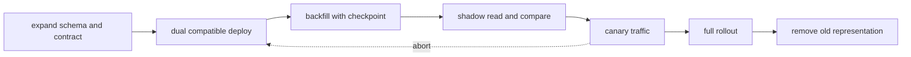

# Compatible changes, testing and gradual deployment

<!-- source: https://spec.openapis.org/oas/ | checked: 2026-09-03 -->
<!-- source: https://martinfowler.com/articles/practical-test-pyramid.html | checked: 2026-09-03 -->
<!-- source: https://kubernetes.io/docs/tasks/run-application/update-deployment-rolling/ | checked: 2026-09-03 -->

Deployment is not the moment of executing a new binary, but the period when old and new code, schema, events, and cache coexist. Make the units of change small and check the path and user outcome at each step. Compatibility cannot be proven solely through the number of unit tests or completion of rollout.

## Terms introduced in this chapter

| word | Meaning in this chapter |
|---|---|
| expand-contract | First, add expressions that will be used together in the old and new versions, and then remove old expressions after conversion. |
| contract test | A test to check whether the actual implementation adheres to the requests and responses agreed upon by the provider and consumer. |
| shadow read | Validation that compares the results of a new path to existing results without writing them to the user. |
| canary | Steps to expose new changes to only some traffic·tenant·resources |
| rollback | Reverting an execution artifact to a previous revision |
| roll forward | Forward deployment of a modified version when a simple rollback is risky due to data or external effects. |

1. Create a coexistence matrix before and after the change.
2. Determine entry, interruption, rollback, and completion evidence for each step.

## Understand the model first

Kubernetes Deployment provides rolling update and revision rollback, but does not determine application contract or DB schema backward compatibility. Even if the Pod is available, old consumers may not be able to read new responses, or background migration may incorrectly change business data.



## coexistence matrix

| producer / consumer | old consumer | new consumer |
|---|---|---|
| old producer | base line | New consumer must read old payload |
| new producer | Old consumer must endure new payload | target combination |

Adding optional fields to the API, expanding event enums, and changing DB columns have different compatibility rules. OpenAPI schema lint checks the document structure, but is unaware of both semantic changes and actual consumer behavior. Contract fixture and consumer test are executed together in CI.

```yaml
change_receipt:
  changeId: order-status-v3
  apiSchema: openapi-orders@7c1a
  eventSchema: order-events@12
  databaseMigration: 20260903_add_fulfillment_state
  compatibility:
    oldProducerNewConsumer: passed
    newProducerOldConsumer: passed
  backfill:
    checkpoint: order_id_800000
    mismatchCount: 0
  rollbackMode: application_only_until_contract_cleanup
```

## Place test on failure boundary

| test layer | Quick search problem | Problem not finding |
|---|---|---|
| unit·property | Function rules and wide input counterexamples | Actual DB·network meaning |
| integration | DB constraint, transaction, serialization | All actual consumer contracts |
| contract | Provider and consumer expression mismatch | Production capacity and data distribution |
| end-to-end | Combination errors in core user flows | All faults and tail behavior |
| load·soak | saturation, leak and tail latency | Self-determination of whether the work is meaningful |
| fault injection | timeout·duplicate·dependency failure | defect not selected |

The test pyramid is not just a picture of putting less money as you go up, but is also a tool to match the feedback cost and the actual risk range. A property-based test shakes up an invariant with a generated input, and a mutation test intentionally changes the production code to see whether the test catches the defect. Even if the coverage number is high, if the assertion is meaningless, the mutation survives.

## Stages of online migration

1. Add a new nullable column·table·event field and check if the old code continues to work.
2. The new code reads both old and new expressions, but leaves the write source of truth as one.
3. Run backfill with checkpoint and rate limit and observe DB load.
4. Compare old and new results by key using shadow read.
5. Check user/dependency SLI and mismatch in canary.
6. The old expression is removed after all writer/reader conversions and retention periods.
7. Removal is performed as a separate change and leaves a recoverable snapshot·receipt.

Dual write is not atomic as it simply writes two stores in order in one application call. Make clear the failure window, repair queue, and source of truth. Event capture and outbox are reviewed by [domain invariants and transaction](#doc=backend-engineering-domain-transaction), and unknown results are returned to [distributed workflow](#doc=backend-engineering-distributed-workflow).

## deployment gate and observation

```json
{
  "deployment": "orders-v18",
  "scope": {"region": "ap-northeast-2", "trafficPercent": 5},
  "entry": ["contract-tests-passed", "backfill-mismatch-zero"],
  "abort": ["error-ratio-plus-1pp", "p99-plus-100ms", "db-pool-wait-plus-20pct"],
  "success": ["order-success-sli-stable-30m", "event-lag-stable", "no-schema-errors"],
  "rollback": "orders-v17",
  "expiresAt": "2026-09-03T03:00:00Z"
}
```

Canary success does not automatically mean full scaling. Each time the scope is expanded, a new blast radius and observation window are created. It also distinguishes between the fact that GitOps reverted the desired revision and the fact that the actual user result was recovered. [Helm and GitOps](#doc=helm-gitops-roadmap), [Observability and SRE](#doc=observability-sre-roadmap), and [AIOps automatic recovery](#doc=aiops-remediation-dry-run-lab) are used together.

## Completion criteria

- We created a coexistence matrix for old and new versions of API, event, and DB.
- We connected the test layer to the actual failure boundary.
- The completion conditions for backfill·shadow read·canary·cleanup were divided.
- Rollout, rollback, and user outcome evidence were separated.

## Explain it in your own words

- Why isn't adding an optional field an automatically compatible change for all consumers?
- What errors can be missed if the fact that backfill is finished is determined by row count alone?
- Why is pod rollout success different from application release success?
- When is roll forward safer than rollback due to DB changes?
