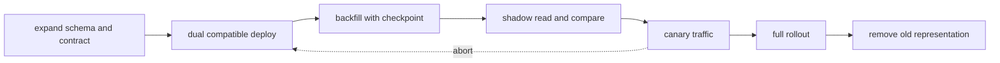

# 호환 변경·테스트와 점진적 배포

<!-- source: https://spec.openapis.org/oas/ | checked: 2026-09-03 -->
<!-- source: https://martinfowler.com/articles/practical-test-pyramid.html | checked: 2026-09-03 -->
<!-- source: https://kubernetes.io/docs/tasks/run-application/update-deployment-rolling/ | checked: 2026-09-03 -->

배포는 새 binary를 실행하는 순간이 아니라 구·신 코드, schema, event와 cache가 공존하는 기간이다. 변경 단위를 작게 만들고 각 단계에서 돌아갈 길과 사용자 결과를 확인해야 한다. unit test 수나 rollout 완료만으로 호환성을 증명할 수 없다.

## 이 장에서 처음 쓰는 말

| 말 | 이 장에서의 뜻 |
|---|---|
| expand-contract | 먼저 구·신 버전이 함께 쓸 표현을 추가하고 전환 뒤 오래된 표현을 제거하는 순서 |
| contract test | provider와 consumer가 합의한 요청·응답을 실제 구현이 지키는지 확인하는 test |
| shadow read | 새 경로의 결과를 사용자에게 쓰지 않고 기존 결과와 비교하는 검증 |
| canary | 일부 traffic·tenant·resource에만 새 변경을 노출하는 단계 |
| rollback | 실행 artifact를 이전 revision으로 되돌리는 작업 |
| roll forward | 데이터·외부 효과 때문에 단순 rollback이 위험할 때 수정 버전을 전진 배포하는 것 |

1. 변경 전후 공존 매트릭스를 만든다.
2. 각 단계의 진입, 중단, rollback과 완료 증거를 정한다.

## 먼저 이해하기

Kubernetes Deployment는 rolling update와 revision rollback을 제공하지만 application contract나 DB schema 역호환을 판단하지 않는다. Pod가 available이어도 새 응답을 old consumer가 읽지 못하거나 background migration이 업무 데이터를 잘못 바꿀 수 있다.



## 공존 매트릭스

| producer / consumer | old consumer | new consumer |
|---|---|---|
| old producer | 기준선 | 새 consumer가 old payload를 읽어야 함 |
| new producer | old consumer가 새 payload를 견뎌야 함 | 목표 조합 |

API의 optional field 추가, event enum 확장과 DB column 변경은 서로 다른 호환 규칙을 가진다. OpenAPI schema lint는 문서 구조를 확인하지만 의미 변화와 실제 consumer 행동을 모두 알지 못한다. contract fixture와 consumer test를 CI에서 함께 실행한다.

```yaml
change_receipt:
  changeId: order-status-v3
  apiSchema: openapi-orders@7c1a
  eventSchema: order-events@12
  databaseMigration: 20260903_add_fulfillment_state
  compatibility:
    oldProducerNewConsumer: passed
    newProducerOldConsumer: passed
  backfill:
    checkpoint: order_id_800000
    mismatchCount: 0
  rollbackMode: application_only_until_contract_cleanup
```

## test를 실패 경계에 배치한다

| test 층 | 빠르게 찾는 문제 | 찾지 못하는 문제 |
|---|---|---|
| unit·property | 함수 규칙과 넓은 입력 반례 | 실제 DB·network 의미 |
| integration | DB constraint, transaction, serialization | 실제 consumer 계약 전체 |
| contract | provider와 consumer 표현 불일치 | production 용량과 데이터 분포 |
| end-to-end | 핵심 사용자 흐름의 조합 오류 | 모든 fault와 tail behavior |
| load·soak | saturation, leak와 tail latency | 업무 의미가 맞는지 자체 판단 |
| fault injection | timeout·duplicate·dependency failure | 선택하지 않은 결함 |

test pyramid는 위로 갈수록 적게 둔다는 그림만이 아니라 피드백 비용과 실제 위험 범위를 맞추는 도구다. property-based test는 생성 입력으로 불변식을 흔들고, mutation test는 production code를 일부러 바꿔 test가 그 결함을 잡는지 본다. coverage 숫자가 높아도 assertion이 무의미하면 mutation이 살아남는다.

## online migration의 단계

1. 새 nullable column·table·event field를 추가하고 old code가 계속 동작하는지 확인한다.
2. new code가 old·new 표현을 모두 읽되 write 정본은 하나로 둔다.
3. checkpoint와 rate limit이 있는 backfill을 실행하고 DB 부하를 관찰한다.
4. shadow read로 old·new 결과를 key별 비교한다.
5. canary에서 사용자·dependency SLI와 mismatch를 확인한다.
6. 모든 writer·reader 전환과 보존 기간이 지난 뒤 old 표현을 제거한다.
7. 제거는 별도 변경으로 수행하고 복구 가능 snapshot·receipt를 남긴다.

dual write는 두 저장소를 한 application call에서 순서대로 쓰는 것만으로 원자적이지 않다. 실패 창, repair queue와 정본을 분명히 한다. event capture와 outbox는 [도메인 불변식과 transaction](#doc=backend-engineering-domain-transaction), 결과 불명은 [분산 워크플로](#doc=backend-engineering-distributed-workflow)로 돌아가 검토한다.

## 배포 gate와 관측

```json
{
  "deployment": "orders-v18",
  "scope": {"region": "ap-northeast-2", "trafficPercent": 5},
  "entry": ["contract-tests-passed", "backfill-mismatch-zero"],
  "abort": ["error-ratio-plus-1pp", "p99-plus-100ms", "db-pool-wait-plus-20pct"],
  "success": ["order-success-sli-stable-30m", "event-lag-stable", "no-schema-errors"],
  "rollback": "orders-v17",
  "expiresAt": "2026-09-03T03:00:00Z"
}
```

canary 성공은 자동으로 전체 확장을 뜻하지 않는다. scope 확대마다 새로운 blast radius와 관찰 window가 생긴다. GitOps가 desired revision을 되돌린 사실과 실제 사용자 결과가 회복된 사실도 구분한다. [Helm과 GitOps](#doc=helm-gitops-roadmap), [Observability와 SRE](#doc=observability-sre-roadmap), [AIOps 자동 복구](#doc=aiops-remediation-dry-run-lab)를 함께 사용한다.

## 완료

- API·event·DB의 구·신 버전 공존 매트릭스를 만들었다.
- test 층을 실제 실패 경계와 연결했다.
- backfill·shadow read·canary·cleanup의 완료 조건을 나눴다.
- rollout, rollback과 사용자 outcome 증거를 분리했다.

## 스스로 설명해 보기

- optional field 추가가 모든 consumer에게 자동으로 호환되는 변경이 아닌 이유는 무엇인가?
- backfill이 끝났다는 사실을 row count 하나로 판정하면 어떤 오류를 놓칠 수 있는가?
- Pod rollout 성공과 application release 성공이 다른 이유는 무엇인가?
- DB 변경 때문에 rollback보다 roll forward가 안전할 수 있는 경우는 언제인가?
