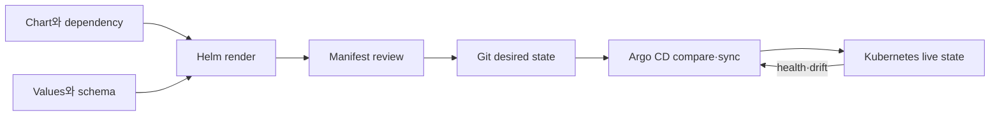

# Helm Charts와 GitOps 로드맵

Helm과 GitOps는 같은 문제가 아니다. Helm은 values와 template로 Kubernetes object를 **렌더링·패키징**하고, Argo CD는 Git의 desired state와 cluster live state를 **비교·수렴**시킨다.

## 한 문장 모델

> `chart + values → rendered manifests → review → Git desired state → Argo CD sync → live resources`이며 각 화살표마다 다른 실패와 owner가 있다.

## 읽는 순서

1. [Chart, release와 desired state](01-chart-release-gitops-model.md): chart 구조, values, hooks, CRD와 Argo CD ownership을 구분한다.
2. [Render, upgrade와 drift 실습](02-render-upgrade-drift-lab.md): lint·template·install·upgrade·rollback과 GitOps drift를 관찰한다.

## 핵심 범위

- Chart API v2, SemVer, `Chart.yaml`, `values.yaml`, `values.schema.json`, `templates/`, `charts/`, `crds/`
- values precedence와 최종 manifest 검토
- dependency, hook와 CRD lifecycle
- release history, upgrade와 rollback
- OCI registry의 chart push/pull
- 사내 object 변형에서 Kustomize와의 경계
- Argo CD Application, target/live state, sync·prune·self-heal

## Ownership 원칙

| 대상 | 기본 owner |
|---|---|
| VPC·EKS cluster·IAM 기반 | Terraform |
| cluster 안 application desired state | Git과 Argo CD |
| third-party package 구조 | Helm chart |
| environment별 작은 object patch | Kustomize 또는 명시적 values |

경계는 조직마다 다를 수 있지만 하나의 object를 Terraform Helm provider와 Argo CD가 동시에 관리하지 않는다.

## 완료 기준

- `helm lint` 성공과 Kubernetes에서 안전한 manifest라는 판단을 구분한다.
- final values와 rendered manifest를 code review 대상으로 만든다.
- hook job, CRD와 application resource의 삭제·rollback 수명이 다름을 설명한다.
- auto-sync·prune·self-heal을 각각 켰을 때 blast radius를 예측한다.

## 스스로 설명해 보기

1. chart version과 container image version을 분리해야 하는 이유는 무엇인가?
2. Helm rollback이 database migration을 자동으로 되돌리지 못하는 이유는 무엇인가?
3. Argo CD가 drift를 발견하는 것과 안전하게 복구하는 것은 왜 다른가?

<!-- source: https://helm.sh/docs/topics/charts/ | checked: 2026-09-03 -->
<!-- source: https://helm.sh/docs/topics/registries/ | checked: 2026-09-03 -->
<!-- source: https://argo-cd.readthedocs.io/en/stable/core_concepts/ | checked: 2026-09-03 -->
