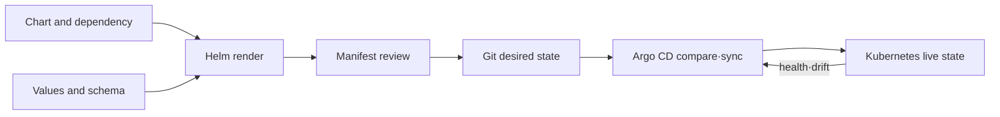

# Helm Charts and GitOps Roadmap

## Starting point for beginners

To deploy an application in Kubernetes, you need several YAML files such as Deployment, Service, and Settings. If you copy and modify each development, verification, and operation environment, different files will increase and it will be difficult to know which values ​​have actually been deployed. Helm manages repeated YAML frames and changed values ​​by grouping them together.

| New term | Plain-language meaning | Why it matters / when to use it |
|---|---|---|
| manifest | YAML document listing what to create in Kubernetes | Declare Kubernetes objects in a form that can be reviewed and reapplied. |
| chart | Helm package that bundles the manifest template and default values | Package related Kubernetes resources as a configurable installation unit. |
| template | A document frame where the final YAML is created by entering values. | Reuse a resource structure while varying environment-specific inputs. |
| values | Inputs such as image and replica number that vary depending on the environment | Vary deployment choices without copying and editing the entire template. |
| release | A record of installing one chart to a cluster with specific values. | Track which chart and values were installed so upgrades and rollback targets are identifiable. |
| GitOps | An operating method that continuously compares the actual cluster with the desired state written in Git | Use reviewed Git changes as the operational target and continuously reconcile the cluster. |

Helm is a tool that creates and installs YAML, and GitOps is a method of managing whether the actual state remains the same as Git. Rather than memorizing both concepts at once, first visually check the final YAML created by Helm and then learn automatic convergence of GitOps.

Helm and GitOps are not the same problem. Helm **renders and packages** Kubernetes objects with values ​​and templates, and Argo CD **compares and converges** Git's desired state and the cluster live state.

## The model in one sentence

> It is `chart + values → rendered manifests → review → Git desired state → Argo CD sync → live resources` and each arrow has a different failure and owner.

## Reading order

1. [Chart, release and desired state](01-chart-release-gitops-model.md): Distinguish between chart structure, values, hooks, CRD and Argo CD ownership.
2. [Render, upgrade and drift lab](02-render-upgrade-drift-lab.md): Observe lint·template·install·upgrade·rollback and GitOps drift.

## core scope

- Chart API v2, SemVer, `Chart.yaml`, `values.yaml`, `values.schema.json`, `templates/`, `charts/`, `crds/`
- Review values ​​precedence and final manifest
- dependency, hook and CRD lifecycle
- release history, upgrades and rollbacks
- OCI registry chart push/pull
- Boundaries with Kustomize in in-house object transformation
- Argo CD Application, target/live state, sync·prune·self-heal

## Version Note

As of confirmation date, the official site shows Helm 4.2.4, but the Charts description page itself has not yet been updated for Helm 4, so it warns that some content may be inaccurate or not applicable. This course uses common structures such as chart directories and values·templates as a learning starting point. For Helm 4's new features, compatibility, and command operations, check the Overview and command reference of the corresponding version separately.

## Ownership principle

| Target | default owner |
|---|---|
| VPC·EKS cluster·IAM based | Terraform |
| Cluster application desired state | Git and Argo CD |
| third-party package structure | Helm chart |
| Small object patches for each environment | Kustomize or explicit values |

The boundary may vary from organization to organization, but one object is not managed simultaneously by the Terraform Helm provider and Argo CD.

## Completion criteria

This topic is not something you read once and then stop. First, convert the terminology table into your own words and follow the flow of requests made in the concepts chapter. In the lab, the normal state is first recorded, then a failure is created by changing only one condition, and the cause is explained with evidence before recovery. Finally, expand to more complex environments by answering the operational judgment questions below.

- `helm lint` distinguishes between success and the judgment that it is a safe manifest in Kubernetes.
- Make final values ​​and rendered manifest subject to code review.
- Explains that the deletion/rollback lifespan of hook job, CRD, and application resource are different.
- When auto-sync, prune, and self-heal are turned on, the blast radius is predicted.

## Check your understanding

1. In what order are charts, values ​​and rendered manifest connected?
2. What are the different problems that Helm and GitOps solve?

**Confirmation criteria:** You just need to be able to explain that values ​​are added to the template of the chart to create the final manifest, Helm is responsible for creating and installing this, and GitOps continuously compares the differences between Git and cluster.

## Develop operational judgment

1. Why do you need to separate chart version and container image version?
2. Why doesn't Helm rollback automatically revert database migrations?
3. Why is Argo CD different from detecting drift and safely recovering it?

<!-- source: https://helm.sh/docs/topics/charts/ | checked: 2026-09-03 | docs-version: Helm 4.2.4 | retrieval-warning: page states it is not yet updated for Helm 4 -->
<!-- source: https://helm.sh/docs/topics/registries/ | checked: 2026-09-03 | docs-version: Helm 4.2.4 -->
<!-- source: https://argo-cd.readthedocs.io/en/stable/core_concepts/ | checked: 2026-09-03 -->
