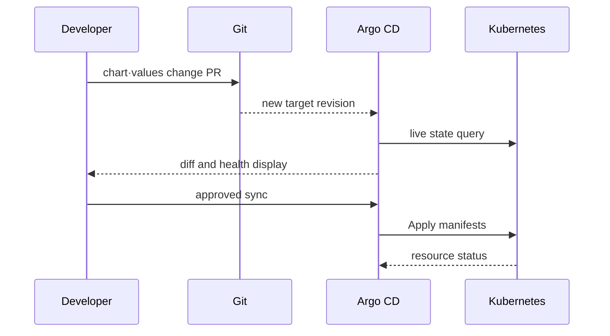

# Chart, release and desired state

## Terms introduced in this chapter

- **render**: This is the process of creating the final YAML that Kubernetes will receive by inserting values ​​into the template.
- **desired state**: A desired state declared in Git or a configuration file that “this is how it should be”.
- **live state**: The status of resources that actually exist in the current cluster.
- **sync**: This is an operation to create, change, and delete resources to reduce the difference between the desired state and the live state.
- **drift**: A phenomenon in which the desired state and the actual state differ.
- **CRD**: A definition that adds a new type of resource to Kubernetes.

At first, only check `template + values = manifest` directly. Next, separate and understand release, which is a record of the manifest being installed on the cluster, and GitOps, which continuously checks for differences based on Git.

## Understand the model first

Using Helm and GitOps together creates at least four layers of state. The chart template is a rule that creates a Kubernetes object, and values ​​are inputs to the rule. The manifest that renders the two becomes the actual API request, and the resulting live object exists in the cluster. Helm release history or Git commit are other criteria for tracking this status.

| Target | easy question | failure example |
|---|---|---|
| chart | What types of manifests can I create? | Invalid template condition |
| values | What did you choose for this environment? | type error, missing required value |
| rendered manifest | What to send to the API server? | Incorrect image·selector·permissions |
| release | Which revision did you install/upgrade? | hook failure, partial rollout |
| Git desired state | What is the controller trying to revert to? | stale commit, wrong promotion |
| live state | What actually runs on the cluster? | manual drift, admission mutation |

Even if you change the replica from 2 to 3 in values, the rendered manifest will not change if the template does not use that value. Conversely, even if the manifest is rendered as 3, the live workload may not change due to admission rejection or lack of quota. Each boundary must be observed separately.

## Follow the process of a value becoming a deployment state

1. The chart provides templates and basic values ​​for Kubernetes resources.
2. Users add environment-specific values ​​or command line values.
3. Helm combines the values ​​according to priority and renders the template as the final manifest.
4. The person or CI checks whether the manifest contains only the expected image, replica, and permissions.
5. Choose the lifecycle owner. With the Helm CLI, install/upgrade submits resources and records Helm release revisions. With Argo CD's Helm integration, Helm only renders templates; Argo CD applies and owns the application lifecycle.
6. Argo CD continuously compares rendered desired resources with live resources. A Helm-sourced Argo CD application does not require a corresponding entry in `helm list` or `helm history`.
7. Depending on the allowed policy, Argo CD reports or synchronizes differences. Avoid having a separate Helm release and Argo CD compete for the same resources.

If you only use Helm, steps 6 and 7 are not required. Adding GitOps does not mean that the fourth step of reviewing whether the template is safe disappears.

## Chart is package, release is installation instance

```text
sample-chart/
├── Chart.yaml
├── values.yaml
├── values.schema.json
├── charts/
├── crds/
└── templates/
```

In Chart API v2, `apiVersion`, `name`, and `version` are core metadata. `version` is the SemVer of the chart package and does not have the same meaning as `appVersion`.

```yaml
apiVersion: v2
name: sample-api
description: Minimal study chart
type: application
version: 0.1.0
appVersion: "1.4.2"
```

A release is an instance where the chart is installed with a specific namespace and values. The same chart can be installed in different releases on `dev` and `prod`.

## Values ​​are input contracts

default `values.yaml`, additional values ​​file and CLI override are combined to create final values. The deeper the override layer, the more difficult it is to estimate the results by reading only the source, so review the results of `helm template`.

```json
{
  "$schema": "http://json-schema.org/draft-07/schema#",
  "type": "object",
  "required": ["image", "replicaCount"],
  "properties": {
    "replicaCount": { "type": "integer", "minimum": 1, "maximum": 20 },
    "image": {
      "type": "object",
      "required": ["repository", "digest"],
      "properties": {
        "repository": { "type": "string", "minLength": 1 },
        "digest": { "type": "string", "pattern": "^sha256:[a-f0-9]{64}$" }
      }
    }
  }
}
```

Schema validation blocks input shapes, but it is a separate verification process to determine whether the template creates a safe object and whether the image is trustworthy.

## Hooks and CRDs are special life cycles

Hooks execute jobs, etc. at release lifecycle points such as install and upgrade. If you do not design weight and delete policy, you may end up with outdated hook resources or block the next release.

The CRD of `crds/` is not treated with the same upgrade/delete lifespan as a general template. CRD schema migration and existing custom resource compatibility are planned separately.

## compare·sync in GitOps

Argo CD Application connects source, destination and project. The target state is the desired state described by sources such as Git, and the live state is the actual state observed in the cluster.



Auto-sync allows CIs to only change Git commits without cluster credentials, but it can also automatically propagate incorrect commits. prune deletes missing resources from Git, and self-heal returns live drift to the target state. Don’t think of the three as one “automation” toggle.

## Explain it in your own words

1. Why is a rendered manifest review necessary even if there is a values ​​schema?
2. How are the rollback completion conditions for hook and application deployment different?
3. Why can self-heal undo urgent manual action?

<!-- source: https://helm.sh/docs/topics/charts/ | checked: 2026-09-03 | docs-version: Helm 4.2.4 | retrieval-warning: page states it is not yet updated for Helm 4 -->
<!-- source: https://helm.sh/docs/chart_template_guide/values_files/ | checked: 2026-09-03 | docs-version: Helm 4.2.4 -->
<!-- source: https://helm.sh/docs/topics/charts_hooks/ | checked: 2026-09-03 | docs-version: Helm 4.2.4 -->
<!-- source: https://argo-cd.readthedocs.io/en/stable/core_concepts/ | checked: 2026-09-03 -->
<!-- source: https://argo-cd.readthedocs.io/en/stable/user-guide/auto_sync/ | checked: 2026-09-03 -->
<!-- source: https://argo-cd.readthedocs.io/en/stable/user-guide/helm/ | checked: 2026-09-10 -->
