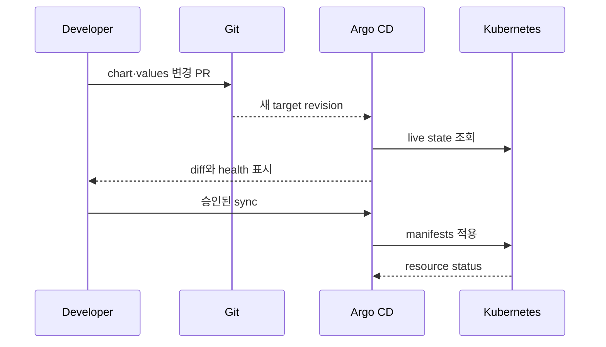

# Chart, release와 desired state

## 먼저 이해하기

Helm과 GitOps를 함께 쓰면 상태가 최소 네 겹 생긴다. chart template은 Kubernetes object를 만드는 규칙이고 values는 그 규칙에 넣는 입력이다. 둘을 렌더링한 manifest가 실제 API request가 되며, cluster에는 그 결과의 live object가 존재한다. Helm release history나 Git commit은 이 상태를 추적하는 또 다른 기준이다.

| 대상 | 쉬운 질문 | 실패 예 |
|---|---|---|
| chart | 어떤 종류의 manifest를 만들 수 있는가? | 잘못된 template 조건 |
| values | 이번 환경이 무엇을 선택했는가? | type 오류, 누락된 필수 값 |
| rendered manifest | API server에 무엇을 보낼 것인가? | 잘못된 image·selector·권한 |
| release | 어떤 revision을 install·upgrade했는가? | hook 실패, partial rollout |
| Git desired state | controller가 무엇으로 되돌리려 하는가? | stale commit, 잘못된 promotion |
| live state | cluster에서 실제로 무엇이 실행되는가? | manual drift, admission mutation |

values에서 replica를 2에서 3으로 바꿔도 template이 그 값을 쓰지 않으면 rendered manifest는 달라지지 않는다. 반대로 manifest가 3으로 렌더돼도 admission rejection이나 quota 부족으로 live workload가 바뀌지 않을 수 있다. 각 경계를 따로 관찰해야 한다.

## Chart는 package, release는 설치 instance

```text
sample-chart/
├── Chart.yaml
├── values.yaml
├── values.schema.json
├── charts/
├── crds/
└── templates/
```

Chart API v2에서 `apiVersion`, `name`, `version`은 핵심 metadata다. `version`은 chart package의 SemVer이며 `appVersion`과 같은 의미가 아니다.

```yaml
apiVersion: v2
name: sample-api
description: Minimal study chart
type: application
version: 0.1.0
appVersion: "1.4.2"
```

release는 chart를 특정 namespace와 values로 설치한 instance다. 같은 chart를 `dev`와 `prod`에 서로 다른 release로 설치할 수 있다.

## Values는 input contract다

default `values.yaml`, 추가 values file과 CLI override가 합쳐져 최종 values가 된다. override 계층이 깊을수록 source만 읽고 결과를 추정하기 어려워지므로 `helm template` 결과를 review한다.

```json
{
  "$schema": "https://json-schema.org/draft/2020-12/schema",
  "type": "object",
  "required": ["image", "replicaCount"],
  "properties": {
    "replicaCount": { "type": "integer", "minimum": 1, "maximum": 20 },
    "image": {
      "type": "object",
      "required": ["repository", "digest"],
      "properties": {
        "repository": { "type": "string", "minLength": 1 },
        "digest": { "type": "string", "pattern": "^sha256:[a-f0-9]{64}$" }
      }
    }
  }
}
```

schema validation은 input shape를 막지만 template이 안전한 object를 만드는지, image가 신뢰할 수 있는지는 별도 검증이다.

## Hook와 CRD는 특별한 수명주기다

hook은 install·upgrade 같은 release lifecycle 지점에 Job 등을 실행한다. weight와 delete policy를 설계하지 않으면 오래된 hook resource가 남거나 다음 release를 막을 수 있다.

`crds/`의 CRD는 일반 template과 같은 upgrade·delete 수명으로 취급하지 않는다. CRD schema migration과 기존 custom resource 호환성을 별도 계획한다.

## GitOps의 compare·sync

Argo CD Application은 source, destination과 project를 연결한다. target state는 Git 등 source가 말하는 원하는 상태이고 live state는 cluster에서 관찰한 실제 상태다.



auto-sync는 CI가 cluster credential 없이 Git commit만 바꾸게 할 수 있지만, 잘못된 commit도 자동 전파할 수 있다. prune은 Git에서 빠진 resource를 삭제하며 self-heal은 live drift를 target state로 되돌린다. 셋을 하나의 “자동화” toggle로 생각하지 않는다.

## 스스로 설명해 보기

1. values schema가 있어도 rendered manifest review가 필요한 이유는 무엇인가?
2. hook와 application Deployment의 rollback 완료 조건은 어떻게 다른가?
3. self-heal이 긴급한 수동 조치를 되돌릴 수 있는 이유는 무엇인가?

<!-- source: https://helm.sh/docs/topics/charts/ | checked: 2026-09-03 -->
<!-- source: https://helm.sh/docs/chart_template_guide/values_files/ | checked: 2026-09-03 -->
<!-- source: https://helm.sh/docs/topics/charts_hooks/ | checked: 2026-09-03 -->
<!-- source: https://argo-cd.readthedocs.io/en/stable/core_concepts/ | checked: 2026-09-03 -->
<!-- source: https://argo-cd.readthedocs.io/en/stable/user-guide/auto_sync/ | checked: 2026-09-03 -->
