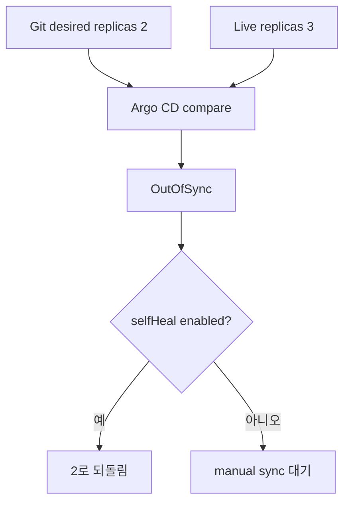

# Render, upgrade와 drift 실습

> 실습 등급: render 단계는 **Local**, install·upgrade는 **Local Kubernetes**다. 공개 registry에 push하지 않으며 AWS 비용은 없다.

## 1. Chart 생성과 최소화

```bash
helm create sample-api
find sample-api -maxdepth 2 -type f | sort
```

학습에 필요 없는 template는 제거하고 Deployment와 Service만 남긴다. 삭제 전 `helm template`로 어떤 object가 사라지는지 확인한다.

`values.yaml`의 image는 mutable tag보다 검증한 digest를 받을 수 있게 설계한다.

```yaml
replicaCount: 1
image:
  repository: nginx
  digest: sha256:replace-with-a-reviewed-digest
service:
  port: 80
```

template에서는 repository와 digest를 명시적으로 결합한다.

```yaml
image: "{{ .Values.image.repository }}@{{ .Values.image.digest }}"
```

## 2. Render gate

```bash
helm lint sample-api
helm template sample-api sample-api \
  --namespace infra-study \
  --values sample-api/values.yaml \
  > rendered.yaml
kubectl apply --dry-run=client -f rendered.yaml
```

`helm lint`는 chart 관례와 일부 오류를 검사하고 `helm template`은 최종 YAML을 보여 준다. client dry-run은 cluster admission·CRD·version compatibility까지 보장하지 않는다. production gate에서는 server-side dry-run 또는 disposable cluster 검증을 추가한다.

## 3. Install, upgrade와 rollback

검증한 digest를 넣은 뒤 local cluster에서 실행한다.

```bash
kubectl create namespace infra-study
helm upgrade --install sample-api sample-api \
  --namespace infra-study \
  --wait --timeout 3m
helm list -n infra-study
helm history sample-api -n infra-study
kubectl get deployment,pod,service -n infra-study
```

replica 수를 2로 바꾸어 upgrade한 뒤 rollout을 확인한다.

```bash
helm upgrade sample-api sample-api -n infra-study --set replicaCount=2 --wait
kubectl rollout status deployment/sample-api -n infra-study
helm history sample-api -n infra-study
```

의도적인 잘못된 image digest로 upgrade할 때는 `--atomic`과 timeout의 효과를 별도 local 실험으로 확인한다. 실패 뒤 release revision, Pod event와 실제 Deployment image를 기록한다.

```bash
helm rollback sample-api 1 -n infra-study --wait
kubectl rollout status deployment/sample-api -n infra-study
```

rollback 성공 판정은 Helm status뿐 아니라 workload readiness와 요청 성공을 포함한다.

## 4. GitOps drift 사고 실험

Argo CD가 관리하는 Deployment를 직접 scale했다고 가정한다.

```bash
kubectl scale deployment/sample-api -n infra-study --replicas=3
```



긴급 조치가 필요한 조직은 self-heal을 끄는 대신 변경 TTL·승인·Git 반영 절차를 정할 수 있다. 중요한 것은 drift를 숨기지 않고 누가 언제 target state에 반영할지 정하는 것이다.

## 정리

```bash
helm uninstall sample-api -n infra-study
kubectl delete namespace infra-study
rm -f rendered.yaml
```

CRD나 cluster-scoped resource가 chart에 있었다면 namespace 삭제만으로 정리되지 않는다. 이 실습 chart에는 넣지 않는다.

## 스스로 설명해 보기

1. `helm lint`, client dry-run과 실제 cluster admission이 각각 잡지 못하는 것은 무엇인가?
2. Helm rollback 후에도 외부 DB migration이 남을 수 있는 이유는 무엇인가?
3. auto-sync, prune과 self-heal을 독립적으로 검토해야 하는 이유는 무엇인가?

<!-- source: https://helm.sh/docs/helm/helm_lint/ | checked: 2026-09-03 -->
<!-- source: https://helm.sh/docs/helm/helm_template/ | checked: 2026-09-03 -->
<!-- source: https://helm.sh/docs/helm/helm_upgrade/ | checked: 2026-09-03 -->
<!-- source: https://helm.sh/docs/helm/helm_rollback/ | checked: 2026-09-03 -->
<!-- source: https://argo-cd.readthedocs.io/en/stable/user-guide/auto_sync/ | checked: 2026-09-03 -->
