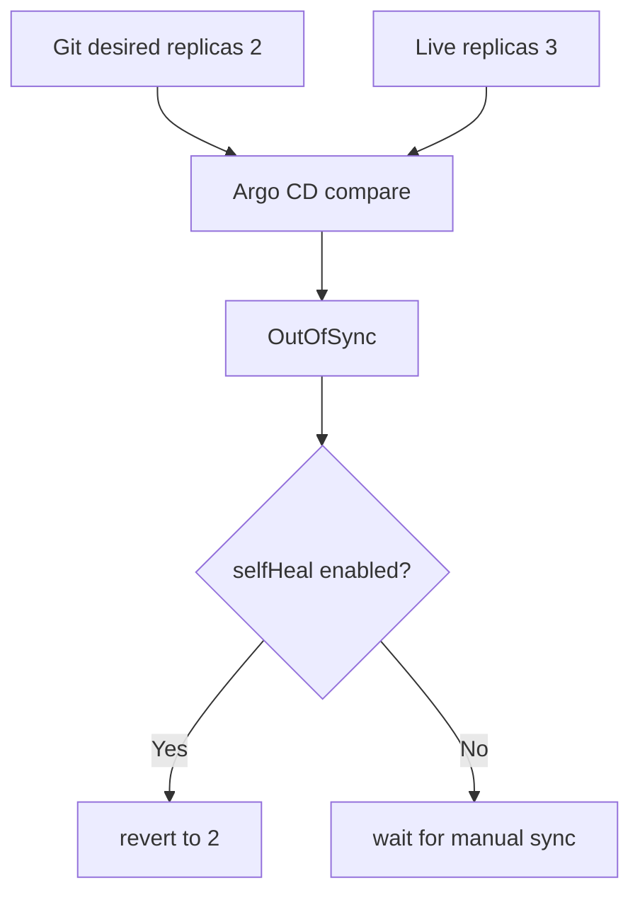

# Render, upgrade and drift lab

> Lab level: render stage is **Local**, install·upgrade is **Local Kubernetes**. There is no push to a public registry and there are no AWS costs.

## Lab prerequisites

- **Tool**: `helm version` and `kubectl version --client` should succeed.
- **cluster**: To reach the install stage, a disposable local Kubernetes such as kind or minikube is required. If there is no cluster, it only proceeds to the render stage.
- **Check current target**: Make sure it is not an operating cluster with `kubectl config current-context`.
- **directory**: Start from an empty lab directory. `helm create` creates the entire `sample-api/`.
- **Observation order**: Proceed in the following order: chart inspection → final YAML creation → Kubernetes format inspection → actual installation.
- **Cleanup target**: Helm release, `infra-study` namespace, `sample-api/` directory and `rendered.yaml`.

At first, you only need to run up to `helm lint` and `helm template`. When you can find the image and replica number directly in the generated YAML, proceed to cluster installation.

## Understand the model first

This lab checks the same chart in four steps. Lint finds basic errors in the chart itself, and template shows the final YAML with values ​​applied. Kubernetes dry-run checks the API format and some admission conditions, and the actual install checks whether the controller creates a Pod and reaches readiness. Previous steps do not guarantee the success of later steps.

| gate | meaning of success | What you don't know yet |
|---|---|---|
| `helm lint` | Passed chart convention/some template inspection | All results for specific values |
| `helm template` | Create the desired YAML | Whether to accept cluster API/admission |
| client dry-run | Local schema processing possible | server CRD·policy·quota |
| install/upgrade | release action completed | User requests and external dependencies are normal |
| rollout check | Achieve controller readiness | SLO and business results |

Rather than just writing “success” after each command, write down what you learned and what you still don’t know.

## 1. Chart creation and minimization

```bash
helm create sample-api
find sample-api -maxdepth 2 -type f | sort
```

Templates that are not needed for learning are removed, leaving only Deployment and Service. Before deleting, check which object disappears with `helm template`.

The image of `values.yaml` is designed to receive a verified digest rather than a mutable tag.

```yaml
replicaCount: 1
image:
  repository: nginx
  digest: sha256:replace-with-a-reviewed-digest
service:
  port: 80
```

The template explicitly combines repository and digest.

```yaml
image: "{{ .Values.image.repository }}@{{ .Values.image.digest }}"
```

## 2. Render gate

```bash
helm lint sample-api
helm template sample-api sample-api \
  --namespace infra-study \
  --values sample-api/values.yaml \
  > rendered.yaml
kubectl apply --dry-run=client -f rendered.yaml
```

`helm lint` checks chart conventions and some errors, and `helm template` shows the final YAML. Client dry-run does not guarantee cluster admission·CRD·version compatibility. Add server-side dry-run or disposable cluster verification at the production gate.

## 3. Install, upgrade and rollback

After inserting the verified digest, run it on the local cluster.

```bash
kubectl create namespace infra-study
helm upgrade --install sample-api sample-api \
  --namespace infra-study \
  --wait --timeout 3m
helm list -n infra-study
helm history sample-api -n infra-study
kubectl get deployment,pod,service -n infra-study
```

Change the replica number to 2, upgrade, and check rollout.

```bash
helm upgrade sample-api sample-api -n infra-study --set replicaCount=2 --wait
kubectl rollout status deployment/sample-api -n infra-study
helm history sample-api -n infra-study
```

When upgrading to an intentionally incorrect image digest, check the effects of `--atomic` and timeout through a separate local experiment. After failure, release revision, Pod event, and actual deployment image are recorded.

```bash
helm rollback sample-api 1 -n infra-study --wait
kubectl rollout status deployment/sample-api -n infra-study
```

Rollback success judgment includes not only Helm status but also workload readiness and request success.

## 4. GitOps drift thought experiment

Assume that you directly scaled the deployment managed by Argo CD.

```bash
kubectl scale deployment/sample-api -n infra-study --replicas=3
```



Organizations that need urgent action can set change TTL, approval, and Git reflection procedures instead of turning off self-heal. The important thing is not to hide drift and to decide who will reflect on the target state and when.

## Cleanup

```bash
helm uninstall sample-api -n infra-study
kubectl delete namespace infra-study
rm -f rendered.yaml
```

If a CRD or cluster-scoped resource was in the chart, it will not be cleaned up just by deleting the namespace. It is not included in this lab chart.

## How to interpret the results

First find the image, replica, label selector, and service port in the `helm template` results. Even if the chart source is complex, what the cluster receives is this manifest. If you don't see the expected value, fix the values ​​precedence and template reference before examining the cluster.

The fact that a new revision has been created in `helm history` means that the release record has been updated. If `kubectl rollout status` fails, check Pod event, image pull, probe and quota. Even if `--atomic` performed a rollback, it is separate from whether external database migration or hook side effects have returned to their original state.

If Argo CD shows `OutOfSync`, compare has found drift. Even if the replica returns with self-healing, the operating path is not closed unless the reason for the emergency change is recorded in Git and the incident record.

## Explain it in your own words

1. `helm lint`, what does client dry-run and actual cluster admission fail to capture?
2. Why can external DB migration remain even after Helm rollback?
3. Why should auto-sync, prune and self-heal be reviewed independently?

<!-- source: https://helm.sh/docs/helm/helm_lint/ | checked: 2026-09-03 | docs-version: Helm 4.2.4 -->
<!-- source: https://helm.sh/docs/helm/helm_template/ | checked: 2026-09-03 | docs-version: Helm 4.2.4 -->
<!-- source: https://helm.sh/docs/helm/helm_upgrade/ | checked: 2026-09-03 | docs-version: Helm 4.2.4 -->
<!-- source: https://helm.sh/docs/helm/helm_rollback/ | checked: 2026-09-03 | docs-version: Helm 4.2.4 -->
<!-- source: https://argo-cd.readthedocs.io/en/stable/user-guide/auto_sync/ | checked: 2026-09-03 -->
