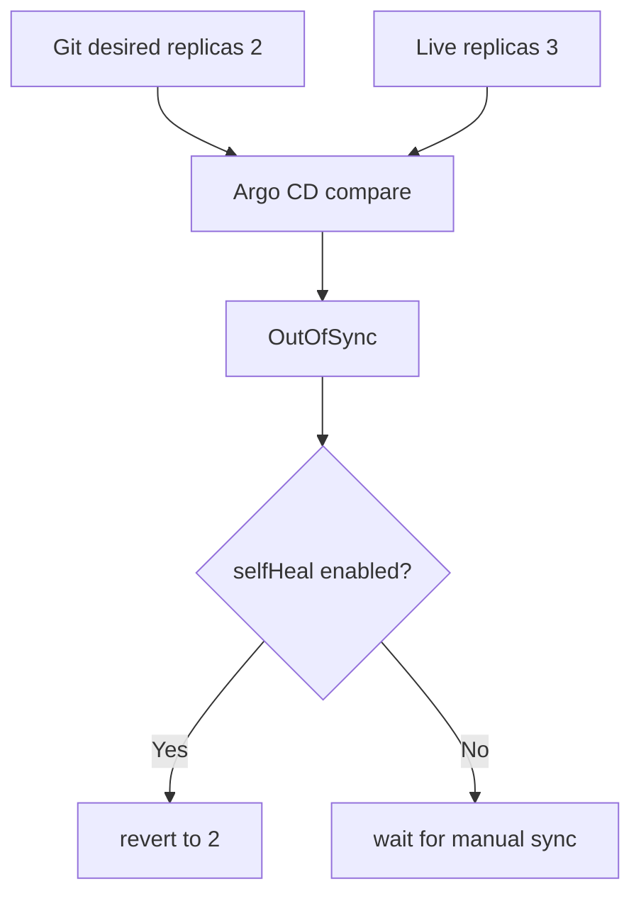

# Render, upgrade and drift lab

> Lab level: render stage is **Local**, install·upgrade is **Local Kubernetes**. There is no push to a public registry and there are no AWS costs.

## Lab prerequisites

- **Tool**: `helm version` and `kubectl version --client` should succeed.
- **cluster**: To reach the install stage, a disposable local Kubernetes such as kind or minikube is required. If there is no cluster, it only proceeds to the render stage.
- **Check current target**: Make sure it is not an operating cluster with `kubectl config current-context`.
- **directory**: Start from an empty lab directory and create the four files below. These templates do not depend on scaffold helpers.
- **Observation order**: Proceed in the following order: chart inspection → final YAML creation → Kubernetes format inspection → actual installation.
- **Cleanup target**: Helm release, `infra-study` namespace, `sample-api/` directory and `rendered.yaml`.

At first, you only need to run up to `helm lint` and `helm template`. When you can find the image and replica number directly in the generated YAML, proceed to cluster installation.

## Understand the model first

This lab checks the same chart in four steps. Lint finds basic errors in the chart itself, and template shows the final YAML with values ​​applied. Kubernetes dry-run checks the API format and some admission conditions, and the actual install checks whether the controller creates a Pod and reaches readiness. Previous steps do not guarantee the success of later steps.

| gate | meaning of success | What you don't know yet |
|---|---|---|
| `helm lint` | Passed chart convention/some template inspection | All results for specific values |
| `helm template` | Create the desired YAML | Whether to accept cluster API/admission |
| client dry-run | Local schema processing possible | server CRD·policy·quota |
| install/upgrade | release action completed | User requests and external dependencies are normal |
| rollout check | Achieve controller readiness | SLO and business results |

Rather than just writing “success” after each command, write down what you learned and what you still don’t know.

## 1. Chart creation and minimization

Create `sample-api/templates/`. Save this as `sample-api/Chart.yaml`:

```yaml
apiVersion: v2
name: sample-api
type: application
version: 0.1.0
```

Save this as `sample-api/values.yaml`. The zero digest is a render-only fixture: it has the correct shape but does not identify a runnable image. Before installation, replace it with a reviewed nginx digest available for your cluster architecture.

```yaml
replicaCount: 1
image:
  repository: nginx
  digest: sha256:0000000000000000000000000000000000000000000000000000000000000000
service:
  port: 80
```

Save this as `sample-api/templates/deployment.yaml`:

```yaml
apiVersion: apps/v1
kind: Deployment
metadata:
  name: {{ .Release.Name }}
spec:
  replicas: {{ .Values.replicaCount }}
  selector:
    matchLabels:
      app.kubernetes.io/instance: {{ .Release.Name }}
  template:
    metadata:
      labels:
        app.kubernetes.io/instance: {{ .Release.Name }}
    spec:
      containers:
        - name: http
          image: "{{ .Values.image.repository }}@{{ required "image.digest is required" .Values.image.digest }}"
          ports:
            - name: http
              containerPort: 80
          readinessProbe:
            httpGet:
              path: /
              port: http
          resources:
            requests:
              cpu: 50m
              memory: 32Mi
            limits:
              memory: 128Mi
```

Save this as `sample-api/templates/service.yaml`:

```yaml
apiVersion: v1
kind: Service
metadata:
  name: {{ .Release.Name }}
spec:
  selector:
    app.kubernetes.io/instance: {{ .Release.Name }}
  ports:
    - port: {{ .Values.service.port }}
      targetPort: http
```

## 2. Render gate

```bash
helm lint sample-api
helm template sample-api sample-api \
  --namespace infra-study \
  --values sample-api/values.yaml \
  > rendered.yaml
```

`helm lint` and `helm template` can run without a cluster for this chart. Confirm exactly one Deployment and one Service, matching selectors, and the expected image and replica count. Render again with `--set replicaCount=2` and compare the manifests. Optionally save the values schema from the preceding chapter as `sample-api/values.schema.json`; `--set replicaCount=0` must then fail schema validation.

After selecting the disposable cluster, run `kubectl apply --dry-run=server -n infra-study -f rendered.yaml` once the namespace exists. Even client dry-run can need API discovery; it is not an offline proof of admission compatibility. A dry-run does not pull the image or prove readiness.

## 3. Install, upgrade and rollback

After inserting the verified digest, run it on the local cluster.

```bash
kubectl create namespace infra-study
helm upgrade --install sample-api sample-api \
  --namespace infra-study \
  --wait=watcher --timeout 3m
helm list -n infra-study
helm history sample-api -n infra-study
kubectl get deployment,pod,service -n infra-study
```

Change the replica number to 2, upgrade, and check rollout.

```bash
helm upgrade sample-api sample-api -n infra-study --set replicaCount=2 --wait=watcher --timeout 3m
kubectl rollout status deployment/sample-api -n infra-study
helm history sample-api -n infra-study
```

For Helm 4, repeat the upgrade with the render-only zero digest, `--rollback-on-failure`, and `--timeout 1m`. Record the nonzero command exit, failed revision, Pod events, and recovered deployment image. Helm 3 uses `--atomic`; select the flag from your installed major version's help. Neither option reverses external database writes performed by a hook.

```bash
helm rollback sample-api 1 -n infra-study --wait=watcher --timeout 3m
kubectl rollout status deployment/sample-api -n infra-study
```

Rollback success judgment includes not only Helm status but also workload readiness and request success.

## 4. GitOps drift thought experiment

This is a separate thought experiment: the Helm CLI lab above has not installed Argo CD or created an Application. In an Argo CD-owned example, assume Git declares two replicas and you directly scale its Deployment. Do not enroll the CLI-managed lab resources under a second lifecycle owner.

```bash
kubectl scale deployment/sample-api -n infra-study --replicas=3
```



Organizations that need urgent action can set change TTL, approval, and Git reflection procedures instead of turning off self-heal. The important thing is not to hide drift and to decide who will reflect on the target state and when.

## Cleanup

```bash
helm uninstall sample-api -n infra-study
kubectl delete namespace infra-study
rm -f rendered.yaml
```

If a CRD or cluster-scoped resource was in the chart, it will not be cleaned up just by deleting the namespace. It is not included in this lab chart.

## Example results

Expected excerpts; the render stage needs no cluster. Release revisions below assume a fresh release and successful installation with a real image digest.

```text
# helm lint sample-api
1 chart(s) linted, 0 chart(s) failed
# helm template ... --set replicaCount=2
kind: Deployment
...
  replicas: 2
...
kind: Service
# Optional schema, replicaCount=0
- at '/replicaCount': minimum: got 0, want 1
# Live rollout with a valid digest
deployment "sample-api" successfully rolled out
```

A fresh install starts at revision 1 and the successful replica upgrade creates revision 2. A rollback creates another revision; it does not erase history. The zero-digest upgrade should exit nonzero. Require the restored image, ready replicas, and a successful request before recording recovery; rendering the zero digest successfully is expected and proves no image availability.

## How to interpret the results

First find the image, replica, label selector, and service port in the `helm template` results. Even if the chart source is complex, what the cluster receives is this manifest. If you don't see the expected value, fix the values ​​precedence and template reference before examining the cluster.

The fact that a new revision has been created in `helm history` means that the CLI-managed release record has been updated. If `kubectl rollout status` fails, check Pod events, image pull, probes, and quota. An automatic rollback still requires workload and request verification, plus a separate check of external migration or hook side effects.

If Argo CD shows `OutOfSync`, compare has found drift. Even if the replica returns with self-healing, the operating path is not closed unless the reason for the emergency change is recorded in Git and the incident record.

## Explain it in your own words

1. `helm lint`, what does client dry-run and actual cluster admission fail to capture?
2. Why can external DB migration remain even after Helm rollback?
3. Why should auto-sync, prune and self-heal be reviewed independently?

<!-- source: https://helm.sh/docs/helm/helm_lint/ | checked: 2026-09-03 | docs-version: Helm 4.2.4 -->
<!-- source: https://helm.sh/docs/helm/helm_template/ | checked: 2026-09-03 | docs-version: Helm 4.2.4 -->
<!-- source: https://helm.sh/docs/helm/helm_upgrade/ | checked: 2026-09-03 | docs-version: Helm 4.2.4 -->
<!-- source: https://helm.sh/docs/helm/helm_rollback/ | checked: 2026-09-03 | docs-version: Helm 4.2.4 -->
<!-- source: https://argo-cd.readthedocs.io/en/stable/user-guide/auto_sync/ | checked: 2026-09-03 -->
<!-- source: https://helm.sh/docs/helm/helm_upgrade/ | checked: 2026-09-10 | version-scope: Helm 4 rollback-on-failure and watcher wait -->
