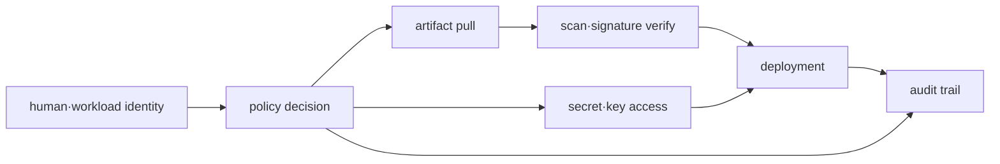

# 인프라 보안 로드맵

## 무엇을 해결하는가

보안은 배포 마지막의 scan 한 번이 아니다. identity가 어떤 권한으로 artifact와 secret을 받아 workload를 실행하고, 그 행위가 어떤 audit evidence로 남는지 수명주기 전체를 연결해야 한다.

## 선수 지식

- AWS account·IAM·STS와 VPC boundary
- Kubernetes ServiceAccount·RBAC·Secret
- image registry와 CI/CD의 기본 흐름

## 학습 순서

1. **Identity·secret·artifact model**: least privilege와 trust boundary를 설계한다.
2. **Allow/deny 검증 실습**: 허용 동작과 명시적 거부를 모두 관찰하고 credential 수명주기를 추적한다.

## 완료 조건

- human, CI와 workload identity를 분리한다.
- policy의 resource·action·condition을 설명하고 deny를 재현한다.
- secret rotation과 signed artifact 검증 실패 시의 차단 지점을 지정한다.

## 범위 밖

독립 Vault 운영, 모든 compliance framework와 penetration testing 과정은 포함하지 않는다.

## 스스로 설명해 보기

1. private subnet만으로 workload가 안전하다고 결론 낼 수 없는 이유는 무엇인가?
2. image scan과 signature verification이 서로 대체되지 않는 이유는 무엇인가?
3. 짧은 수명의 credential도 과도한 권한이면 위험한 이유는 무엇인가?

<!-- source: https://docs.aws.amazon.com/IAM/latest/UserGuide/access_policies.html | checked: 2026-09-03 -->
<!-- source: https://docs.aws.amazon.com/secretsmanager/latest/userguide/intro.html | checked: 2026-09-03 -->
<!-- source: https://slsa.dev/spec/v1.2/ | checked: 2026-09-03 | version: SLSA 1.2 -->
