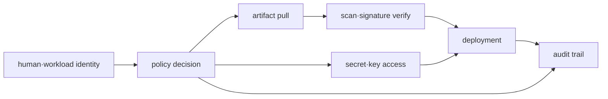

# Infrastructure Security Roadmap

## Starting point for beginners

Just because a program can access a database doesn't mean it needs the authority to delete all data. The first question of security is “Who is it?” and the second question is “What can we do?” This involves managing secret information such as passwords and evidence that the deployment file has not been changed.

| New term | Plain-language meaning |
|---|---|
| identity | Information indicating who the person or program is that sent the request |
| authentication | The process of verifying that the claimed identity is correct |
| authorization | The process of determining whether a confirmed identity can perform a specific task |
| policy | Rules that state which actions will be allowed or denied under what conditions |
| secret information | Values ​​that, if exposed, may allow others to use the privileges |
| artifact | Files resulting from build, such as container image or package to be deployed |

Initially, allow only one read operation and ensure that the other operations are actually denied. Afterwards, secret replacement and image verification are extended to the same life cycle of “who creates it, who uses it, and when is it disposed of?”

## What does it solve

Security is not just one scan at the end of a deployment. The entire life cycle must be connected to determine with what authority the identity receives artifacts and secrets, executes workloads, and what audit evidence that action leaves behind.

## prerequisite knowledge

- AWS account·IAM·STS and VPC boundary
- Kubernetes ServiceAccount·RBAC·Secret
- Basic flow of image registry and CI/CD

## learning sequence

1. **Identity·secret·artifact model**: Design least privilege and trust boundary.
2. **Allow/deny verification lab**: Observe both allow behavior and explicit deny and track the credential life cycle.

## Completion criteria

This topic is not something you read once and then stop. First, convert the terminology table into your own words and follow the flow of requests made in the concepts chapter. In the lab, the normal state is first recorded, then a failure is created by changing only one condition, and the cause is explained with evidence before recovery. Finally, expand to more complex environments by answering the operational judgment questions below.

- Separate human, CI and workload identity.
- Describe the resource·action·condition of the policy and reproduce the deny.
- Specifies the blocking point when secret rotation and signed artifact verification fail.

## out of range

Independent Vault operation, does not include any compliance framework and penetration testing processes.

## Check your understanding

1. What do authentication and authorization each check?
2. Why should we test for write rejections as well as successful read operations?

**Verification criteria:** Authentication confirms who is who, and authorization verifies what that identity can do. When you look at allow and deny together, you can see that the permission boundary is not as wide as expected.

## Develop operational judgment

1. Why can't we conclude that a workload is safe from a private subnet alone?
2. Why aren't image scan and signature verification replaced with each other?
3. Why are short-lived credentials dangerous if they have excessive privileges?

<!-- source: https://docs.aws.amazon.com/IAM/latest/UserGuide/access_policies.html | checked: 2026-09-03 -->
<!-- source: https://docs.aws.amazon.com/secretsmanager/latest/userguide/intro.html | checked: 2026-09-03 -->
<!-- source: https://slsa.dev/spec/v1.2/ | checked: 2026-09-03 | version: SLSA 1.2 -->
