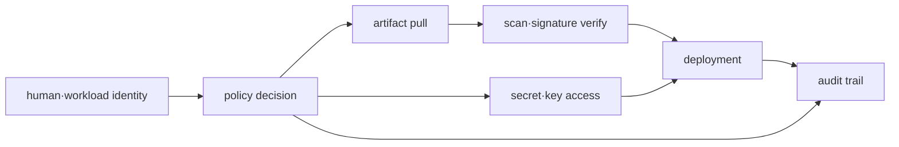

# 인프라 보안 로드맵

## 처음 보는 사람을 위한 출발점

프로그램이 데이터베이스에 접속할 수 있다고 해서 모든 데이터를 삭제할 권한까지 필요한 것은 아니다. 보안의 첫 질문은 “누구인가?”이고 두 번째 질문은 “무엇을 해도 되는가?”다. 여기에 비밀번호 같은 비밀 정보와 배포 파일이 바뀌지 않았다는 증거를 관리하는 일이 이어진다.

| 처음 만나는 말 | 학습용 쉬운 뜻 |
|---|---|
| 신원(identity) | 요청을 보낸 사람이나 프로그램이 누구인지 나타내는 정보 |
| 인증(authentication) | 주장한 신원이 맞는지 확인하는 과정 |
| 인가(authorization) | 확인된 신원이 특정 작업을 해도 되는지 판단하는 과정 |
| 정책(policy) | 어떤 조건에서 어떤 작업을 허용하거나 거부할지 적은 규칙 |
| 비밀 정보(secret) | 노출되면 다른 사람이 권한을 사용할 수 있는 값 |
| 산출물(artifact) | 배포할 container image나 package처럼 빌드 결과로 나온 파일 |

처음에는 읽기 한 작업만 허용하고 다른 작업은 실제로 거부되는지 확인한다. 이후 secret 교체와 image 검증을 같은 “누가 만들고, 누가 사용하며, 언제 폐기하는가”의 수명주기로 확장한다.

## 무엇을 해결하는가

보안은 배포 마지막의 scan 한 번이 아니다. identity가 어떤 권한으로 artifact와 secret을 받아 workload를 실행하고, 그 행위가 어떤 audit evidence로 남는지 수명주기 전체를 연결해야 한다.

## 선수 지식

- AWS account·IAM·STS와 VPC boundary
- Kubernetes ServiceAccount·RBAC·Secret
- image registry와 CI/CD의 기본 흐름

## 학습 순서

1. **Identity·secret·artifact model**: least privilege와 trust boundary를 설계한다.
2. **Allow/deny 검증 실습**: 허용 동작과 명시적 거부를 모두 관찰하고 credential 수명주기를 추적한다.

## 완료 조건

이 주제는 한 번 읽고 끝내지 않는다. 먼저 용어 표를 자신의 말로 바꾸고, 개념 장에서 한 요청의 흐름을 따라간다. 실습에서는 정상 상태를 먼저 기록한 뒤 조건 하나만 바꿔 실패를 만들고, 증거로 원인을 설명한 뒤 복구한다. 마지막으로 아래 운영 판단 질문에 답하면서 더 복잡한 환경으로 확장한다.

- human, CI와 workload identity를 분리한다.
- policy의 resource·action·condition을 설명하고 deny를 재현한다.
- secret rotation과 signed artifact 검증 실패 시의 차단 지점을 지정한다.

## 범위 밖

독립 Vault 운영, 모든 compliance framework와 penetration testing 과정은 포함하지 않는다.

## 처음 이해했는지 확인

1. authentication과 authorization은 각각 무엇을 확인하는가?
2. read 작업이 성공하는 것뿐 아니라 write가 거부되는 것도 시험해야 하는 이유는 무엇인가?

**확인 기준:** 인증은 누구인지, 인가는 그 신원이 무엇을 해도 되는지 확인한다. 허용과 거부를 함께 봐야 권한 경계가 예상보다 넓지 않음을 알 수 있다.

## 운영 판단으로 확장하기

1. private subnet만으로 workload가 안전하다고 결론 낼 수 없는 이유는 무엇인가?
2. image scan과 signature verification이 서로 대체되지 않는 이유는 무엇인가?
3. 짧은 수명의 credential도 과도한 권한이면 위험한 이유는 무엇인가?

<!-- source: https://docs.aws.amazon.com/IAM/latest/UserGuide/access_policies.html | checked: 2026-09-03 -->
<!-- source: https://docs.aws.amazon.com/secretsmanager/latest/userguide/intro.html | checked: 2026-09-03 -->
<!-- source: https://slsa.dev/spec/v1.2/ | checked: 2026-09-03 | version: SLSA 1.2 -->
