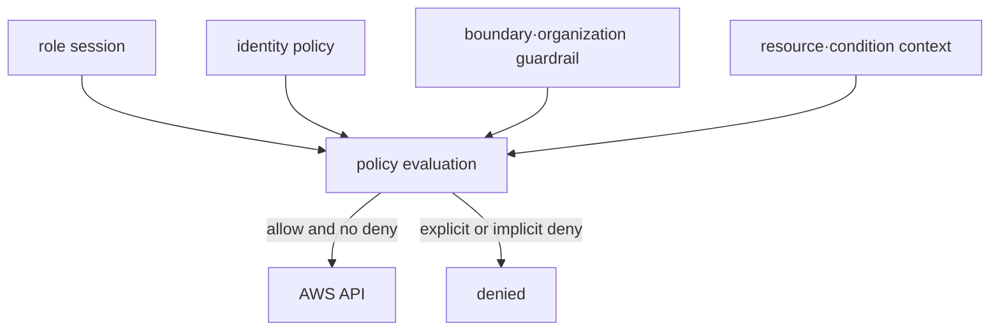
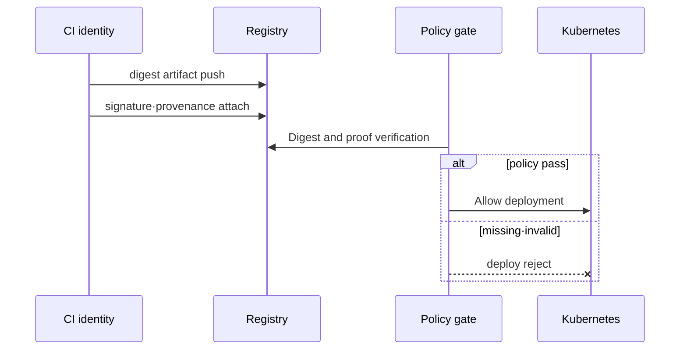

# Identity, secret and artifact trust model

## Terms introduced in this chapter

- **least privilege**: This is the principle of giving only the minimum privileges necessary for a task and disallowing any tasks that are not necessary. **Why it matters / when to use it:** Limit the damage a compromised or mistaken identity can cause. **Concrete situation (illustrative):** A reporting job can also delete production data. → Reduce its permissions to required reads. → Verify reporting succeeds while deletion is denied.
- **temporary credential**: Temporary login information that becomes unusable after a certain period of time. **Why it matters / when to use it:** Reduce the period during which a leaked credential can be reused. **Concrete situation (illustrative):** A short CI job uses a permanent cloud key. → Replace it with a scoped temporary credential. → Verify expiry and the next job's renewal path.
- **encryption key**: This is a secret value used when converting data into an unreadable form and restoring it. **Why it matters / when to use it:** Control who can decrypt protected data and manage that access separately from storage access. **Concrete situation (illustrative):** A workload reads encrypted storage but cannot decrypt its data. → Inspect the relevant key permissions. → Verify authorized decryption without broadening unrelated access.
- **rotation**: The process of replacing a secret or key with a new value and safely discarding the old value. **Why it matters / when to use it:** Replace exposed or aging credentials while verifying consumers can use the new value. **Concrete situation (illustrative):** A database credential must be replaced while clients stay online. → Switch consumers using a reviewed rotation sequence. → Confirm new authentication and retirement of the old value.
- **digest**: A fixed length value calculated from the file contents. Used when comparing whether content has changed. **Why it matters / when to use it:** Identify exact content and detect mismatches; authenticity still requires a trusted reference. **Concrete situation (illustrative):** Two downloaded packages have the same filename. → Compare their digests with a trusted release reference. → Reject the unexpected content identity.
- **provenance**: A provenance record that shows which source and build process the artifact was created from. **Why it matters / when to use it:** Trace a deployable artifact to its source and build process before trusting its origin. **Concrete situation (illustrative):** A deployment receives an image whose origin is unclear. → Inspect verified provenance linking it to source and build identity. → Check the artifact digest and trusted builder policy before accepting it.

Initially, allow only one action to a subject and ensure that other actions are denied. We then expand the scope to the entire life cycle of how identities, secrets, and artifacts are created, used, and disposed of.

## Understand the model first

Let's consider the flow in which a deployed Pod reads an S3 object and connects to a database. The Pod first proves what workload identity it has, and IAM determines whether that identity can read a specific object. The application must receive the secret value and authenticate it to the database, and it must be verified whether the image being executed is the exact artifact created by the CI. Afterwards, an audit trail must remain to determine who made what changes and what access.

| question | concept in charge | What happens when a failure occurs? |
|---|---|---|
| Who is it? | authentication, role session, workload identity | No credential, expiration, issuer mismatch |
| What can I do? | Authorization and policy evaluation | explicit/implicit deny |
| How are sensitive values ​​communicated? | secret store, encryption, rotation | Old version·Overexposure |
| Can I trust the executable file? | digest, scan, signature, provenance | Block unverified artifacts |
| Can you explain later? | audit log and change history | actor·resource·decision untraceable |

In this path, encryption alone does not solve all problems. An encrypted secret is overprivileged if too many principals can decrypt it, and a signed image may also contain vulnerable dependencies. Each control answers a different question.

## Walking through a deployment request step by step

1. Developers or CIs prove their identity with credentials.
2. The policy engine determines whether image upload or deployment action is allowed for the principal.
3. Build creates an artifact from the source and leaves behind a digest and provenance.
4. Check whether it is an artifact of the builder allowed by the deployment gate and whether it passes the vulnerability/signature policy.
5. The workload reads only the secrets needed during execution as temporary identities.
6. Deployment and secret access results remain in the audit trail.
7. When a credential, secret, or artifact expires or is replaced, the previous object is discontinued and discarded.

One level of success does not guarantee total trust. Even if you successfully log in, you may not have deployment permissions, and even if the signature is correct, it does not mean that there are no known vulnerabilities in the image.

## Divide Authentication and Authorization

The temporary credential issued by AWS STS represents identity and session context. Actual permission is determined by a combination of evaluation factors such as identity policy, resource policy, permissions boundary, organization policy, and explicit deny.

Least privilege is not a “small policy,” but rather a process of narrowing down the necessary actions, resources, and conditions to the actual calls of the workload and reviewing them over time. Do not reuse human, CI, and runtime roles.

## Boundary between secret and key

- KMS keys provide cryptographic operations and access policies. The application password itself is not arbitrarily stored in KMS metadata.
- Secrets Manager manages secret value, version and rotation workflow.
- Kubernetes Secret is not a vault that basically guarantees confidential storage itself. Review API·etcd encryption, RBAC, external secret delivery, and Pod exposure paths together.
- Rotation includes not only the creation of new values, but also consumer switching, discarding old values, and rollback on failure.

## Artifact provenance

The scan finds known vulnerabilities and configuration issues, but does not verify build identity. SBOM is an inventory of included components, but does not guarantee safety. Signature and provenance provide evidence to verify that the artifact was created according to the expected builder and workflow.

It is easy to connect verified bytes and execution bytes by using digest as the deployment identity rather than mutable tag.

## Audit trail

It records who accessed, through what session, what resource, and through what decision. It does not leave secret values ​​in the application log, and denials and policy changes are also sent to the central audit flow. Log preservation and access itself are separate rights.

## Explain it in your own words

1. Why can a request be rejected even if IAM policy contains `Allow`?
2. Why does the decision to complete secret rotation include discarding previous credentials?
3. What questions do SBOM, scan, signature, and provenance each answer?

<!-- source: https://docs.aws.amazon.com/IAM/latest/UserGuide/reference_policies_evaluation-logic.html | checked: 2026-09-03 -->
<!-- source: https://docs.aws.amazon.com/kms/latest/developerguide/overview.html | checked: 2026-09-03 -->
<!-- source: https://docs.aws.amazon.com/secretsmanager/latest/userguide/intro.html | checked: 2026-09-03 -->
<!-- source: https://docs.aws.amazon.com/AmazonECR/latest/userguide/image-scanning.html | checked: 2026-09-03 -->
<!-- source: https://docs.sigstore.dev/cosign/verifying/verify/ | checked: 2026-09-03 -->
