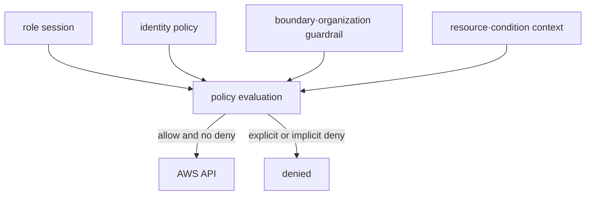
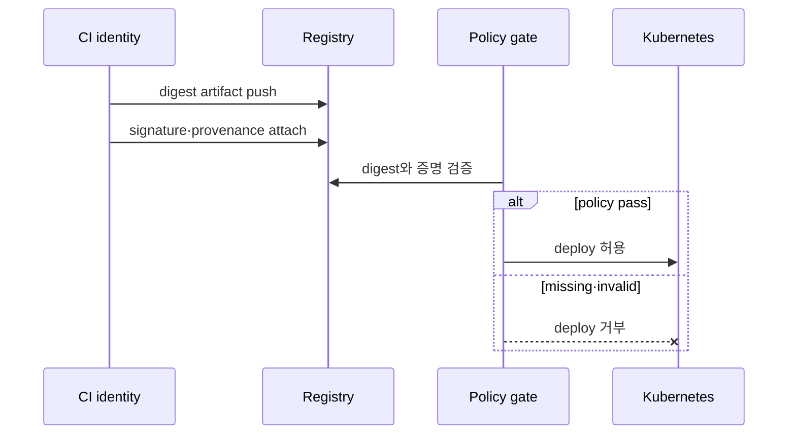

# Identity, secret과 artifact trust model

## Authentication과 authorization을 나눈다

AWS STS가 발급한 temporary credential은 identity와 session context를 나타낸다. 실제 허용 여부는 identity policy, resource policy, permissions boundary, organization policy와 explicit deny 같은 평가 요소의 결합으로 결정된다.

least privilege는 “작은 policy”가 아니라 필요한 action, resource와 condition을 workload의 실제 call로 좁히고 시간이 지나도 검토하는 과정이다. human, CI와 runtime role을 재사용하지 않는다.

## Secret과 key의 경계

- KMS key는 cryptographic operation과 access policy를 제공한다. 애플리케이션 password 자체를 임의로 KMS metadata에 저장하지 않는다.
- Secrets Manager는 secret value, version과 rotation workflow를 관리한다.
- Kubernetes Secret은 기본적으로 confidential storage 자체를 보장하는 vault가 아니다. API·etcd encryption, RBAC, external secret delivery와 Pod 노출 경로를 함께 검토한다.
- rotation은 새 값 생성만이 아니라 consumer 전환, 이전 값 폐기와 실패 rollback까지 포함한다.

## Artifact provenance

scan은 알려진 취약점과 설정 문제를 찾지만 build identity를 증명하지 않는다. SBOM은 포함 component의 inventory지만 안전성을 보증하지 않는다. signature와 provenance는 artifact가 기대한 builder와 workflow에서 생성됐는지 검증하는 근거를 제공한다.

mutable tag가 아니라 digest를 deployment identity로 사용해야 검증한 bytes와 실행할 bytes를 연결하기 쉽다.

## Audit trail

누가, 어떤 session으로, 어떤 resource에, 어떤 결정을 거쳐 접근했는지 기록한다. application log에 secret 값을 남기지 않고, denial과 policy change도 중앙 audit 흐름으로 보낸다. 로그 보존과 접근 자체도 별도 권한이다.

## 스스로 설명해 보기

1. IAM policy에 `Allow`가 있어도 요청이 거부될 수 있는 이유는 무엇인가?
2. secret rotation 완료 판정에 이전 credential 폐기가 포함되는 이유는 무엇인가?
3. SBOM, scan, signature와 provenance가 각각 답하는 질문은 무엇인가?

<!-- source: https://docs.aws.amazon.com/IAM/latest/UserGuide/reference_policies_evaluation-logic.html | checked: 2026-09-03 -->
<!-- source: https://docs.aws.amazon.com/kms/latest/developerguide/overview.html | checked: 2026-09-03 -->
<!-- source: https://docs.aws.amazon.com/secretsmanager/latest/userguide/intro.html | checked: 2026-09-03 -->
<!-- source: https://docs.aws.amazon.com/AmazonECR/latest/userguide/image-scanning.html | checked: 2026-09-03 -->
<!-- source: https://docs.sigstore.dev/cosign/verifying/verify/ | checked: 2026-09-03 -->
