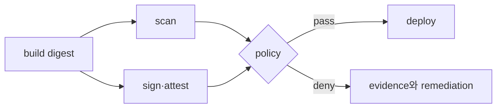

# Allow·deny와 artifact 수명주기 실습

> 실습 등급: policy 검토는 **Local/Plan only**, AWS API 검증은 **AWS optional**이다. temporary role과 격리된 test resource만 사용하며 secret 값과 account ID를 기록하지 않는다.

## 1. 최소 policy 설계

특정 prefix의 object read만 허용하는 예다. bucket 이름은 별도 variable로 주입한다.

```json
{
  "Version": "2012-10-17",
  "Statement": [
    {
      "Effect": "Allow",
      "Action": ["s3:GetObject"],
      "Resource": "arn:aws:s3:::replace-study-bucket/releases/*"
    }
  ]
}
```

검토 질문은 “무엇이 허용되는가”와 “무엇이 허용되지 않아야 하는가”를 쌍으로 만든다.

| request | 예상 |
|---|---|
| `releases/app.tar` read | allow |
| 같은 bucket의 `private/key` read | deny |
| object write·delete | deny |
| 다른 bucket read | deny |

## 2. Policy simulation과 실제 deny

권한이 있다면 IAM policy simulator로 먼저 확인한다. 실제 API 시험은 전용 role session에서 수행한다.

```bash
aws sts get-caller-identity
aws s3api head-object \
  --bucket replace-study-bucket \
  --key releases/app.tar
aws s3api put-object \
  --bucket replace-study-bucket \
  --key releases/denied.txt \
  --body denied.txt
```

두 번째 write는 실패가 기대 결과다. terminal output에는 account identity, bucket name 또는 request metadata가 포함될 수 있으므로 공개 artifact에 복사하지 않는다. 예상한 deny와 credential 오류를 혼동하지 말고 error code와 CloudTrail event를 함께 본다.

## 3. Artifact gate 사고 실험

```bash
cosign verify \
  --certificate-identity replace-with-workflow-identity \
  --certificate-oidc-issuer replace-with-issuer \
  registry.example.invalid/sample@sha256:replace-with-digest
```

`.invalid` 주소는 실행용 registry가 아니다. 실제 조직 registry에서는 다음 경우를 각각 시험한다.

- 올바른 digest와 기대한 workflow identity: 통과
- 같은 tag가 가리키는 다른 digest: 거부
- signature 없음 또는 다른 issuer: 거부
- scan policy가 정한 심각도 초과: 별도 gate에서 거부



## 4. Secret rotation 완료 기준

1. 새 secret version을 생성한다.
2. canary consumer가 새 version으로 인증하는지 확인한다.
3. 모든 consumer를 전환하고 authentication error를 관측한다.
4. 이전 version을 비활성화하거나 폐기한다.
5. rollback window와 audit receipt를 닫는다.

AWS optional resource를 만들었다면 test object, bucket, role·policy, CloudTrail 보관 범위를 inventory와 역순으로 정리한다. audit 보존 정책 때문에 즉시 삭제하지 않는 로그가 있다면 명시한다.

## 스스로 설명해 보기

1. 예상한 AccessDenied와 잘못된 credential을 어떤 증거로 구분하는가?
2. tag를 검증하고 digest를 배포하지 않으면 어떤 race가 생길 수 있는가?
3. 새 secret이 동작한다는 사실만으로 rotation이 끝나지 않은 이유는 무엇인가?

<!-- source: https://docs.aws.amazon.com/IAM/latest/UserGuide/access_policies_testing-policies.html | checked: 2026-09-03 -->
<!-- source: https://docs.aws.amazon.com/cli/latest/reference/sts/get-caller-identity.html | checked: 2026-09-03 -->
<!-- source: https://docs.sigstore.dev/cosign/verifying/verify/ | checked: 2026-09-03 -->
<!-- source: https://docs.aws.amazon.com/secretsmanager/latest/userguide/rotating-secrets.html | checked: 2026-09-03 -->
