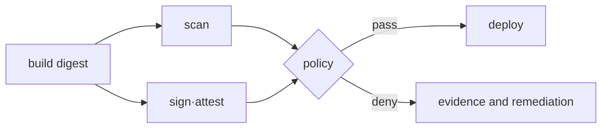

# Allow·deny and artifact life cycle lab

<!-- source: https://docs.aws.amazon.com/awscloudtrail/latest/userguide/logging-data-events-with-cloudtrail.html | checked: 2026-09-10 | object-level audit coverage is not enabled by default -->

> Lab level: Policy review is **Local/Plan only**, AWS API verification is **AWS optional**. Only temporary roles and isolated test resources are used, and secret values ​​and account IDs are not recorded.

## Lab prerequisites

- **First step**: Without AWS, read whether `Action`, `Resource`, and `Condition` in the JSON policy mean action, target, and condition, respectively.
- **AWS selection step**: Use a dedicated test bucket·prefix and temporary role. The default roles of operational buckets or people are not used.
- **Test pair**: Write down one read that should be allowed and one write that should be rejected before execution.
- **Safety Conditions**: Enter only temporary strings that can be made public in the test object and do not use actual secrets or customer data.
- **Record**: Leaves not only success/failure but also caller, action, resource, and policy scope involved in the decision.
- **Cleanup target**: test object, bucket, temporary role·policy, and local verification artifact.

An expected rejection in the security lab is a successful observation. Instead of adding the `*` permission right away to eliminate the error, first check which boundary denied the request.

## Understand the model first

Least privilege is not a test that only checks that one permitted operation succeeds. The policy boundary can be confirmed only when the intended read succeeds and adjacent prefix reads, writes, and deletes fail. You can detect wildcards or incorrect resource ARNs by testing allow and deny pairs.

In IAM, **implicit deny** is the default result that does not correspond to any Allow. **explicit deny** is when the identity/resource policy or upper guardrail explicitly denies it and takes precedence over Allow. Because AccessDenied alone does not know which layer made the decision, caller, action, resource, and evaluation context are collected.

| test | expected results | checking boundaries |
|---|---|---|
| release object read | allow | Required work actions |
| private prefix read | deny | resource scope |
| object write/delete | deny | action scope |
| Different role session | deny | principal·trust scope |
| Incorrectly signed digest | deploy deny | artifact identity |
| previous credential at its target service | deny after revocation | credential lifetime |

## 1. Minimum policy design

This is an example of only allowing reading of objects with a specific prefix. The bucket name is injected as a separate variable.

```json
{
  "Version": "2012-10-17",
  "Statement": [
    {
      "Effect": "Allow",
      "Action": ["s3:GetObject"],
      "Resource": "arn:aws:s3:::replace-study-bucket/releases/*"
    }
  ]
}
```

Review questions pair “what is acceptable” with “what should not be acceptable.”

| request | expectation |
|---|---|
| `releases/app.tar` read | allow |
| Read `private/key` from the same bucket | deny |
| object write·delete | deny |
| read another bucket | deny |

## 2. Policy simulation and actual deny

If you have permission, check first with the IAM policy simulator. Actual API testing is performed in a dedicated role session.

```bash
aws sts get-caller-identity
aws s3api head-object \
  --bucket replace-study-bucket \
  --key releases/app.tar
printf 'public lab fixture\n' > denied.txt
aws s3api put-object \
  --bucket replace-study-bucket \
  --key releases/denied.txt \
  --body denied.txt
```

Create the harmless `denied.txt` fixture only in an empty lab directory. A missing local file is not evidence of IAM denial. The write must reach S3 and return the expected authorization error; successful STS identity lookup alone proves no S3 permission. CloudTrail object-level events require data-event logging and are not in default event history. Record the error and configured audit coverage without publishing account metadata.

## 3. Artifact gate thought experiment

```bash
cosign verify \
  --certificate-identity replace-with-workflow-identity \
  --certificate-oidc-issuer replace-with-issuer \
  registry.example.invalid/sample@sha256:replace-with-digest
```

The address `.invalid` is not a registry for execution. The actual organizational registry tests each of the following cases:

- Correct digest and expected workflow identity: Passed
- Other digests pointed to by the same tag: Rejected
- No signature or other issuer: Reject
- Severity determined by scan policy exceeded: Rejected at a separate gate



## 4. Secret rotation completion criteria

1. Create a new secret version.
2. Check whether the canary consumer authenticates with the new version.
3. Switch all consumers and observe authentication errors.
4. Revoke the previous credential at its target service and verify that authentication with it fails. Moving a Secrets Manager version label does not itself revoke a database password, and authorized retrieval of an old stored version is a separate policy question.
5. Close the rollback window and audit receipt.

If you created an AWS optional resource, organize the test object, bucket, role·policy, and CloudTrail storage range in reverse order from inventory. Specify if there are logs that are not deleted immediately due to the audit retention policy.

## Example results

Illustrative AWS excerpts using the isolated read-only test role; these are not live authorization receipts.

```text
# head-object on the allowed, pre-created releases object (selected fields)
ContentLength: 19
ContentType: text/plain
# Write of the locally created denied.txt
An error occurred (AccessDenied) when calling the PutObject operation
# After actual target-service credential revocation
authentication rejected
```

The first two lines summarize fields from the JSON response; the actual size and content type depend on the pre-created fixture. A successful HEAD proves metadata access, not a downloaded body. A missing local upload file or a missing source object does not prove an IAM deny. The last line is a semantic outcome to record from your target service, not literal AWS CLI text: changing a secret's version label alone does not revoke the old credential.

## How to interpret the results

If expected read fails, wildcard permission is not immediately applied. Check whether the caller is the expected role, whether the object ARN is correct, and whether there are other layers such as bucket policy, KMS key policy, and organization guardrail. Conversely, if write succeeds, the test fails. Rather than “the command was successful,” the criterion for judgment is whether the policy’s intended boundary was maintained.

Successful Cosign verification means that the downloaded digest satisfies the expected signature conditions of the identity/issuer. This does not mean that there are no vulnerabilities in the image or that the runtime settings are safe. The scan, provenance policy, and admission results are connected through separate gates.

Rotation requires both new credential success and old credential failure. If the old value continues to operate, the risk window of the exposed credential has not been closed, and if some consumers are caching the previous value, a failure may occur at the moment of discard.

## Explain it in your own words

1. What evidence distinguishes an expected AccessDenied from an incorrect credential?
2. What races can occur if you don't verify tags and deploy digests?
3. Why doesn't the rotation end just because the new secret is running?

<!-- source: https://docs.aws.amazon.com/IAM/latest/UserGuide/access_policies_testing-policies.html | checked: 2026-09-03 -->
<!-- source: https://docs.aws.amazon.com/cli/latest/reference/sts/get-caller-identity.html | checked: 2026-09-03 -->
<!-- source: https://docs.sigstore.dev/cosign/verifying/verify/ | checked: 2026-09-03 -->
<!-- source: https://docs.aws.amazon.com/secretsmanager/latest/userguide/rotating-secrets.html | checked: 2026-09-03 -->
