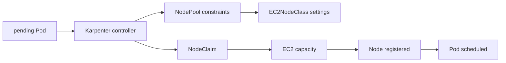

# Karpenter Advanced Roadmap

## Starting point for beginners

If a Pod is created in Kubernetes, but the Node to run it does not have enough CPU or memory, the Pod cannot be deployed and goes into a waiting state, `Pending`. People can add EC2 servers, but it is difficult to manually adjust them as requests suddenly increase or decrease. Karpenter reads the requests of waiting Pods and prepares Nodes by selecting appropriate AWS EC2 resources.

| New term | Plain-language meaning | Why it matters / when to use it |
|---|---|---|
| Pod | A bundle of containers that Kubernetes runs and manages together | Give tightly coupled containers a shared scheduling and lifecycle boundary. |
| Node | The server where the pods actually run | Locate the compute capacity and host failures that determine whether workloads can run. |
| scheduler | Kubernetes component that determines which Pods to place on which Node | Place pending Pods on eligible Nodes according to declared resources and constraints. |
| request | Amount of CPU and memory declared needed for the Pod to run | Give placement and capacity planning a declared resource requirement instead of an implicit guess. |
| NodePool | Common conditions and limits of nodes that Karpenter can create | Bound which Nodes Karpenter may create so provisioning follows operational policy. |
| NodeClaim | Karpenter's specific request for one specific Node | Trace one provisioning attempt from its requested capacity through the resulting Node. |
| disruption | The process of safely emptying and destroying running nodes for replacement, integration, expiration, etc. | Replace or remove Nodes through a controlled drain process that respects workload availability. |

This course is conducted after learning Kubernetes scheduling and AWS basics. At first, we follow only one path, `Pod waits → create a Node request → launch EC2 → run the Pod`, and then learn the impact of removing nodes to reduce costs on the service.

## Why is this course only in-depth?

Karpenter directly connects pending Pod scheduling needs to AWS compute capacity selection. Kubernetes scheduler, EKS, IAM, EC2 capacity, cost, and disruption must all be understood and dealt with, so they are separated from the basic process.

## prerequisite knowledge

- [requests, affinity, taint and topology of Kubernetes scheduling](../kubernetes/07-scheduling-and-autoscaling.md)
- AWS IAM, subnet/security group, EC2 purchase options and EKS
- SLO·PDB·RPO/RTO·cost budget

## learning sequence

1. **Provisioning·disruption model**: Separate responsibilities between NodePool, EC2NodeClass, and NodeClaim.
2. **Pending Pod·consolidation lab**: Check capacity convergence and disruption results in event·node·AWS resource.

## Completion criteria

This topic is not something you read once and then stop. First, convert the terminology table into your own words and follow the flow of requests made in the concepts chapter. In the lab, the normal state is first recorded, then a failure is created by changing only one condition, and the cause is explained with evidence before recovery. Finally, expand to more complex environments by answering the operational judgment questions below.

- Explains the intersection of Pod requirement and NodePool constraint.
- Defines Spot/On-Demand selection, diversification and fallback policies.
- Verify the impact of PDB/graceful termination on consolidation, drift, expiry, and interruption.

## out of range

It does not include comparison of other autoscaler products, custom provider development, or optimization of any EC2 instance type.

## Version Note

As of confirmation date, the official current document uses `karpenter.sh/v1`'s NodePool and NodeClaim examples. However, the compatibility of Karpenter release, Kubernetes·EKS version and AWS provider settings must be rechecked for each installation environment. This does not mean that the YAML in this document can be directly applied to a specific cluster.

## Check your understanding

1. What does it mean that Pod is `Pending`?
2. What decisions do the scheduler and Karpenter each make?

**Confirmation criteria:** Pending includes both waiting for scheduling and waiting for containers to be prepared, such as image downloads. Check `PodScheduled`, `spec.nodeName`, and events before diagnosing capacity. The scheduler binds Pods; Karpenter provisions capacity for eligible unschedulable Pods.

## Develop operational judgment

1. Why is Karpenter not a scheduler that binds Pods directly to nodes?
2. Why can provisioning reliability be lowered by allowing only the cheapest instance?
3. Why can't consolidation be successful just because the number of nodes has decreased?

<!-- source: https://karpenter.sh/docs/concepts/ | checked: 2026-09-03 | api-version: karpenter.sh/v1 -->
<!-- source: https://karpenter.sh/docs/concepts/nodepools/ | checked: 2026-09-03 | api-version: karpenter.sh/v1 -->
<!-- source: https://karpenter.sh/docs/concepts/nodeclaims/ | checked: 2026-09-03 | api-version: karpenter.sh/v1 -->
