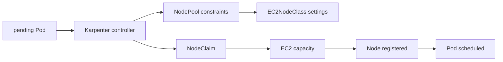

# Karpenter 심화 로드맵

## 이 과정만 심화인 이유

Karpenter는 pending Pod의 scheduling 요구를 AWS compute capacity 선택과 직접 연결한다. Kubernetes scheduler, EKS, IAM, EC2 capacity와 비용·disruption을 모두 이해한 뒤 다뤄야 하므로 기본 과정과 분리한다.

## 선수 지식

- [Kubernetes scheduling](../kubernetes/07-scheduling-and-autoscaling.md)의 requests, affinity, taint와 topology
- AWS IAM, subnet·security group, EC2 purchase options와 EKS
- SLO·PDB·RPO/RTO·cost budget

## 학습 순서

1. **Provisioning·disruption model**: NodePool, EC2NodeClass와 NodeClaim의 책임을 구분한다.
2. **Pending Pod·consolidation 실습**: capacity 수렴과 disruption 결과를 event·node·AWS resource에서 확인한다.

## 완료 조건

- Pod requirement와 NodePool constraint의 intersection을 설명한다.
- Spot·On-Demand 선택, diversification과 fallback 정책을 정의한다.
- consolidation, drift, expiry와 interruption에서 PDB·graceful termination의 영향을 검증한다.

## 범위 밖

다른 autoscaler 제품 비교, custom provider 개발과 모든 EC2 instance type 최적화는 포함하지 않는다.

## 스스로 설명해 보기

1. Karpenter가 Pod를 직접 node에 bind하는 scheduler가 아닌 이유는 무엇인가?
2. 가장 싼 instance 하나만 허용하면 provisioning reliability가 낮아질 수 있는 이유는 무엇인가?
3. node 수가 줄었다는 사실만으로 consolidation 성공을 판정할 수 없는 이유는 무엇인가?

<!-- source: https://karpenter.sh/docs/concepts/ | checked: 2026-09-03 -->
<!-- source: https://karpenter.sh/docs/concepts/nodepools/ | checked: 2026-09-03 -->
<!-- source: https://karpenter.sh/docs/concepts/nodeclaims/ | checked: 2026-09-03 -->
