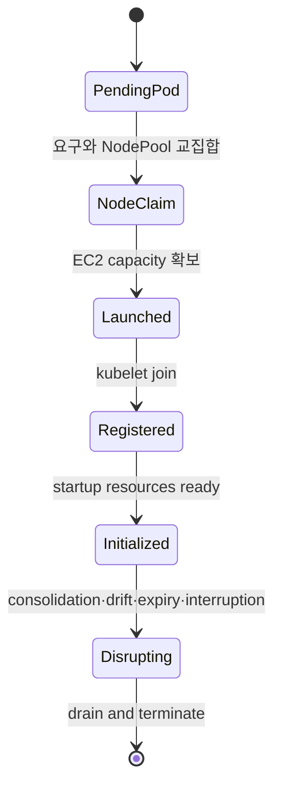
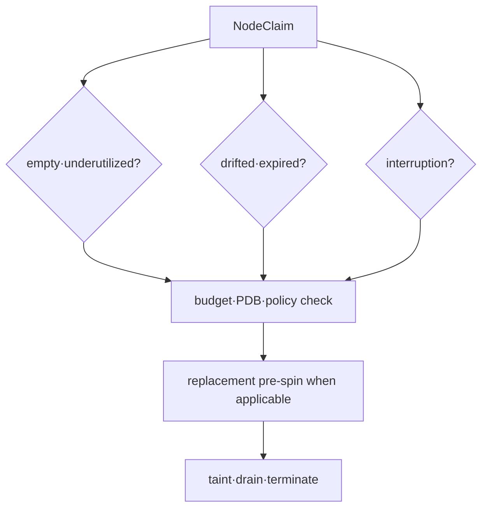

# Provisioning과 disruption model

## 먼저 이해하기

Kubernetes scheduler가 Pod를 놓을 node를 찾지 못하면 Pod는 Pending에 남는다. Karpenter는 그 Pending Pod들의 CPU·memory request, architecture, zone, taint·toleration과 volume topology를 모아 “어떤 새 node라면 이 Pod들을 실행할 수 있는가?”를 계산한다. EC2 capacity를 확보해 node가 cluster에 등록되면 scheduler가 다시 Pod를 배치한다.

여기서 Karpenter가 scheduler를 대신하는 것은 아니다. scheduler는 존재하는 node에 Pod를 bind하고, Karpenter는 요구를 만족할 node capacity가 없을 때 공급한다.

| resource | 사람이 선언하는 것 | controller가 구체화하는 것 |
|---|---|---|
| Pod | request와 scheduling constraint | 필요한 capacity의 입력 |
| NodePool | 허용 범위·limit·disruption policy | 어떤 NodeClaim을 만들 수 있는지 |
| EC2NodeClass | AWS subnet·AMI·role·storage 선택 | EC2 launch 설정 |
| NodeClaim | 한 node의 구체적 요구와 상태 | instance launch·register·terminate 수명주기 |
| Node | Kubernetes가 보는 실행 capacity | scheduler가 Pod를 배치할 대상 |

예를 들어 Pod가 arm64를 요구하지만 NodePool이 amd64만 허용하면 둘의 교집합이 없다. AWS에 arm64 instance가 충분해도 provisioning되지 않는다. 반대로 instance type을 하나만 허용하면 요구 조건은 맞아도 그 zone에 capacity가 없어 launch가 실패할 수 있다. constraint의 정확성과 선택지의 폭을 함께 설계해야 한다.

## 세 resource의 책임

- **NodePool**: 허용할 requirement, taint, limit, disruption policy와 template를 정의한다.
- **EC2NodeClass**: AMI, subnet, security group, role, storage와 EC2-specific discovery를 정의한다.
- **NodeClaim**: 한 node capacity 요청의 구체화된 수명주기다. 일반적으로 controller가 만들고 관리한다.

Pod requests가 없거나 실제 사용량보다 지나치게 작으면 Karpenter의 bin-packing 판단도 잘못된 입력을 받는다. node selector, required affinity, topology spread, toleration과 volume topology는 가능한 offering을 좁힌다. NodePool requirement와 Pod requirement의 교집합이 비면 provisioning되지 않는다.

## Capacity type과 diversification

Karpenter는 환경과 설정에 따라 reserved, spot, on-demand capacity type requirement를 사용할 수 있다. Spot은 interruption을 수용할 workload와 넓은 instance family·size·zone 선택으로 설계한다. critical stateful workload에 비용 이유만으로 Spot을 강제하지 않는다.

## Disruption의 종류

disruption은 controller가 판단하는 automated method와 cloud provider interruption 같은 흐름을 포함한다. consolidation은 empty 또는 underutilized node를 delete·replace할 수 있고, drift는 NodePool/NodeClass 변화에 맞지 않는 NodeClaim 교체를 유도할 수 있다. expiration은 node age를 제한하지만 동시에 많은 node가 교체되지 않도록 budget을 둔다.

PDB는 voluntary disruption에서 application availability를 보호하지만 너무 엄격하거나 여러 PDB가 겹치면 drain을 막는다. PDB만 믿지 말고 terminationGracePeriod, application shutdown, queue handoff와 node termination deadline을 맞춘다.

## 관측과 비용

Kubernetes event, Karpenter controller log·metric, NodeClaim condition, Pod scheduling event와 EC2 instance identity를 같은 timestamp로 연결한다. provisioning latency, pending duration, failed launch, interruption, consolidation savings뿐 아니라 rescheduling 오류와 SLO impact를 본다.

## 스스로 설명해 보기

1. EC2NodeClass와 NodePool을 분리하면 어떤 변경 경계를 얻는가?
2. Pod request 오류가 node 비용과 안정성에 동시에 영향을 주는 이유는 무엇인가?
3. PDB가 허용해도 application shutdown이 실패할 수 있는 이유는 무엇인가?

<!-- source: https://karpenter.sh/docs/concepts/nodepools/ | checked: 2026-09-03 -->
<!-- source: https://karpenter.sh/docs/concepts/nodeclasses/ | checked: 2026-09-03 -->
<!-- source: https://karpenter.sh/docs/concepts/nodeclaims/ | checked: 2026-09-03 -->
<!-- source: https://karpenter.sh/docs/concepts/disruption/ | checked: 2026-09-03 -->
<!-- source: https://karpenter.sh/docs/concepts/scheduling/ | checked: 2026-09-03 -->
