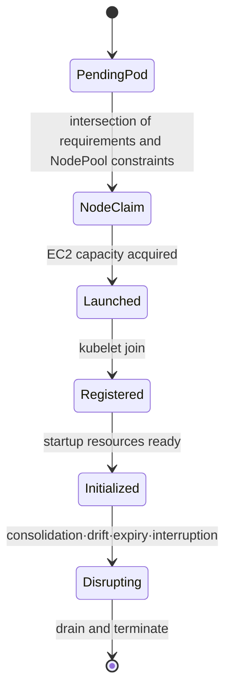
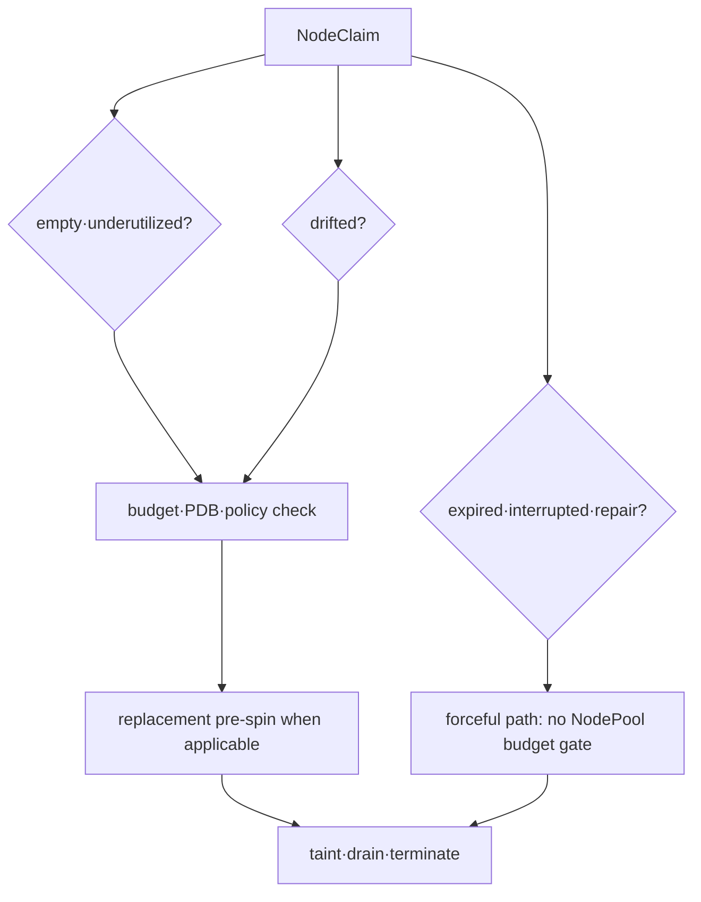

# Provisioning and disruption model

## Terms introduced in this chapter

- **provisioning**: The process of selecting and preparing new compute resources to run workloads.
- **requirement**: Conditions such as CPU architecture, zone, and capacity type that Pod or NodePool allows or requires.
- **capacity type**: A value that classifies EC2 by purchase method such as On-Demand or Spot.
- **consolidation**: An operation to reduce unnecessary nodes when the workload can be safely moved to fewer nodes.
- **PDB**: A Kubernetes policy that limits the number of Pods that can become unavailable simultaneously during a voluntary outage.
- **graceful termination**: A procedure that terminates a process by giving it time to organize its ongoing work.

At first, the path to create a node and the path to destroy a node are viewed separately. Just because it can be made quickly doesn't mean it can be safely reduced, and the evidence for success for the two routes is different.

## Understand the model first

If the Kubernetes scheduler does not find a node to place the Pod on, the Pod remains in Pending. Karpenter collects the CPU/memory request, architecture, zone, taint/toleration, and volume topology of the Pending Pods and calculates “Which new node can run these Pods?” Once EC2 capacity is secured and the node is registered in the cluster, the scheduler deploys the pod again.

Karpenter does not replace the scheduler here. The scheduler binds pods to existing nodes, and Karpenter supplies them when there is no node capacity to satisfy the demand.

| resource | what a person declares | What the controller embodies |
|---|---|---|
| Pod | request and scheduling constraints | Enter the required capacity |
| NodePool | Allowable range·limit·disruption policy | What NodeClaim Can You Make? |
| EC2NodeClass | Select AWS subnet·AMI·role·storage | EC2 launch settings |
| NodeClaim | Specific needs and status of a node | instance launch·register·terminate life cycle |
| Node | Execution capacity as seen by Kubernetes | Where the scheduler will place the pod |

For example, if a Pod requires arm64, but NodePool only allows amd64, there is no intersection of the two. Even if there are enough arm64 instances in AWS, they are not provisioned. Conversely, if only one instance type is allowed, launch may fail due to lack of capacity in the zone even if the requirements are met. The accuracy of constraints and the breadth of options must be designed together.

## View each step until a waiting Pod is executed

1. The scheduler looks at existing nodes, but cannot find one that satisfies all of the Pod's CPU, memory, and placement conditions.
2. The Pod remains in the Pending state and the reason it was not deployed is recorded in an event.
3. Karpenter calculates the intersection of the Pending Pod requirements and the allowed NodePool conditions.
4. Find EC2 options that can be created using the subnet·security group·AMI·role conditions of EC2NodeClass.
5. Create a NodeClaim, a request for a specific Node, and request the start of an EC2 instance.
6. The instance is registered as a node in the cluster and the necessary startup resources are prepared.
7. The Kubernetes scheduler places pods on new nodes.

Karpenter prepares capacity in steps 3 to 6. Since the final Pod placement is done by the Kubernetes scheduler, you need to view the logs and events of both components together.

## Responsibilities of the three resources

- **NodePool**: Defines requirements, taints, limits, disruption policies and templates to allow.
- **EC2NodeClass**: Defines AMI, subnet, security group, role, storage and EC2-specific discovery.
- **NodeClaim**: This is the concrete life cycle of a node capacity request. Generally, it is created and managed by a controller.

If there are no pod requests or they are too small compared to the actual usage, Karpenter's bin-packing judgment also receives incorrect input. Node selector, required affinity, topology spread, toleration and volume topology narrow down possible offerings. If the intersection of NodePool requirement and Pod requirement is empty, provisioning is not performed.

## Capacity type and diversification

Karpenter can use reserved, spot, and on-demand capacity type requirements depending on the environment and settings. Spot is designed with workloads to accommodate interruptions and a wide selection of instance families, sizes, and zones. Spot is not enforced on critical stateful workloads solely for cost reasons.

## Types of Disruption

Consolidation and drift are graceful disruption methods subject to NodePool disruption budgets. Expiration, interruption, and node repair are forceful methods: those budgets do not rate-limit their start, and draining need not wait for a healthy replacement. Stagger node ages and test application shutdown against actual termination deadlines; a budget of one does not guarantee that only one expiring node drains at a time.

PDBs constrain eviction requests, but cannot prevent a provider reclaiming an instance. A configured node `terminationGracePeriod` can also end draining by forcibly deleting remaining Pods. Test PDBs, Pod shutdown grace, queue handoff, and the node/provider deadline as separate boundaries.

## Observations and Costs

Connect Kubernetes event, Karpenter controller log·metric, NodeClaim condition, Pod scheduling event, and EC2 instance identity with the same timestamp. View provisioning latency, pending duration, failed launch, interruption, and consolidation savings, as well as rescheduling errors and SLO impact.

## Explain it in your own words

1. What change boundaries do we get if we separate EC2NodeClass and NodePool?
2. Why do pod request errors affect node cost and stability at the same time?
3. Why can application shutdown fail even if PDB allows it?

<!-- source: https://karpenter.sh/docs/concepts/nodepools/ | checked: 2026-09-03 | api-version: karpenter.sh/v1 -->
<!-- source: https://karpenter.sh/docs/concepts/nodeclasses/ | checked: 2026-09-03 | api-version: karpenter.sh/v1 -->
<!-- source: https://karpenter.sh/docs/concepts/nodeclaims/ | checked: 2026-09-03 | api-version: karpenter.sh/v1 -->
<!-- source: https://karpenter.sh/docs/concepts/disruption/ | checked: 2026-09-03 | api-version: karpenter.sh/v1 -->
<!-- source: https://karpenter.sh/docs/concepts/scheduling/ | checked: 2026-09-03 | api-version: karpenter.sh/v1 -->
<!-- source: https://karpenter.sh/docs/concepts/disruption/ | checked: 2026-09-10 | scope: graceful versus forceful disruption -->
