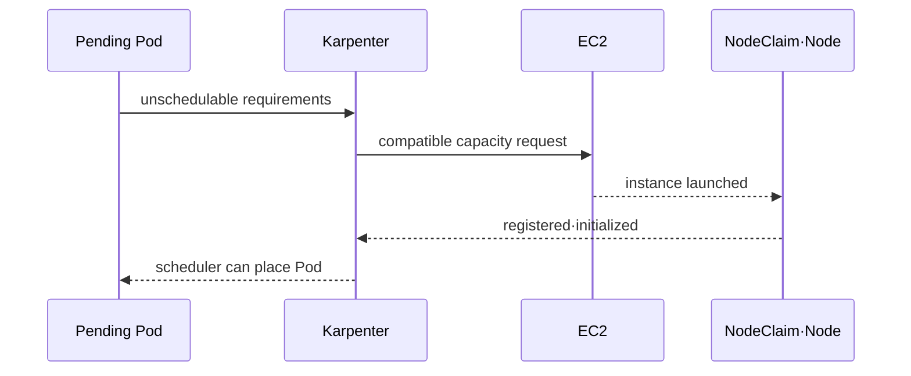

# Pending Pod and consolidation lab

> lab level: **AWS optional**. An isolated environment with EKS and Karpenter installed is required, and EC2·EKS·network·log costs may be incurred. In CI, only manifest static verification is performed.

## Lab prerequisites

This lab is not a guide to installing Karpenter for the first time. First learn Kubernetes scheduling, AWS IAM·VPC·EC2, and EKS, and start after configuring Karpenter through the official installation procedure on a test cluster that can be deleted.

- **Compatibility**: Check the official documentation for the installed Kubernetes·EKS·Karpenter version combination.
- **Tools**: Requires `kubectl`, AWS CLI, and Karpenter CRD of current cluster.
- **AWS Identity**: Check whether it is a temporary role in the expected account/Region and review the EC2 creation cost/quota.
- **Files**: Complete `EC2NodeClass`, `NodePool`, test deployment and PDB manifest are required.
- **Observation**: Prepare a list of controller logs, Kubernetes events, NodeClaim conditions, and EC2 instances so that they can be viewed before the experiment.
- **Suspension conditions**: Immediately stop if there is a larger instance than expected, an unallowed subnet/zone, or a decrease in Pod availability.

The NodePool below is an example for explaining the structure. Since there is no `EC2NodeClass` and test deployment for each environment, the lab will not start just by copying it as is. Instead of guessing missing values, fill them in based on official installation results and cluster resources.

## Understand the model first

There is convergence in two directions in this lab. When the workload is increased, capacity must be created to satisfy the Pending Pod demand, and when the workload is removed, unnecessary capacity must be reduced within the disruption policy. If only quick scale-up is confirmed, cost and scale-down safety cannot be verified.

Observation targets also differ by class. Pod event shows why the scheduler failed to deploy, Karpenter log shows which requirements and offerings were reviewed, NodeClaim condition shows launch·register·initialize progress, and EC2 API shows actual instance and purchase option.

| situation | expectation observation | What to see when you stay long |
|---|---|---|
| Pod Pending | Reason for unschedulable | request·affinity·taint·volume topology |
| Create NodeClaim | selected requirement | NodePool intersection and limit |
| launched | provider ID·instance | EC2 capacity·quota·IAM |
| registered | Kubernetes Node appears | bootstrap·network·security group |
| initialized | Prepare startup resources | CNI·CSI·DaemonSet readiness |
| disrupting | taint·eviction·replacement | PDB·budget·grace period |
| terminated | NodeClaim·Node·EC2 Summary | finalizer and cloud resource remaining |

## 1. Gate before execution

- Check the current official documentation for Karpenter installation method, controller IAM permissions, and EKS/Kubernetes compatibility.
- Check that the NodePool·EC2NodeClass selector finds only the intended subnet, security group, and AMI.
- Set the test namespace, tag, budget, rollback owner, and end time.
- First collect controller metric·log, Kubernetes event, and EC2 inventory.

## 2. Limited NodePool

Below is an example explaining the structure. AMI family, role, and discovery tag must match the official installation results for each environment.

```yaml
apiVersion: karpenter.sh/v1
kind: NodePool
metadata:
  name: study
spec:
  template:
    spec:
      requirements:
        - key: kubernetes.io/arch
          operator: In
          values: ["amd64"]
        - key: karpenter.sh/capacity-type
          operator: In
          values: ["spot", "on-demand"]
      nodeClassRef:
        group: karpenter.k8s.aws
        kind: EC2NodeClass
        name: study
      expireAfter: 168h
  limits:
    cpu: "8"
  disruption:
    consolidationPolicy: WhenEmptyOrUnderutilized
    consolidateAfter: 5m
    budgets:
      - nodes: "1"
```

Since API fields and defaults may change, server-side dry-run is performed based on the cluster CRD and documentation at the time of creation.

```bash
kubectl apply --server-side --dry-run=server -f nodepool.yaml
kubectl get nodepool,ec2nodeclass,nodeclaim
```

## 3. From pending to capacity convergence

Creates a disposable deployment with an explicit CPU request that does not enter the current node. The request is determined to induce only one node within the account limit.

```bash
kubectl scale deployment/capacity-demo -n infra-capstone --replicas=1
kubectl get pod -n infra-capstone -o wide
kubectl get nodeclaim
kubectl get events -n infra-capstone --sort-by=.lastTimestamp
```

Repeat these snapshots, or run each `-w` watch in a separate terminal and stop it with Ctrl-C. A watch does not exit automatically when the next step becomes ready. Distinguish an unscheduled Pod from a scheduled Pod waiting for an image; extra EC2 capacity will not fix an invalid image.



Completion includes not only Pod Running, but also NodeClaim condition, node Ready, application request success, and matching expected instance capacity type·zone·tag.

## 4. Consolidation and blocked disruption

Reduce Deployment to 0 and observe the event, NodeClaim, and EC2 termination after `consolidateAfter`. Next, PDB checks the event to determine why disruption is blocked in a small workload that blocks eviction. Do not experiment by modifying the production PDB.

The success judgment is as follows.

- No unauthorized disruption occurs while the workload is present.
- After workload removal, target nodes are cleaned up within the budget range.
- The readiness and SLO of rescheduled Pods are maintained.
- After deleting the Kubernetes node and NodeClaim, no EC2 instance·volume remains.

## Cleanup

Delete the test workload first and observe the NodeClaim cleanup created by NodePool. Afterwards, the test NodePool·EC2NodeClass and related IAM·network·log artifacts are organized in reverse inventory order. Before arbitrarily removing a finalizer, check the controller and cloud instance status.

## Example results

Illustrative status transitions, not an EKS execution record. NodeClaim names and reason strings depend on the installed version.

```text
# Unschedulable workload
PodScheduled=False
nodeName=<empty>
# After capacity is provisioned and the scheduler binds the Pod
PodScheduled=True
nodeName=<new-node>
# A bad image can still be Pending after scheduling
PodScheduled=True
container waiting reason=ImagePullBackOff
```

For consolidation, record the old node, disruption eligibility, Pod relocation, and user outcome. A budget or PDB can delay voluntary disruption; an absent deletion is not proof that the controller failed. Provider interruption follows a different path and may not wait for replacement capacity.

## How to interpret the results

If a Pod changes from Pending to Running, an example of an end-to-end capacity path is successful. However, if it is outside the range of zone·capacity type·instance expected by NodeClaim, the policy goal has been failed. Also check the application request and SLO.

If a NodeClaim is created but the node is not registered, it is not a scheduler problem, but check the bootstrap boundary after EC2 launch. Subnet route, security group, instance role, cluster endpoint reachability and startup log are the next evidence. If there is no NodeClaim itself, look at the intersection of Pod and NodePool requirements, limit and controller authority first.

After scale-down, if only the Kubernetes Node disappears and the EC2 instance remains, the cleanup is not finished. Conversely, if the number of nodes decreases quickly, but the Pod loses readiness or bypasses the PDB, consolidation also fails. Cost reduction and availability guardrail must be satisfied simultaneously.

## Explain it in your own words

1. Why do I need to view pending Pod events and controller logs together?
2. Why is it dangerous to immediately relieve PDB in a situation where PDB has blocked consolidation?
3. Why can't cleanup be determined to be complete just by deleting the node object?

<!-- source: https://karpenter.sh/docs/concepts/nodepools/ | checked: 2026-09-03 | api-version: karpenter.sh/v1 -->
<!-- source: https://karpenter.sh/docs/concepts/nodeclaims/ | checked: 2026-09-03 | api-version: karpenter.sh/v1 -->
<!-- source: https://karpenter.sh/docs/concepts/disruption/ | checked: 2026-09-03 | api-version: karpenter.sh/v1 -->
<!-- source: https://karpenter.sh/docs/troubleshooting/ | checked: 2026-09-03 | api-version: karpenter.sh/v1 -->
