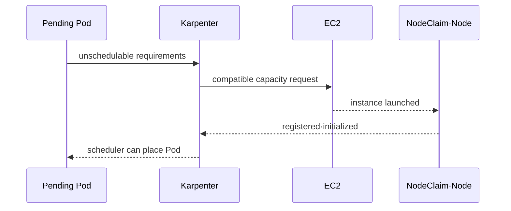

# Pending Pod와 consolidation 실습

> 실습 등급: **AWS optional**. EKS와 Karpenter가 설치된 격리 환경이 필요하며 EC2·EKS·network·log 비용이 발생할 수 있다. CI에서는 manifest 정적 검증만 수행한다.

## 1. 실행 전 gate

- Karpenter 설치 방식과 controller IAM 권한, EKS·Kubernetes 호환성을 현재 공식 문서에서 다시 확인한다.
- NodePool·EC2NodeClass selector가 의도한 subnet, security group과 AMI만 찾는지 확인한다.
- test namespace, tag, budget, rollback owner와 종료 시간을 정한다.
- controller metric·log, Kubernetes event와 EC2 inventory를 먼저 수집한다.

## 2. 제한된 NodePool

아래는 구조를 설명하는 예다. AMI family, role과 discovery tag는 환경별 공식 설치 결과에 맞춰야 한다.

```yaml
apiVersion: karpenter.sh/v1
kind: NodePool
metadata:
  name: study
spec:
  template:
    spec:
      requirements:
        - key: kubernetes.io/arch
          operator: In
          values: ["amd64"]
        - key: karpenter.sh/capacity-type
          operator: In
          values: ["spot", "on-demand"]
      nodeClassRef:
        group: karpenter.k8s.aws
        kind: EC2NodeClass
        name: study
      expireAfter: 168h
  limits:
    cpu: "8"
  disruption:
    consolidationPolicy: WhenEmptyOrUnderutilized
    consolidateAfter: 5m
    budgets:
      - nodes: "1"
```

API field와 default는 바뀔 수 있으므로 cluster CRD와 작성 시점 문서를 기준으로 server-side dry-run한다.

```bash
kubectl apply --server-side --dry-run=server -f nodepool.yaml
kubectl get nodepool,ec2nodeclass,nodeclaim
```

## 3. Pending에서 capacity 수렴까지

현재 node에 들어가지 않는 명시적 CPU request를 가진 disposable Deployment를 만든다. request는 account limit 안에서 한 node만 유도하도록 정한다.

```bash
kubectl scale deployment/capacity-demo -n infra-capstone --replicas=1
kubectl get pod -n infra-capstone -w
kubectl get nodeclaim -w
kubectl get events -n infra-capstone --sort-by=.lastTimestamp
```



완료는 Pod Running뿐 아니라 NodeClaim condition, node Ready, application request 성공과 예상한 instance capacity type·zone·tag의 일치를 포함한다.

## 4. Consolidation과 blocked disruption

Deployment를 0으로 줄이고 `consolidateAfter` 이후 event, NodeClaim과 EC2 종료를 관찰한다. 그다음 PDB가 eviction을 막는 작은 workload에서 disruption이 blocked되는 이유를 event로 확인한다. production PDB를 수정해 실험하지 않는다.

성공 판정은 다음과 같다.

- workload가 있는 동안 허용되지 않은 disruption이 발생하지 않는다.
- workload 제거 후 budget 범위에서 대상 node가 정리된다.
- rescheduled Pod의 readiness와 SLO가 유지된다.
- Kubernetes node와 NodeClaim 삭제 뒤 EC2 instance·volume이 남지 않는다.

## 정리

test workload를 먼저 삭제하고 NodePool이 만든 NodeClaim 정리를 관찰한다. 그 뒤 test NodePool·EC2NodeClass와 관련 IAM·network·log artifact를 inventory 역순으로 정리한다. finalizer를 임의 제거하기 전에 controller와 cloud instance 상태를 조사한다.

## 스스로 설명해 보기

1. pending Pod event와 controller log를 함께 봐야 하는 이유는 무엇인가?
2. PDB가 consolidation을 막은 상황에서 PDB를 바로 완화하면 위험한 이유는 무엇인가?
3. Node object 삭제만으로 cleanup 완료를 판정할 수 없는 이유는 무엇인가?

<!-- source: https://karpenter.sh/docs/concepts/nodepools/ | checked: 2026-09-03 -->
<!-- source: https://karpenter.sh/docs/concepts/nodeclaims/ | checked: 2026-09-03 -->
<!-- source: https://karpenter.sh/docs/concepts/disruption/ | checked: 2026-09-03 -->
<!-- source: https://karpenter.sh/docs/troubleshooting/ | checked: 2026-09-03 -->
