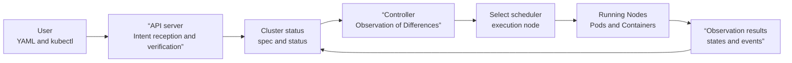
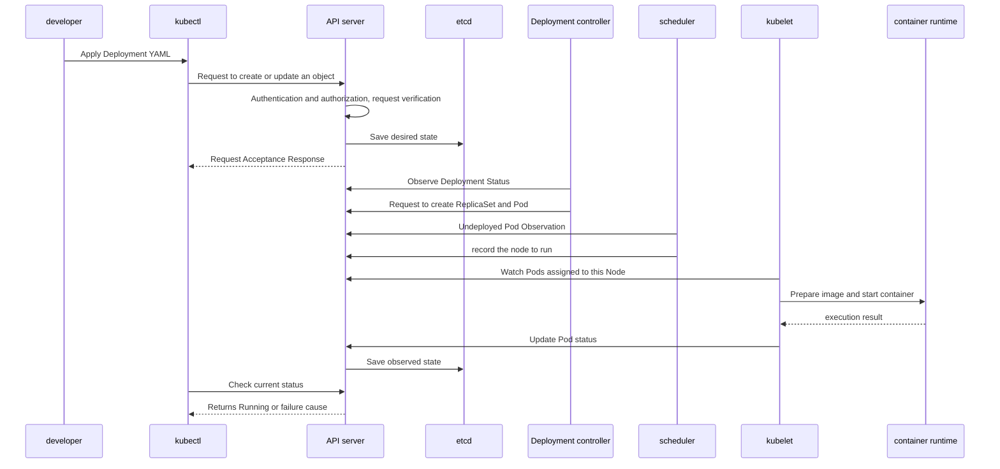

# Kubernetes Complete Learning Roadmap

## Starting point for beginners

Assume that you succeed in running the application as a single container. As the number of users increases, you need to run three of the same container, automatically replace it if one stops, and continuously check various statuses to deploy a new version without service interruption. Kubernetes automates this repetitive operation with APIs and controllers.

| New term | Plain-language meaning |
|---|---|
| container | A unit that isolates and executes application processes and files required for execution |
| image | Read-only execution material used when creating a container |
| cluster | A set of control planes and multiple servers managed together by Kubernetes |
| Node | The server where the container actually runs |
| Pod | A bundle of containers that Kubernetes deploys and manages together on one node. |
| Namespace | A logical boundary that divides the name, inquiry, authority, and policy scope of related resources within a cluster. |
| kubectl | Command-line tool that allows users to send inquiry/change requests to the Kubernetes API |
| desired state | A user-declared goal, such as “I need to keep three Pods ready” |

First, deploy a web server on a local cluster and check why a new Pod is created when a Pod is deleted. Based on that experience, you learn API object, controller, scheduler, and network in order.

Kubernetes is an open source platform that automates the deployment, scaling, and management of containerized applications. However, if you memorize just this one sentence, it is difficult to understand why API objects and controllers are needed. This process begins with understanding Kubernetes not as a “tool that executes commands sequentially,” but as a system that continually reduces the gap between the desired state and the actual state.

To ensure that you can understand the overall structure just by reading this document, I did not copy the list of links from the original material. Subsequent chapters follow the same method, accumulating explanations, diagrams, execution examples, and failure cases internally in place of external pages.

## The model in one sentence

> Users declare their desired state in the API, and Kubernetes' multiple control loops observe the current state and adjust actual resources until the difference disappears.

The most important arrow in this picture is the last **observation result → cluster status**. If a script runs once and ends, a person must run it again after a failure. Kubernetes receives the actual results back as a state and uses them as input for the next adjustment.

## The moment when containers alone become insufficient

Container runtimes are good at downloading images and running processes on one machine. However, when a service grows to multiple machines and multiple replicas, the following questions cannot be answered by a single runtime:

- Who will recreate the container when it dies?
- On which machines will the three replicas be placed?
- How will a client find an instance whose IP changes every time it is replaced?
- How do you replace a few new versions one by one, and go back to the previous version if it fails?
- What to place first and what to oust when CPU and memory are scarce?

Kubernetes solves this problem with API objects and control loops rather than individual command sets. For example, Deployment, `replicas: 3`, is not a one-time command to “create three pods now.” **It is an ongoing intention that there should be three**. When one disappears and the actual number becomes two, the controller detects the difference and requests the creation of a new Pod.

## Automation provided by Kubernetes

| problem | Basic solution of Kubernetes | Let's look at it in more detail later |
|---|---|---|
| Creation and replacement of multiple replicas | Workload controller such as Deployment | [Pods and workloads](04-pods-and-workloads.md) |
| Stable access to changing Pod addresses | Service, EndpointSlice and DNS | [Service and Networking](05-services-and-networking.md) |
| Separate lifespan of data and settings | Volume, PV/PVC, ConfigMap and Secret | [Storage and application configuration](06-storage-and-configuration.md) |
| Appropriate node selection and resource allocation | Scheduler, requests and placement constraints | [Scheduling and resources/autoscaling](07-scheduling-and-autoscaling.md) |
| Restrict API access and execution permissions | Authentication/authorization, RBAC and security policy | [Security and Policy](08-security-and-policy.md) |
| Fault detection and state recovery | Probe, controller, event and state observations | [Observation and Troubleshooting](09-observability-and-troubleshooting.md) |

## What Kubernetes Doesn't Replace

Adopting Kubernetes does not automatically eliminate all operational problems.

| What Kubernetes Does | Things that need to be designed separately |
|---|---|
| Running and deploying container images | Build and test application source |
| Workload copy and rollout management | Database transactions and data consistency |
| Provides a foundation for exposing metrics | Select a monitoring, log, and notification product that suits your organization |
| Provides Secret object and delivery mechanism | Key generation, rotation, and external secret storage operation policy |
| Replacing failed containers or pods | Request idempotence, user error handling and business recovery |

In other words, Kubernetes is not a completed PaaS, but a component that can create a platform. Given the large number of choices, network implementation, observation tools, deployment policies, and security standards must be specified by the operator.

## Until a deployment request becomes an actual container

The following sequence shows the boundaries of responsibility for each component rather than revealing all of the implementation details. The controller, scheduler, and kubelet read and update state through the API server without directly modifying etcd.

A success response of `kubectl apply` does not mean that the container is already normal. This is close to meaning that the API received the request and stored it. Whether or not it is actually executed must be checked with the subsequently updated `status`, condition and event.

## Reading the same event from three perspectives

The event “one pod was deleted” has different meaning depending on which floor you look at.

1. **Pod Perspective** — The lifespan of existing Pods is over. It is not being revived with the same name and IP.
2. **Deployment perspective** — Create a new Pod because there is one less than the desired number of replicas.
3. **Service Perspective** — Exclude existing endpoints that are not ready and include new Pods in the target when they are ready.

Understanding this distinction can provide a more accurate explanation than “Kubernetes brought back Pods.” The missing instance is not restored, but the higher-level controller satisfies the desired state again with a new instance.

## Internal learning sequence

| order | internal document | Questions Answered in This Chapter | Results to see for yourself |
|---:|---|---|---|
| 1 | [Why Kubernetes and the first cluster](01-why-and-first-cluster.md) | What operational problems does it solve and how does the first application run? | Local Cluster, Deployment and Service |
| 2 | [API and Object](02-api-and-objects.md) | How does YAML become a persistent system intent? | Spec/status and object changes |
| 3 | [Cluster architecture and control loop](03-cluster-architecture.md) | Who reads state and changes actual resources? | Track from API request to container execution |
| 4 | [Pods and workloads](04-pods-and-workloads.md) | Which controller do you choose for each life cycle? | Stateless, stateful, and batch workloads |
| 5 | [Service and Networking](05-services-and-networking.md) | How do you reliably access constantly changing Pods? | Internal/external request path |
| 6 | [Storage and application configuration](06-storage-and-configuration.md) | How do we divide the lifespan of code, settings, and data? | Setting up and persistent data connections |
| 7 | [Scheduling and resources/autoscaling](07-scheduling-and-autoscaling.md) | Which node should I place it on and how many should I increase it to? | Placement Constraints and HPA |
| 8 | [Security and Policy](08-security-and-policy.md) | Who can do what and how far can they communicate? | Least privilege and network policy |
| 9 | [Observation and Troubleshooting](09-observability-and-troubleshooting.md) | Why are the desired state and the actual state different? | Track the cause of a broken deployment |
| 10 | [Production Operations and Expansion](10-production-and-extension.md) | How to ensure long-term operation of cluster and platform functions? | Operational Checklist and Scaling Methods |

## What to do when you receive a link in the future

Links are written evidence, not destinations to link back to on the site. After checking the contents, insert the following elements into the internal document.

1. A one-sentence model that describes the problem it solves
2. Relationship/Data/Control Flow Diagram
3. Sequence diagram tracking normal operation
4. Minimal YAML and commands that can be run as-is
5. Detailed explanation of each field and status change
6. Common Failures, Observation Signals and Recovery Sequences
7. Differences between choosing a development and production environment
8. Review questions to explain the principles again

The original data URL and confirmation date are left as evidence metadata in the Markdown repository, but the published text must be understandable and labable even without reading the link.

## Check your understanding

1. What is the difference between an image and a running container?
2. What difference does running a Pod directly and declaring `replicas: 1` in Deployment make after failure?

**Confirmation criteria:** It can be explained that the image is an execution material and the container is an execution instance created with it. If the desired state of the deployment remains, the controller requests a new Pod even if the existing Pod disappears.

## Develop operational judgment

1. Why can a user request fail even if `kubectl apply` succeeds?
2. What state do Pods, Deployments and Services each possess?
3. Why doesn't Kubernetes automatically resolve database transaction and application errors?

<!-- source: https://kubernetes.io/ko/docs/home/ | checked: 2026-09-03 -->
<!-- source: https://kubernetes.io/ko/docs/concepts/overview/ | checked: 2026-09-03 | translation-warning: true -->
<!-- source: https://kubernetes.io/ko/docs/concepts/overview/components/ | checked: 2026-09-03 | translation-warning: true -->
<!-- source: https://kubernetes.io/ko/docs/concepts/overview/working-with-objects/kubernetes-objects/ | checked: 2026-09-03 -->
