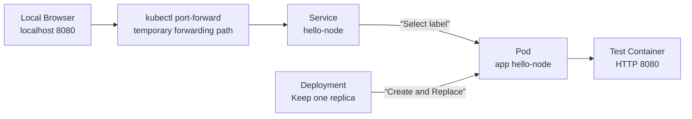
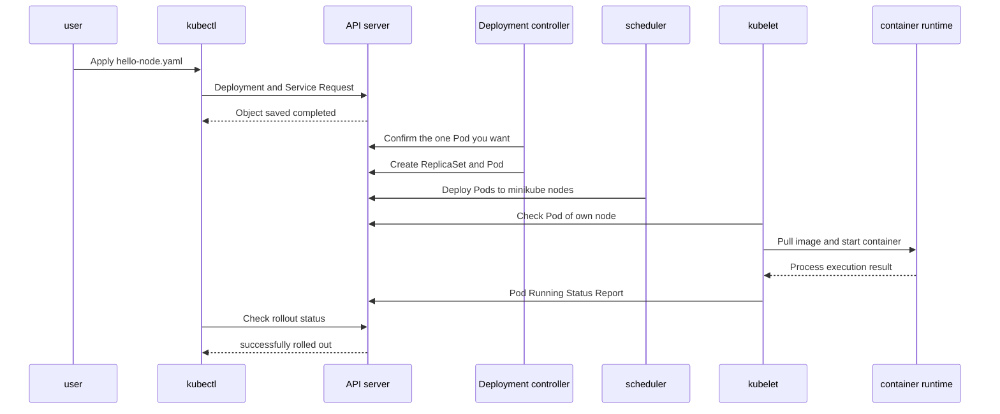

# 01. Why Kubernetes and the first cluster

In this chapter, we will create a local cluster and deploy a small web server. Rather than simply typing out commands, check what API objects each command creates and in what order the control plane and nodes respond.

## When you finish this chapter

- You can separate the responsibilities of the container runtime and Kubernetes.
- The relationship between Deployment, Pod, and Service can be explained graphically.
- You can distinguish between the questions answered by `kubectl get`, `describe`, `logs`, and `events`.
- Pod deletion and incorrect image deployment can be reproduced and the cause can be found using observation signals.

## lab structure

This example creates a single-node cluster inside `minikube` and runs a test container that responds on HTTP 8080 port. Connect to the local browser with `port-forward` without creating an external load balancer.



Deployment is responsible for the Pod's lifespan and number of replicas, and Service allows access with the same name and virtual address even if the Pod's current IP changes. `port-forward` is a temporary entry path used only by this lab and is not intended for production release.

## Preparation

This assumes the environment in which the following commands are executed.

```shell
minikube version
kubectl version --client
```

If you do not have these two tools, you must first install them according to your operating system. This document focuses on the actions that occur within the cluster rather than the installer itself.

## Create a cluster

```shell
minikube start
kubectl cluster-info
kubectl get nodes
```

If normal, one node appears as `Ready`.

```text
NAME       STATUS   ROLES           AGE   VERSION
minikube   Ready    control-plane   1m    v1.x.y
```

Here, `Ready` does not mean “all applications are normal.” This is the result of the kubelet reporting the node status and the control plane determining that the node can be used as a workload placement target.

## Declaring your first application

Save the following contents as `hello-node.yaml`.

```yaml
apiVersion: apps/v1
kind: Deployment
metadata:
  name: hello-node
spec:
  replicas: 1
  selector:
    matchLabels:
      app: hello-node
  template:
    metadata:
      labels:
        app: hello-node
    spec:
      containers:
        - name: hello-node
          image: registry.k8s.io/e2e-test-images/agnhost:2.53
          args: ["netexec", "--http-port=8080"]
          ports:
            - name: http
              containerPort: 8080
---
apiVersion: v1
kind: Service
metadata:
  name: hello-node
spec:
  selector:
    app: hello-node
  ports:
    - name: http
      port: 8080
      targetPort: http
```

### Reading YAML as a relationship

| field | meaning | What happens when something goes wrong |
|---|---|---|
| `replicas: 1` | Number of Pods a Deployment will maintain | If the actual number of Pods is different, the controller creates and deletes them. |
| `selector.matchLabels` | The label that Deployment will determine to be its own Pod. | If it is different from the template label, the API refuses to create it. |
| `template.metadata.labels` | Label attached to new Pod | If it is different from the service selector, no endpoint is created. |
| `image` | Container image to be imported by the runtime | In case of name/tag error `ImagePullBackOff` |
| `containerPort` | Description attached to the port to be used by the container | By itself, it does not expose any ports to the outside world. |
| Service's `selector` | Conditions for selecting pods to receive traffic | If there is no matching Pod, there is a Service but no destination. |
| `targetPort: http` | Forward to container port named `http` | If the names do not match, endpoint port resolution fails. |

## Application and status observation

```shell
kubectl apply -f hello-node.yaml
kubectl rollout status deployment/hello-node
kubectl get deployment,pod,service
```

Immediately after `apply`, only the API object is saved and the Pod may not be ready yet. `rollout status` waits until Deployment can use the desired replica.



## Send request to application

Continue executing the following command in a separate terminal.

```shell
kubectl port-forward service/hello-node 8080:8080
```

Request from another terminal.

```shell
curl http://127.0.0.1:8080/
```

If a response is received, the flow is in `curl → port-forward → Service → selected Pod → container` order. Check whether the Service has selected the Pod with the following command.

```shell
kubectl get service hello-node
kubectl get endpointslice -l kubernetes.io/service-name=hello-node
```

If there is no address in EndpointSlice, check whether the Service selector and Pod label are the same before suspecting a network plugin.

```shell
kubectl get service hello-node -o jsonpath='{.spec.selector}'
kubectl get pods --show-labels
```

## Observation commands answer different questions

| command | question to answer | When you see it first |
|---|---|---|
| `kubectl get pods` | What stage are your pods currently in? | When quickly scanning the entire status |
| `kubectl describe pod <name>` | What are the scheduling, images, probes and latest events? | Pending, pull failure, repeated restart |
| `kubectl logs <name>` | What did the container process output? | Application startup/processing error |
| `kubectl get events --sort-by=.lastTimestamp` | What was the sequence of recent cluster events? | When narrowing down the causes chronologically |
| `kubectl rollout status deployment/hello-node` | Is the transition to the new version complete? | Immediately after deployment and in the automation pipeline |

Just because there is nothing in `logs` does not mean that the infrastructure is normal. Image errors or scheduling errors before the container starts mainly appear in Pod status and events.

## Experiment 1: What is recovered when you delete a Pod

```shell
kubectl get pods
kubectl delete pod -l app=hello-node
kubectl get pods -w
```

The existing Pod is terminated and a Pod with a new name is created. This is not a revived Pod that was deleted. This is the result of creating a new Pod after discovering the difference between the intention of Deployment being `replicas: 1` and the actual number of `0`.

If you delete Deployment, the results will change.

```shell
kubectl delete deployment hello-node
kubectl get pods -w
```

Since the parent intent itself is gone, no new Pod is created. To lab again, apply the original YAML.

```shell
kubectl apply -f hello-node.yaml
kubectl rollout status deployment/hello-node
```

## Experiment 2: Deploying a non-existent image

```shell
kubectl set image deployment/hello-node \
  hello-node=registry.k8s.io/e2e-test-images/agnhost:not-found
kubectl rollout status deployment/hello-node --timeout=30s
```

Rollout does not complete within the time limit. Now narrow down from symptoms to causes.

```shell
kubectl get pods
kubectl describe pod -l app=hello-node
kubectl get events --sort-by=.lastTimestamp
```

You may see `ErrImagePull` or `ImagePullBackOff` in the new Pod. This state is different from `CrashLoopBackOff`, where the application code dies after execution. Because the image name verification or registry access step failed, the event comes before the container log.

Revert to the original declaration.

```shell
kubectl apply -f hello-node.yaml
kubectl rollout status deployment/hello-node
```

## Frequent misunderstandings

### Since `kubectl apply` was successful, the service is normal.

The fact that an API request has been accepted is different from the fact that the application is ready. You must check the deployment's available replica, Pod condition, Service endpoint, and actual request in order.

### Just remember the Pod IP yourself.

Pods can be replaced and receive new IPs. The choice of persistent access name and target is left to the Service.

### When a container dies, the same container comes back to life.

A distinction must be made between cases where the runtime restarts a container within the same Pod and cases where a parent controller creates a new Pod. You can see the difference by looking at the name, UID, and event.

### Now that you have a local single node, you are ready for production.

This lab is a minimal environment for observing APIs and control loops. High availability, backups, upgrades, network policies, observation, and resource planning are covered separately in [Production Operations and Scaling](10-production-and-extension.md).

## Clean up and delete

In the port-forward terminal, press `Ctrl+C` and run the following.

```shell
kubectl delete -f hello-node.yaml
minikube stop
```

To completely erase the cluster, add the following command:

```shell
minikube delete
```

## Explain it in your own words

1. Why is a new Pod created when I delete a Pod, but not when I delete a Deployment?
2. Why do we look at selector and EndpointSlice first when a Service exists but the request is not delivered?
3. Why are events more useful than application logs in `ImagePullBackOff`?
4. What steps do `kubectl apply` responses and `rollout status` confirm?

[Next Chapter: APIs and Objects](02-api-and-objects.md) · [Full Roadmap](00-roadmap.md)

<!-- source: https://kubernetes.io/ko/docs/tutorials/hello-minikube/ | checked: 2026-09-03 | last-modified: 2026-03-27 -->
<!-- source: https://kubernetes.io/ko/docs/tutorials/kubernetes-basics/deploy-app/deploy-intro/ | checked: 2026-09-03 | translation-warning: true -->
<!-- source: https://kubernetes.io/ko/docs/tutorials/kubernetes-basics/explore/explore-intro/ | checked: 2026-09-03 | translation-warning: true -->
<!-- source: https://kubernetes.io/ko/docs/concepts/overview/components/ | checked: 2026-09-03 | translation-warning: true -->
<!-- source: https://kubernetes.io/ko/docs/concepts/overview/working-with-objects/kubernetes-objects/ | checked: 2026-09-03 -->
