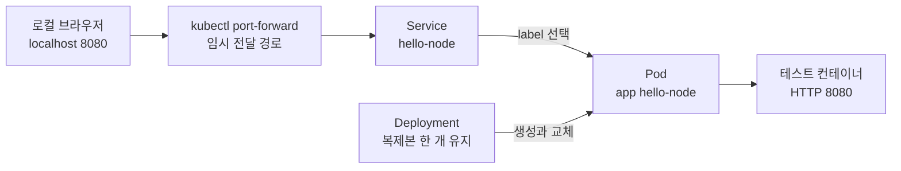
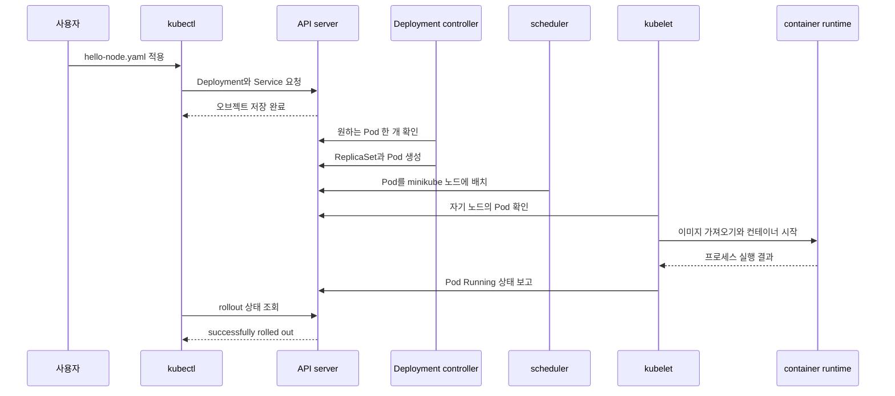

# 01. 왜 Kubernetes인가와 첫 클러스터

이 장에서는 로컬 클러스터를 만들고 작은 웹 서버를 배포한다. 명령을 따라 치는 데서 끝내지 않고, 각 명령이 어떤 API 오브젝트를 만들며 컨트롤 플레인과 노드가 어떤 순서로 반응하는지 확인한다.

## 이 장을 마치면

- 컨테이너 런타임과 쿠버네티스의 책임을 구분할 수 있다.
- Deployment, Pod와 Service의 관계를 그림으로 설명할 수 있다.
- `kubectl get`, `describe`, `logs`, `events`가 답하는 질문을 구분할 수 있다.
- Pod 삭제와 잘못된 이미지 배포를 재현하고 관측 신호로 원인을 찾을 수 있다.

## 실습 구조

이 예시는 `minikube` 안에 단일 노드 클러스터를 만들고, HTTP 8080 포트에서 응답하는 테스트 컨테이너를 실행한다. 외부 로드 밸런서를 만들지 않고 `port-forward`로 로컬 브라우저와 연결한다.



Deployment는 Pod의 수명과 복제본 수를 책임지고, Service는 Pod의 현재 IP가 바뀌어도 같은 이름과 가상 주소로 접근할 수 있게 한다. `port-forward`는 이 실습에서만 사용하는 임시 진입 경로이며 프로덕션 공개 방식이 아니다.

## 준비 사항

다음 명령이 실행되는 환경을 전제로 한다.

```shell
minikube version
kubectl version --client
```

두 도구가 없다면 먼저 운영체제에 맞게 설치해야 한다. 이 문서에서는 설치 프로그램 자체보다 클러스터 안에서 일어나는 동작에 집중한다.

## 클러스터 만들기

```shell
minikube start
kubectl cluster-info
kubectl get nodes
```

정상이라면 노드 하나가 `Ready`로 나타난다.

```text
NAME       STATUS   ROLES           AGE   VERSION
minikube   Ready    control-plane   1m    v1.x.y
```

여기서 `Ready`는 “모든 애플리케이션이 정상”이라는 뜻이 아니다. kubelet이 노드 상태를 보고하고, 컨트롤 플레인이 해당 노드를 워크로드 배치 대상으로 사용할 수 있다고 판단한 결과다.

## 첫 애플리케이션 선언하기

다음 내용을 `hello-node.yaml`로 저장한다.

```yaml
apiVersion: apps/v1
kind: Deployment
metadata:
  name: hello-node
spec:
  replicas: 1
  selector:
    matchLabels:
      app: hello-node
  template:
    metadata:
      labels:
        app: hello-node
    spec:
      containers:
        - name: hello-node
          image: registry.k8s.io/e2e-test-images/agnhost:2.53
          args: ["netexec", "--http-port=8080"]
          ports:
            - name: http
              containerPort: 8080
---
apiVersion: v1
kind: Service
metadata:
  name: hello-node
spec:
  selector:
    app: hello-node
  ports:
    - name: http
      port: 8080
      targetPort: http
```

### YAML을 관계로 읽기

| 필드 | 의미 | 잘못되면 보이는 현상 |
|---|---|---|
| `replicas: 1` | Deployment가 유지할 Pod 수 | 실제 Pod 수가 다르면 컨트롤러가 생성·삭제 |
| `selector.matchLabels` | Deployment가 자기 Pod로 판단할 레이블 | 템플릿 레이블과 다르면 API가 생성을 거부 |
| `template.metadata.labels` | 새 Pod에 붙는 레이블 | Service selector와 다르면 endpoint가 생기지 않음 |
| `image` | 런타임이 가져올 컨테이너 이미지 | 이름·태그 오류 시 `ImagePullBackOff` |
| `containerPort` | 컨테이너가 사용할 포트에 붙인 설명 | 그 자체로 외부에 포트를 공개하지 않음 |
| Service의 `selector` | 트래픽을 받을 Pod 선택 조건 | 일치하는 Pod가 없으면 Service는 있지만 대상은 없음 |
| `targetPort: http` | 이름이 `http`인 컨테이너 포트로 전달 | 이름이 맞지 않으면 endpoint port 해석 실패 |

## 적용과 상태 관찰

```shell
kubectl apply -f hello-node.yaml
kubectl rollout status deployment/hello-node
kubectl get deployment,pod,service
```

`apply` 직후에는 API 오브젝트만 저장되고 Pod가 아직 준비되지 않았을 수 있다. `rollout status`는 Deployment가 원하는 복제본을 사용할 수 있는 상태까지 기다린다.



## 애플리케이션에 요청 보내기

별도 터미널에서 다음 명령을 계속 실행해 둔다.

```shell
kubectl port-forward service/hello-node 8080:8080
```

다른 터미널에서 요청한다.

```shell
curl http://127.0.0.1:8080/
```

응답을 받았다면 흐름은 `curl → port-forward → Service → 선택된 Pod → 컨테이너` 순서다. Service가 Pod를 선택했는지는 다음 명령으로 확인한다.

```shell
kubectl get service hello-node
kubectl get endpointslice -l kubernetes.io/service-name=hello-node
```

EndpointSlice에 주소가 없다면 네트워크 플러그인부터 의심하기 전에 Service selector와 Pod label이 같은지 확인한다.

```shell
kubectl get service hello-node -o jsonpath='{.spec.selector}'
kubectl get pods --show-labels
```

## 관측 명령은 서로 다른 질문에 답한다

| 명령 | 답하는 질문 | 먼저 볼 때 |
|---|---|---|
| `kubectl get pods` | 현재 Pod들이 어느 단계에 있는가? | 전체 상태를 빠르게 훑을 때 |
| `kubectl describe pod <이름>` | 스케줄링·이미지·probe와 최신 event는 무엇인가? | Pending, pull 실패, 반복 재시작 |
| `kubectl logs <이름>` | 컨테이너 프로세스가 무엇을 출력했는가? | 애플리케이션 시작·처리 오류 |
| `kubectl get events --sort-by=.lastTimestamp` | 최근 클러스터 사건은 어떤 순서였는가? | 원인을 시간순으로 좁힐 때 |
| `kubectl rollout status deployment/hello-node` | 새 버전 전환이 완료됐는가? | 배포 직후와 자동화 파이프라인 |

`logs`에 아무것도 없다고 인프라가 정상인 것은 아니다. 컨테이너가 시작되기 전의 이미지 오류나 스케줄링 오류는 주로 Pod 상태와 event에 나타난다.

## 실험 1: Pod를 삭제하면 무엇이 복구되는가

```shell
kubectl get pods
kubectl delete pod -l app=hello-node
kubectl get pods -w
```

기존 Pod는 종료되고 새로운 이름의 Pod가 생긴다. 이것은 삭제된 Pod가 되살아난 것이 아니다. Deployment가 `replicas: 1`이라는 의도와 실제 개수 `0`의 차이를 발견해 새 Pod를 만든 결과다.

Deployment까지 삭제하면 결과가 달라진다.

```shell
kubectl delete deployment hello-node
kubectl get pods -w
```

상위 의도 자체가 사라졌으므로 새 Pod는 만들어지지 않는다. 다시 실습하려면 원본 YAML을 적용한다.

```shell
kubectl apply -f hello-node.yaml
kubectl rollout status deployment/hello-node
```

## 실험 2: 존재하지 않는 이미지를 배포하기

```shell
kubectl set image deployment/hello-node \
  hello-node=registry.k8s.io/e2e-test-images/agnhost:not-found
kubectl rollout status deployment/hello-node --timeout=30s
```

rollout이 제한 시간 안에 완료되지 않는다. 이제 증상에서 원인으로 좁힌다.

```shell
kubectl get pods
kubectl describe pod -l app=hello-node
kubectl get events --sort-by=.lastTimestamp
```

새 Pod에서 `ErrImagePull` 또는 `ImagePullBackOff`가 보일 수 있다. 이 상태는 애플리케이션 코드가 실행된 뒤 죽은 `CrashLoopBackOff`와 다르다. 이미지 이름 확인이나 레지스트리 접근 단계에서 실패했으므로 컨테이너 로그보다 event가 먼저다.

원래 선언으로 되돌린다.

```shell
kubectl apply -f hello-node.yaml
kubectl rollout status deployment/hello-node
```

## 자주 생기는 오해

### `kubectl apply`가 성공했으니 서비스도 정상이다

API 요청이 수락됐다는 사실과 애플리케이션이 준비됐다는 사실은 다르다. Deployment의 available replica, Pod condition, Service endpoint와 실제 요청을 차례로 확인해야 한다.

### Pod IP를 직접 기억하면 된다

Pod는 교체될 수 있고 새 IP를 받을 수 있다. 지속적인 접근 이름과 대상 선택은 Service에 맡긴다.

### 컨테이너가 죽으면 같은 컨테이너가 살아난다

같은 Pod 안에서 런타임이 컨테이너를 재시작하는 경우와, 상위 컨트롤러가 새 Pod를 만드는 경우를 구분해야 한다. 이름, UID와 event를 보면 차이를 확인할 수 있다.

### 로컬 단일 노드에서 됐으니 프로덕션 준비가 끝났다

이 실습은 API와 제어 루프를 관찰하기 위한 최소 환경이다. 고가용성, 백업, 업그레이드, 네트워크 정책, 관측과 자원 계획은 [프로덕션 운영과 확장](10-production-and-extension.md)에서 별도로 다룬다.

## 정리와 삭제

port-forward 터미널에서 `Ctrl+C`를 누른 뒤 다음을 실행한다.

```shell
kubectl delete -f hello-node.yaml
minikube stop
```

클러스터까지 완전히 지우려면 다음 명령을 추가한다.

```shell
minikube delete
```

## 스스로 설명해 보기

1. Pod를 삭제했을 때 새 Pod가 생기지만 Deployment를 삭제했을 때는 생기지 않는 이유는 무엇인가?
2. Service가 존재하는데 요청이 전달되지 않을 때 selector와 EndpointSlice를 먼저 보는 이유는 무엇인가?
3. `ImagePullBackOff`에서 애플리케이션 로그보다 event가 더 유용한 이유는 무엇인가?
4. `kubectl apply` 응답과 `rollout status`가 각각 확인하는 단계는 무엇인가?

[다음 장: API와 오브젝트](02-api-and-objects.md) · [전체 로드맵](00-roadmap.md)

<!-- source: https://kubernetes.io/ko/docs/tutorials/hello-minikube/ | checked: 2026-09-03 | last-modified: 2026-03-27 -->
<!-- source: https://kubernetes.io/ko/docs/tutorials/kubernetes-basics/deploy-app/deploy-intro/ | checked: 2026-09-03 | translation-warning: true -->
<!-- source: https://kubernetes.io/ko/docs/tutorials/kubernetes-basics/explore/explore-intro/ | checked: 2026-09-03 | translation-warning: true -->
<!-- source: https://kubernetes.io/ko/docs/concepts/overview/components/ | checked: 2026-09-03 | translation-warning: true -->
<!-- source: https://kubernetes.io/ko/docs/concepts/overview/working-with-objects/kubernetes-objects/ | checked: 2026-09-03 -->
