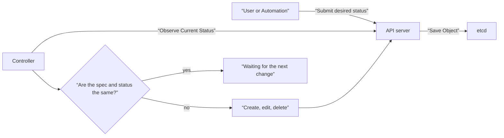
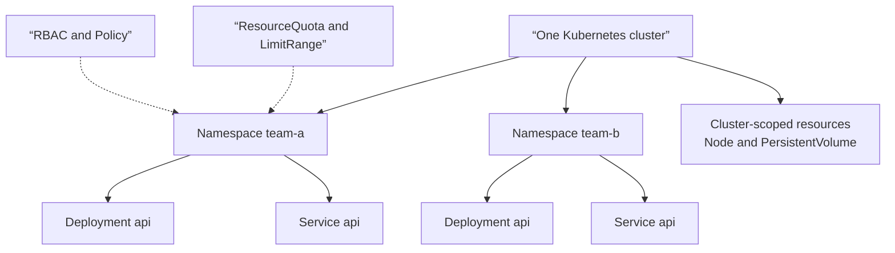
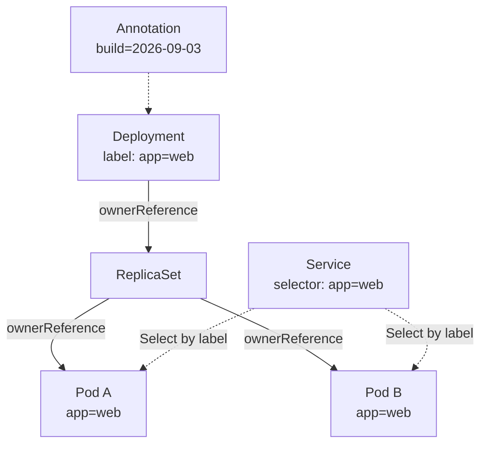
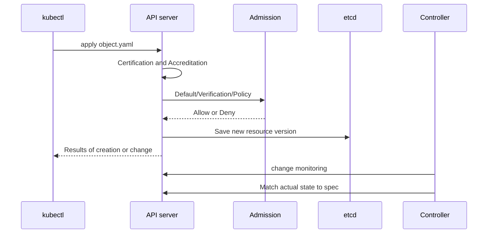

# 02. API and objects

In Kubernetes, YAML is not a configuration file itself, but the intent that is passed to the API. The user records the desired state in `spec` of the object, and the controller observes the actual state and reduces the difference. If you understand this declaration model, you can read numerous resources with the same syntax.

## mental model to catch first

A typical script commands “Run A, then B.” Kubernetes declares that “three web servers must remain ready.” Even if one Pod disappears, the declaration remains, so the controller creates a new Pod.



The important point is that “the apply command launches the container directly”. The API server stores the intent, and multiple control loops adjust the state asynchronously within their respective responsibilities.

## Five columns to read all objects

| field | question | example |
|---|---|---|
| `apiVersion` | Which API group and version is the contract? | `apps/v1` |
| `kind` | What kind of resource is it? | `Deployment` |
| `metadata` | What is the name, namespace, and connection information? | `name`, `labels` |
| `spec` | What state does the user want? | `replicas: 3` |
| `status` | What is the current state observed by the system? | `availableReplicas: 2` |

`status` is usually an observation result used by the controller. Enter the desired `spec` in the manifest to be saved in Git, and check the execution result as `kubectl get ... -o yaml` or `kubectl describe`.

### Name and UID are different

Objects of the same type in the same namespace are searched for by name. However, objects that are deleted and re-created with the same name receive a new UID. You can think of the name as an address written by a person and the UID as an identifier that distinguishes the life of an object.

## What does a Namespace separate?

Namespace is an API object that bundles related resources within a cluster and creates **applicability range of name, inquiry, authority, policy, and resource limit**. Although it looks similar to a folder in a file system, it is not a hierarchical folder in which all resources can be placed within it or sub-namespaces can be created. Each namespaced resource belongs to exactly one Namespace, and Namespaces do not overlap.



Both deployments in the picture can be named `api`. This is because the entire address is different from `Deployment/api` in `team-a` and `Deployment/api` in `team-b`. On the other hand, `metadata.namespace` is not attached to cluster-scoped resources such as Node, Namespace, StorageClass, and PersistentVolume. Check the actual range, including the installed CRD, with the following command.

```bash
kubectl api-resources --namespaced=true
kubectl api-resources --namespaced=false
```

### Reasons for using Namespace

| use | Scope provided by Namespace | What we need together |
|---|---|---|
| Avoid name conflicts | Each team can use the same `Deployment/api` or `Service/api` name. | Consistent name and label rules |
| Classification of work targets | Narrow down the search and change targets to `kubectl -n team-a ...`. | Check correct cluster/context |
| delegation of authority | RoleBinding grants permission within a namespace to a team or ServiceAccount. | Least Privilege RBAC |
| Apply policy | Policies such as NetworkPolicy and Pod Security Admission can be linked on a Namespace basis. | [Security and PolicyThe actual policy object of ](08-security-and-policy.md) and the components that implement it |
| resource distribution | ResourceQuota limits the entire Namespace usage, and LimitRange limits the default value and range of each Pod/container. | [Scheduling and resource ](07-scheduling-and-autoscaling.md) request·limit and capacity planning |
| service discovery | Namespace is included in the Service DNS name. | [Cross Namespace DNS Name and Communication Policy of Service and Networking](05-services-and-networking.md) |

A Namespace **does not establish a security boundary by itself.** Creating one does not automatically block network traffic, reserve CPU or memory, or hide its resources from other teams. Isolation depends on configuring RBAC, NetworkPolicy, Pod Security Admission, ResourceQuota, and LimitRange as appropriate. For stronger fault, management, or security boundaries, also evaluate separate clusters or accounts.

Namespace is useful when multiple teams or projects share a cluster and require different permissions, policies, and quotas. Rather than continuously increasing the namespace to distinguish only versions of the same application, consider the label and workload rollout functions first. It is better to have a Namespace whose purpose is revealed so that operational workloads are not accidentally mixed into `default`. `kube-system`, `kube-public`, and `kube-node-lease` have system uses, so they are not used in general workloads, and the reserved prefix `kube-` is not used in the new name.

### Running example: Using the same name in two namespaces

Save the contents below as `namespace-demo.yaml`. Namespace is a cluster-scoped object, so it does not have its own `metadata.namespace`, and each ConfigMap specifies which Namespace it belongs to.

```yaml
apiVersion: v1
kind: Namespace
metadata:
  name: namespace-demo-a
---
apiVersion: v1
kind: Namespace
metadata:
  name: namespace-demo-b
---
apiVersion: v1
kind: ConfigMap
metadata:
  name: app-config
  namespace: namespace-demo-a
data:
  environment: team-a
---
apiVersion: v1
kind: ConfigMap
metadata:
  name: app-config
  namespace: namespace-demo-b
data:
  environment: team-b
```

Before applying, check the current cluster and context. After application, compare names by namespace and overall search to see if ConfigMap of the same name has different values.

```bash
kubectl config current-context
kubectl cluster-info
kubectl apply --dry-run=client -f namespace-demo.yaml
kubectl apply -f namespace-demo.yaml
kubectl get namespace namespace-demo-a namespace-demo-b
kubectl get configmap app-config -n namespace-demo-a -o jsonpath='{.data.environment}{"\n"}'
kubectl get configmap app-config -n namespace-demo-b -o jsonpath='{.data.environment}{"\n"}'
kubectl get configmap --all-namespaces --field-selector metadata.name=app-config
```

When you run it for the first time, the Namespace that will be referenced by the ConfigMap later is also created in the same file. So, instead of server dry-run, where the API server must verify each document, even Namespaces that do not yet exist, the entire form of this example is first inspected with client dry-run. After actually creating the namespace, you can check the admission policy again with `kubectl apply --dry-run=server -f namespace-demo.yaml`.

`-n` is the short form of `--namespace` and delimits **that one request**. If it is a repetitive task, you can set the default Namespace of the current kubeconfig context, but since the target of the command that omits `-n` will quietly change, check again immediately after setting and immediately before making changes.

```bash
kubectl config set-context --current --namespace=namespace-demo-a
kubectl config view --minify -o jsonpath='{..namespace}{"\n"}'
```

If the default namespace of `metadata.namespace` in the manifest, `-n` in the command, and context are different, do not guess which value applies to the actual request, but check with server dry-run and `kubectl get ... -n <name>`. In GitOps, `metadata.namespace` of namespaced objects is specified for reproducibility, and the Namespace rules enforced separately by the deployment tool are also reviewed.

After completing the lab, return the default value of the current context to `default` and delete the two namespaces. **Namespace deletion is a large task that removes all resources within it**, so in the operating environment, before deletion, do not just look at `kubectl get all -n <name>`, but also check the inventory and backup/retention policy of the Namespace's ConfigMap, Secret, PVC, and custom resource. `all` does not mean all types.

```bash
kubectl config set-context --current --namespace=default
kubectl delete namespace namespace-demo-a namespace-demo-b
```

If the deletion stays in `Terminating` for a long time, the status of the remaining API resources and cleanup controller is checked before removing the finalizer immediately. Forced finalizer removal can skip external resource or storage cleanup.

## Metadata that links objects

- **label** is a short and stable label for selection. Service and Deployment selectors look for Pod labels.
- **annotation** is additional data that is not used for selection, such as build information or tool settings.
- **ownerReference** indicates who owns the life cycle of this object. Deployment owns ReplicaSet, and ReplicaSet owns Pod.
- **finalizer** delays actual removal until the cleanup process after the deletion request is completed.



The ownership relationship and the selection relationship should not be confused. A Service selects Pods, but does not own them. Even if you delete the service, the pod continues to run.

## Order in which declarative application occurs



A successful `kubectl apply` means that the API object was accepted. This doesn't mean the application is ready. Next, you need to check `kubectl rollout status`, condition, and event.

## Running Example: Safe Create, Verify, and Apply Loop

Save the file below as `object.yaml`.

```yaml
apiVersion: apps/v1
kind: Deployment
metadata:
  name: object-demo
  labels:
    app.kubernetes.io/name: object-demo
  annotations:
    study.example/purpose: api-object-practice
spec:
  replicas: 2
  selector:
    matchLabels:
      app.kubernetes.io/name: object-demo
  template:
    metadata:
      labels:
        app.kubernetes.io/name: object-demo
    spec:
      containers:
        - name: web
          image: nginx:1.27-alpine
          ports:
            - name: http
              containerPort: 80
```

Before writing to the server, check with the current API contract and view the diff.

```bash
kubectl explain deployment.spec.strategy
kubectl apply --dry-run=server -f object.yaml
kubectl diff -f object.yaml
kubectl apply -f object.yaml
kubectl get deployment object-demo -o yaml
kubectl get pods -l app.kubernetes.io/name=object-demo --show-labels
kubectl rollout status deployment/object-demo
```

`--dry-run=server` checks whether it passes the default value, verification, and admission of the current API server. On the other hand, local inspection alone cannot determine the CRD or admission policy installed in the cluster.

After the lab is over, look at the ownership relationship and organize it.

```bash
kubectl get rs,pods -l app.kubernetes.io/name=object-demo \
  -o custom-columns=KIND:.kind,NAME:.metadata.name,OWNER:.metadata.ownerReferences[0].kind
kubectl delete -f object.yaml
```

## Selection criteria for create, apply, patch, and edit

| method | the right situation | Things to note |
|---|---|---|
| `create` | When creating a new object once | If it already exists, it will fail. |
| `apply` | When placing a file/Git as the source of truth in the desired state | Conflicts can occur if multiple field managers own the same field. |
| `patch` | When automation changes only a few fields | You need to know the patch types and the meaning of array merging. |
| `edit` | Emergency check or one-time fix | It easily deviates from reproducible files. |

In server-side application, the API server tracks the management subject for each field. Conflicting messages are not a hindrance, but an important signal that “two or more entities are trying to own the same field.” Determine which automation is the source of truth before unconditionally enforcing it.

## Narrowing down failures from symptoms to causes

| symptoms | check first | common causes |
|---|---|---|
| `no matches for kind` | `kubectl api-resources`, `apiVersion` | API version typo, required CRD not installed |
| `unknown field` | `kubectl explain`, server dry-run | Use different versions of fields |
| selector-related rejection | selector and pod template label | Fix two values ​​mismatch or immutable field |
| Apply Success, No Pods | Deployment conditions and events | controller·quota·admission problem |
| No service endpoint | Service selector and Pod label | Select Relationship Mismatch, Pod NotReady |
| Deletion does not end | `deletionTimestamp`, finalizers | External cleanup controller failed to complete |

When an object is different from expected, first compare the “spec I sent”, “spec saved by the server”, and “status” separately. Local YAML and saved results may differ due to application of default values ​​or modification of other controllers.

## Explain it in your own words

1. `kubectl apply` What is the difference between success and application readiness?
2. Why isn't the Pod selected by the Service a child of the Service?
3. Why does the UID need to distinguish between deleted and recreated Pods with the same name?
4. What automation problems could be hidden if field conflicts are unconditionally and forcibly covered?
5. Why is network, authority, and resource isolation between teams not complete just by creating a namespace?
6. How can I distinguish between namespaced and cluster-scoped resources in my current cluster?

[← First cluster](01-why-and-first-cluster.md) · [Cluster architecture and control loop →](03-cluster-architecture.md)

<!-- source: https://kubernetes.io/ko/docs/concepts/overview/kubernetes-api/ | checked: 2026-09-03 -->
<!-- source: https://kubernetes.io/ko/docs/concepts/overview/working-with-objects/kubernetes-objects/ | checked: 2026-09-03 -->
<!-- source: https://kubernetes.io/ko/docs/concepts/overview/working-with-objects/object-management/ | checked: 2026-09-03 -->
<!-- source: https://kubernetes.io/ko/docs/concepts/overview/working-with-objects/labels/ | checked: 2026-09-03 -->
<!-- source: https://kubernetes.io/ko/docs/concepts/overview/working-with-objects/owners-dependents/ | checked: 2026-09-03 -->
<!-- source: https://kubernetes.io/docs/concepts/overview/working-with-objects/namespaces/ | checked: 2026-09-04 -->
<!-- source: https://kubernetes.io/docs/tasks/administer-cluster/namespaces/ | checked: 2026-09-04 -->
<!-- source: https://kubernetes.io/docs/tutorials/cluster-management/namespaces-walkthrough/ | checked: 2026-09-04 -->
<!-- source: https://kubernetes.io/docs/concepts/security/multi-tenancy/ | checked: 2026-09-04 -->
<!-- source: https://kubernetes.io/docs/concepts/policy/resource-quotas/ | checked: 2026-09-04 -->
<!-- source: https://kubernetes.io/docs/concepts/policy/limit-range/ | checked: 2026-09-04 -->
