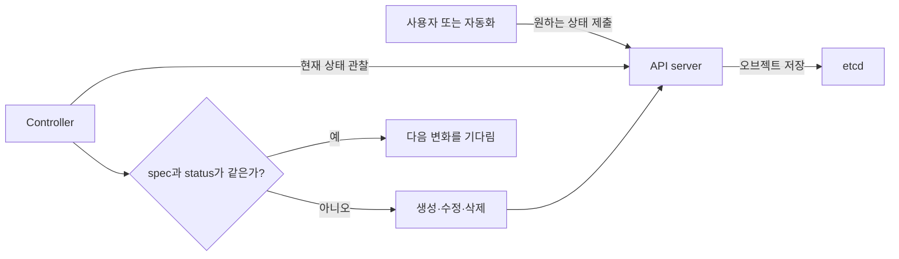
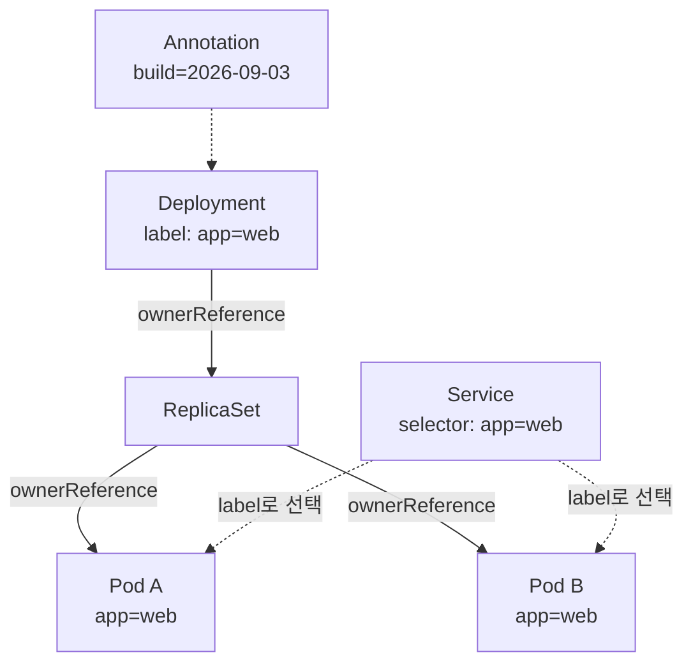
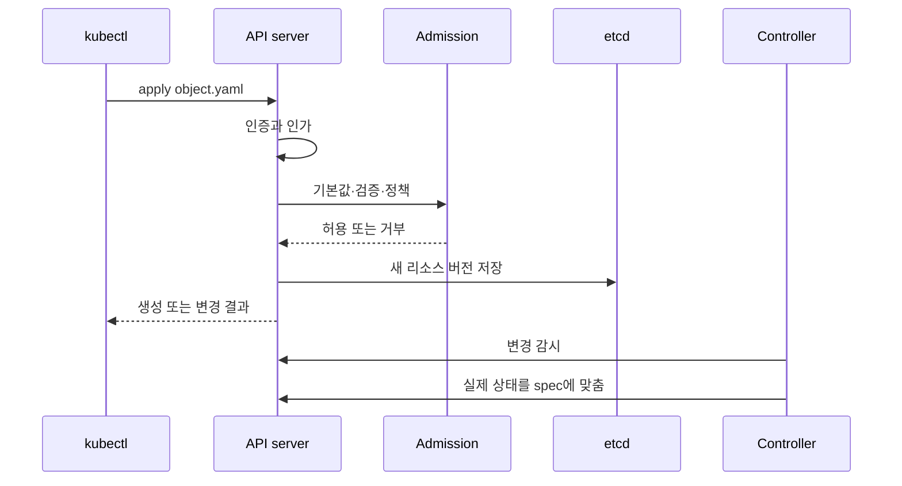

# 02. API와 오브젝트

쿠버네티스에서 YAML은 설정 파일 그 자체가 아니라 **API에 전달하는 의도**다. 사용자는 원하는 상태를 오브젝트의 `spec`에 기록하고, 컨트롤러는 실제 상태를 관찰해 그 차이를 줄인다. 이 선언 모델을 이해하면 수많은 리소스도 같은 문법으로 읽을 수 있다.

## 먼저 잡을 mental model

일반적인 스크립트는 “A를 실행한 다음 B를 실행하라”고 명령한다. 쿠버네티스는 “웹 서버 세 개가 계속 준비된 상태여야 한다”고 선언한다. 한 Pod가 사라져도 선언은 남아 있으므로 컨트롤러가 새 Pod를 만든다.



중요한 점은 “적용 명령이 컨테이너를 직접 띄운다”가 아니라는 것이다. API server가 의도를 저장하고, 여러 제어 루프가 각자의 책임 범위에서 비동기로 상태를 맞춘다.

## 모든 오브젝트를 읽는 다섯 칸

| 필드 | 질문 | 예시 |
|---|---|---|
| `apiVersion` | 어느 API 그룹과 버전의 계약인가? | `apps/v1` |
| `kind` | 어떤 종류의 리소스인가? | `Deployment` |
| `metadata` | 이름·Namespace·연결 정보는 무엇인가? | `name`, `labels` |
| `spec` | 사용자가 원하는 상태는 무엇인가? | `replicas: 3` |
| `status` | 시스템이 관찰한 현재 상태는 무엇인가? | `availableReplicas: 2` |

`status`는 보통 컨트롤러가 쓰는 관찰 결과다. Git에 저장할 매니페스트에는 원하는 `spec`을 적고, 실행 결과는 `kubectl get ... -o yaml`이나 `kubectl describe`로 확인한다.

### 이름과 UID는 다르다

같은 Namespace에서 같은 종류의 오브젝트는 이름으로 찾는다. 그러나 삭제 후 같은 이름으로 다시 만든 오브젝트는 새 UID를 받는다. 이름은 사람이 쓰는 주소이고 UID는 오브젝트 생애를 구분하는 식별자라고 생각하면 된다.

Namespace는 namespaced 리소스의 이름 범위를 나눈다. Node, Namespace, PersistentVolume처럼 클러스터 범위인 리소스도 있으므로 `kubectl api-resources --namespaced=true`로 현재 클러스터의 계약을 확인하는 습관이 좋다.

## 오브젝트를 연결하는 메타데이터

- **label**은 선택을 위한 짧고 안정적인 분류다. Service와 Deployment selector가 Pod label을 찾는다.
- **annotation**은 빌드 정보, 도구 설정처럼 선택에 쓰지 않는 부가 데이터다.
- **ownerReference**는 누가 이 오브젝트의 수명주기를 소유하는지 나타낸다. Deployment가 ReplicaSet을, ReplicaSet이 Pod를 소유한다.
- **finalizer**는 삭제 요청 뒤 정리 작업이 끝날 때까지 실제 제거를 지연한다.



소유 관계와 선택 관계를 혼동하면 안 된다. Service는 Pod를 선택하지만 소유하지는 않는다. Service를 지워도 Pod는 계속 실행된다.

## 선언형 적용이 일어나는 순서



`kubectl apply`가 성공했다는 것은 API 오브젝트가 받아들여졌다는 뜻이다. 애플리케이션이 준비됐다는 뜻은 아니다. 그 다음 `kubectl rollout status`, condition, event를 확인해야 한다.

## 실행 예제: 안전한 작성·검증·적용 루프

아래 파일을 `object.yaml`로 저장한다.

```yaml
apiVersion: apps/v1
kind: Deployment
metadata:
  name: object-demo
  labels:
    app.kubernetes.io/name: object-demo
  annotations:
    study.example/purpose: api-object-practice
spec:
  replicas: 2
  selector:
    matchLabels:
      app.kubernetes.io/name: object-demo
  template:
    metadata:
      labels:
        app.kubernetes.io/name: object-demo
    spec:
      containers:
        - name: web
          image: nginx:1.27-alpine
          ports:
            - name: http
              containerPort: 80
```

서버에 쓰기 전에 현재 API 계약으로 검사하고 diff를 본다.

```bash
kubectl explain deployment.spec.strategy
kubectl apply --dry-run=server -f object.yaml
kubectl diff -f object.yaml
kubectl apply -f object.yaml
kubectl get deployment object-demo -o yaml
kubectl get pods -l app.kubernetes.io/name=object-demo --show-labels
kubectl rollout status deployment/object-demo
```

`--dry-run=server`는 현재 API server의 기본값·검증·admission을 통과하는지 확인한다. 반면 로컬 검사만으로는 클러스터에 설치된 CRD나 admission 정책까지 알 수 없다.

실습이 끝나면 소유 관계를 본 뒤 정리한다.

```bash
kubectl get rs,pods -l app.kubernetes.io/name=object-demo \
  -o custom-columns=KIND:.kind,NAME:.metadata.name,OWNER:.metadata.ownerReferences[0].kind
kubectl delete -f object.yaml
```

## create, apply, patch, edit의 선택 기준

| 방법 | 알맞은 상황 | 주의점 |
|---|---|---|
| `create` | 새 오브젝트를 한 번 만들 때 | 이미 있으면 실패한다. |
| `apply` | 파일·Git을 원하는 상태의 정본으로 둘 때 | 여러 field manager가 같은 필드를 소유하면 충돌할 수 있다. |
| `patch` | 자동화가 일부 필드만 바꿀 때 | 패치 종류와 배열 병합 의미를 알아야 한다. |
| `edit` | 긴급 확인이나 일회성 수정 | 재현 가능한 파일과 쉽게 어긋난다. |

서버 측 적용은 API server가 필드별 관리 주체를 추적한다. 충돌 메시지는 방해물이 아니라 “같은 필드를 둘 이상의 주체가 소유하려 한다”는 중요한 신호다. 무조건 강제하기 전에 어느 자동화가 정본인지 결정한다.

## 실패를 증상에서 원인으로 좁히기

| 증상 | 먼저 확인 | 흔한 원인 |
|---|---|---|
| `no matches for kind` | `kubectl api-resources`, `apiVersion` | API 버전 오타, 필요한 CRD 미설치 |
| `unknown field` | `kubectl explain`, server dry-run | 다른 버전의 필드 사용 |
| selector 관련 거부 | selector와 Pod template label | 두 값 불일치 또는 변경 불가 필드 수정 |
| 적용 성공, Pod 없음 | Deployment condition과 event | controller·quota·admission 문제 |
| Service endpoint 없음 | Service selector와 Pod label | 선택 관계 불일치, Pod NotReady |
| 삭제가 끝나지 않음 | `deletionTimestamp`, finalizers | 외부 정리 컨트롤러가 완료하지 못함 |

오브젝트가 예상과 다를 때는 먼저 “내가 보낸 spec”, “서버가 저장한 spec”, “status”를 분리해 비교한다. 기본값 적용이나 다른 controller의 수정 때문에 로컬 YAML과 저장 결과가 다를 수 있다.

## 스스로 설명해 보기

1. `kubectl apply` 성공과 애플리케이션 준비 완료는 왜 다른가?
2. Service가 선택한 Pod는 왜 Service의 자식이 아닌가?
3. 같은 이름으로 삭제 후 재생성한 Pod를 UID가 구분해야 하는 이유는 무엇인가?
4. field conflict를 무조건 강제로 덮으면 어떤 자동화 문제가 숨어 있을 수 있는가?

[← 첫 클러스터](01-why-and-first-cluster.md) · [클러스터 아키텍처와 제어 루프 →](03-cluster-architecture.md)

<!-- source: https://kubernetes.io/ko/docs/concepts/overview/kubernetes-api/ | checked: 2026-09-03 -->
<!-- source: https://kubernetes.io/ko/docs/concepts/overview/working-with-objects/kubernetes-objects/ | checked: 2026-09-03 -->
<!-- source: https://kubernetes.io/ko/docs/concepts/overview/working-with-objects/object-management/ | checked: 2026-09-03 -->
<!-- source: https://kubernetes.io/ko/docs/concepts/overview/working-with-objects/labels/ | checked: 2026-09-03 -->
<!-- source: https://kubernetes.io/ko/docs/concepts/overview/working-with-objects/owners-dependents/ | checked: 2026-09-03 -->
