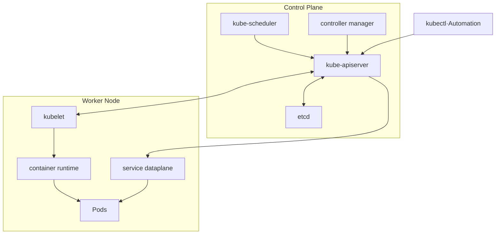
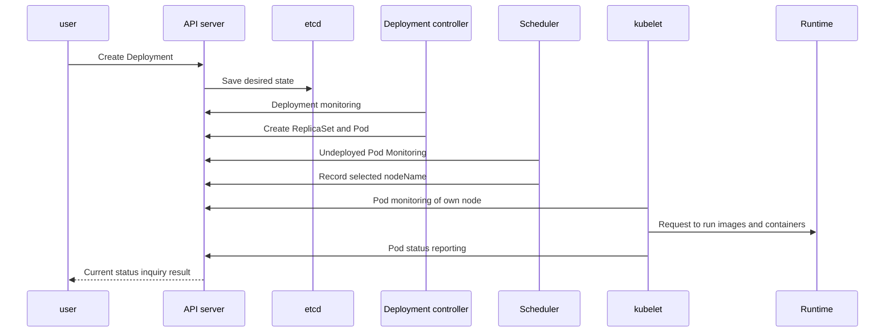
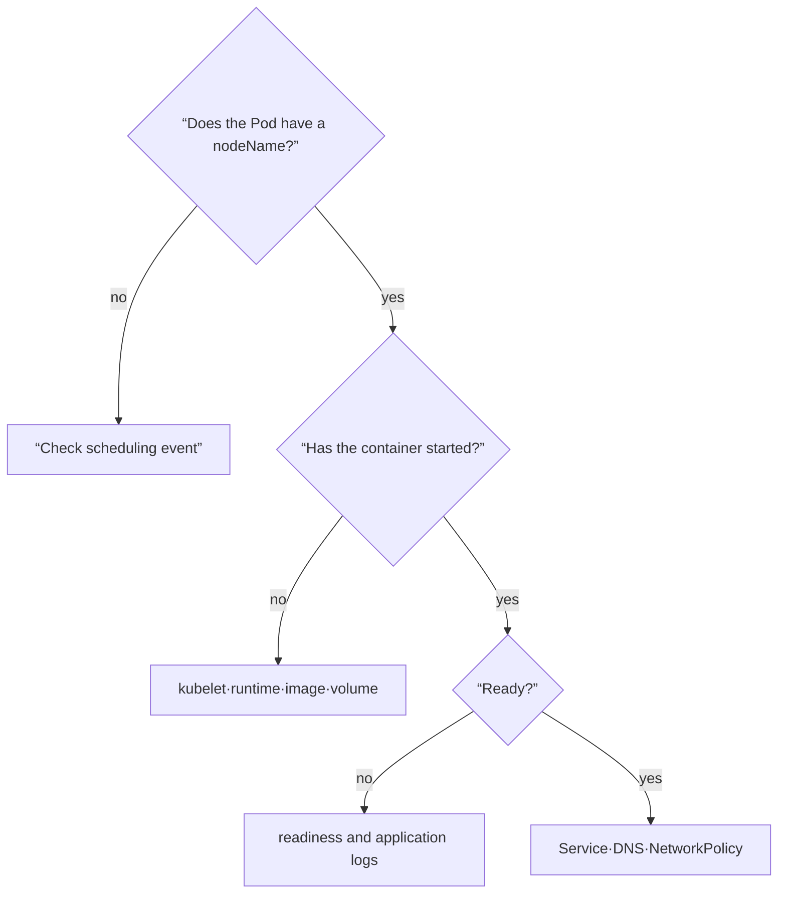

# 03. Cluster architecture and control loop

A Kubernetes cluster is divided into **Control Plane, which determines the state**, and **Nodes, which actually run Pods**. Rather than having one central program perform all tasks in order, multiple components observe the status recorded in the API and repeatedly perform their own small responsibilities.

## Remembering Components as Responsibilities

| location | component | core responsibilities |
|---|---|---|
| control plane | kube-apiserver | Gateway to API, provides status after authentication, authorization, and verification |
| control plane | etcd | Consistent key-value storage of API server data |
| control plane | kube-scheduler | Select a node for a Pod that has not yet decided on a node |
| control plane | kube-controller-manager | Execute control loops such as Deployment, Node, etc. |
| node | kubelet | Keep containers running in Pods assigned to you |
| node | container runtime | Actual execution of images and containers |
| node | kube-proxy or alternative dataplane | Implement node network rules for service traffic |
| addon | DNS, CNI, metrics, etc. | Provides name interpretation, pod network, and observation functions |



The arrows in the diagram are conceptual communication paths. The actual certificate, load balancer, network plug-in, and deployment type will vary depending on the cluster configuration.

## Until one pod runs



In this sequence, components view shared state through an API server rather than passing long chains of commands directly to each other. So, even if some components are temporarily interrupted, the saved intent is not lost and can be adjusted again after recovery.

## Control Loop: Observe, Compare, Act

The common structure of the controller is simple.

1. Observe the current state of related objects.
2. Compare with the desired state of `spec`.
3. If there is a difference, create, modify, or delete the resource you are responsible for.
4. Record the results as status or event and observe again.

This process is asynchronous. Assuming that all states will be completed immediately after the API response makes automation unstable. You must wait for the condition longer than the fixed time `sleep`.

```bash
kubectl apply -f object.yaml
kubectl rollout status deployment/object-demo --timeout=90s
kubectl get deployment object-demo \
  -o jsonpath='{.spec.replicas}{" desired / "}{.status.availableReplicas}{" available\n"}'
```

## Boundary between API server and etcd

Clients and controllers do not write directly to etcd. You must go through API contract, permission, and admission through the API server. Therefore, the availability of the API server is the gateway to all management tasks, and the consistency and recoverability of etcd is the foundation of the cluster health.

The following command checks the current connection and API readiness without writing. Some managed clusters may restrict detailed endpoint access.

```bash
kubectl cluster-info
kubectl get --raw='/readyz?verbose'
kubectl api-resources
kubectl get --raw='/apis/apps/v1' | head
```

Even if `/readyz` is successful, it does not mean that all workloads are normal. This is a signal in the range that the API server is ready to receive requests.

## Scheduler and kubelet answer different questions

The Scheduler decides “On which node will this Pod be placed?” Candidates are filtered and scored using resource requests, node selection conditions, taint, affinity, topology, etc. The selection result is recorded as the Pod's node allocation.

The kubelet is responsible for “Are the Pods assigned to my node running as specified?” At runtime, it requests container execution, observes probe and container status, and reports to the API. Therefore, if it is `Pending` and `nodeName` is empty, it mainly looks at scheduling. If the node is set but the container does not appear, it looks at the kubelet·runtime·image·volume path.

## Node heartbeat and Lease

Nodes send survival signals through status and lease. The control plane does not immediately determine a node with a signal loss as a “permanent failure,” but judges it after a set time and state transition. In network partitioning, the actual container on the node continues to run, but may appear as NotReady in the control plane, so stateful workloads must consider redundant execution and fencing.

```bash
kubectl get nodes -o wide
kubectl describe node <node-name>
kubectl get lease -n kube-node-lease
kubectl get pods -A -o wide --field-selector spec.nodeName=<node-name>
```

## Narrow down failing components by symptoms

| observation | Boundaries to investigate first | next proof |
|---|---|---|
| All `kubectl` requests failed | client → API server | kubeconfig, DNS/TLS, API endpoint |
| API can be read but changes are delayed | controller or admission | controller log, condition, event |
| Pod continues to Pending | scheduler input | Pod event, requests, taint, affinity |
| nodeName exists but ContainerCreating | kubelet/runtime/storage/network | Pod events, kubelet and runtime states |
| Node NotReady | node heartbeat path | Node condition, Lease, node system log |
| Only service connection fails | DNS·EndpointSlice·dataplane | Service, endpoint, CNI·proxy status |



## High availability is a recovery path rather than a number of replications

The production control plane is designed by dividing the failure domains of API endpoint, API server, controller and scheduler, and etcd. However, having multiple instances is not enough. You should actually practice etcd backup restoration, certificates, load balancer, version compatibility, and quorum loss procedures.

Additionally, the controller and scheduler can determine the active leader through leader election even if multiple instances are running. “There are three processes” and “performing the same decision three times at the same time” are different.

## Example results

Illustrative results for the two-replica object from chapter 2:

```text
# rollout status after applying object.yaml
deployment "object-demo" successfully rolled out
# desired / available JSONPath query
2 desired / 2 available
# API readyz verbose response, abbreviated
[+]ping ok
...
readyz check passed
```

These check different boundaries: the API can be ready while a workload has no ready replicas. A user without access to the non-resource readiness URL may receive Forbidden; this is an authorization result, not an unhealthy API diagnosis. After this exercise, delete only the disposable `object.yaml` resources you created.

## Explain it in your own words

1. Why doesn't `kubectl apply` command the kubelet directly?
2. What boundaries can be divided by checking if nodeName exists in Pending Pod?
3. Why may deployment not be adjusted even if the API server is normal?
4. Why can the status and actual process status be different when the node network is separated?

[← API and Object](02-api-and-objects.md) · [Pod and Workload →](04-pods-and-workloads.md)

<!-- source: https://kubernetes.io/ko/docs/concepts/overview/components/ | checked: 2026-09-03 -->
<!-- source: https://kubernetes.io/ko/docs/concepts/architecture/ | checked: 2026-09-03 -->
<!-- source: https://kubernetes.io/ko/docs/concepts/architecture/controller/ | checked: 2026-09-03 -->
<!-- source: https://kubernetes.io/ko/docs/concepts/architecture/nodes/ | checked: 2026-09-03 -->
<!-- source: https://kubernetes.io/ko/docs/concepts/architecture/leases/ | checked: 2026-09-03 -->
