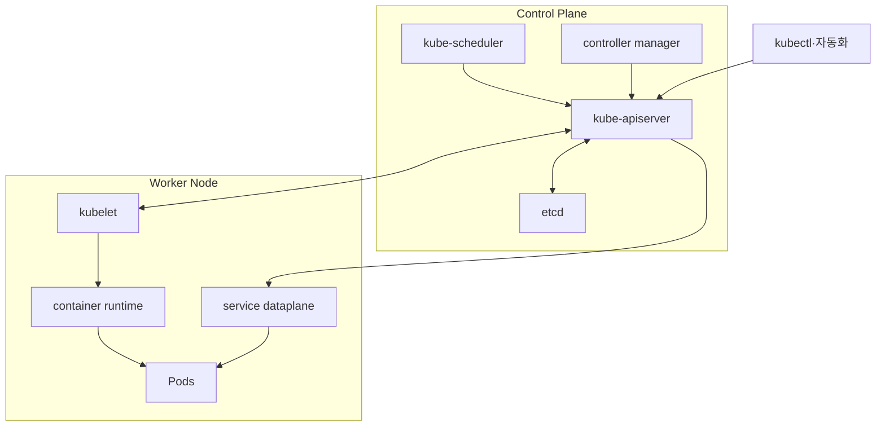
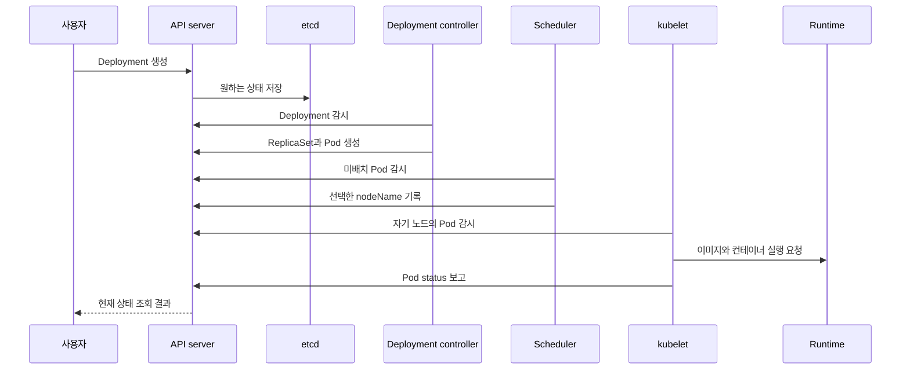
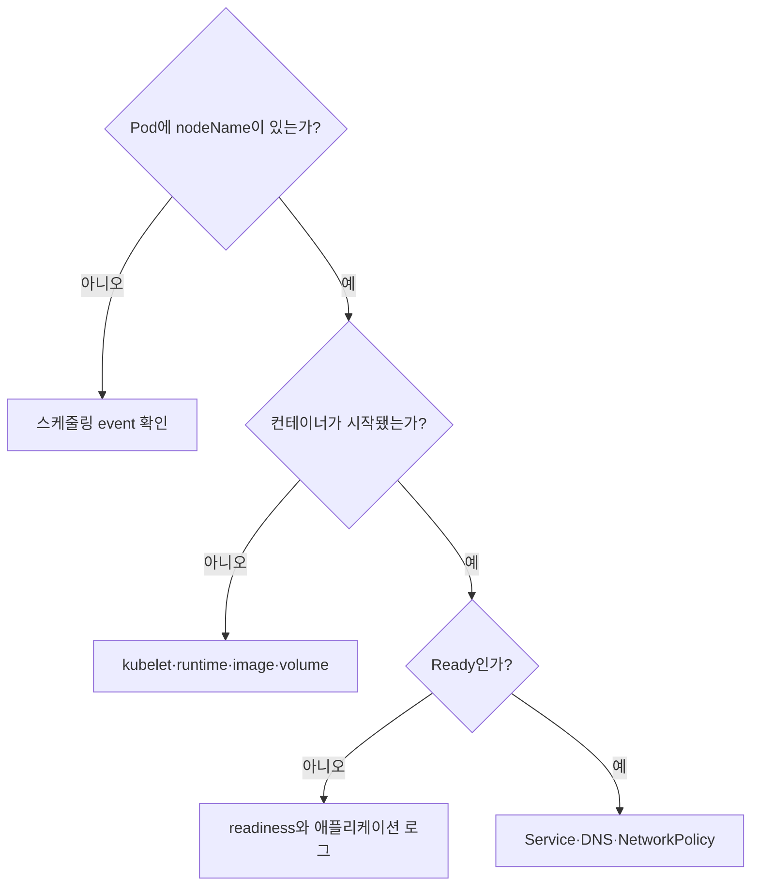

# 03. 클러스터 아키텍처와 제어 루프

쿠버네티스 클러스터는 **상태를 결정하는 컨트롤 플레인**과 **Pod를 실제로 실행하는 노드**로 나뉜다. 하나의 중앙 프로그램이 모든 일을 순서대로 수행하는 구조가 아니라, API에 기록된 상태를 여러 컴포넌트가 관찰하고 각자의 작은 책임을 반복해서 수행한다.

## 컴포넌트를 책임으로 기억하기

| 위치 | 컴포넌트 | 핵심 책임 |
|---|---|---|
| 컨트롤 플레인 | kube-apiserver | API의 관문, 인증·인가·검증 뒤 상태 제공 |
| 컨트롤 플레인 | etcd | API server 데이터의 일관된 키-값 저장소 |
| 컨트롤 플레인 | kube-scheduler | 아직 노드가 정해지지 않은 Pod에 노드 선택 |
| 컨트롤 플레인 | kube-controller-manager | Deployment, Node 등 제어 루프 실행 |
| 노드 | kubelet | 자신에게 배정된 Pod의 컨테이너 실행 상태 유지 |
| 노드 | container runtime | 이미지와 컨테이너의 실제 실행 |
| 노드 | kube-proxy 또는 대체 dataplane | Service 트래픽을 위한 노드 네트워크 규칙 구현 |
| 애드온 | DNS, CNI, metrics 등 | 이름 해석·Pod 네트워크·관측 기능 제공 |



다이어그램의 화살표는 개념적 통신 경로다. 실제 인증서, 로드밸런서, 네트워크 플러그인과 배포 형태는 클러스터 구성에 따라 달라진다.

## Pod 하나가 실행되기까지



이 시퀀스에서 컴포넌트들은 서로에게 긴 명령 체인을 직접 넘기기보다 API server를 통해 공유 상태를 본다. 그래서 일부 컴포넌트가 잠시 중단되어도 저장된 의도는 사라지지 않고, 복구 뒤 다시 조정할 수 있다.

## 제어 루프: 관찰하고, 비교하고, 행동한다

컨트롤러의 공통 구조는 단순하다.

1. 관련 오브젝트의 현재 상태를 관찰한다.
2. `spec`의 원하는 상태와 비교한다.
3. 차이가 있으면 자신이 담당하는 리소스를 생성·수정·삭제한다.
4. 결과를 status나 event로 기록하고 다시 관찰한다.

이 과정은 비동기다. API 응답 직후 모든 상태가 완성될 것이라고 가정하면 자동화가 불안정해진다. 고정 시간 `sleep`보다 condition을 기다려야 한다.

```bash
kubectl apply -f object.yaml
kubectl wait --for=condition=Available deployment/object-demo --timeout=90s
kubectl get deployment object-demo \
  -o jsonpath='{.spec.replicas}{" desired / "}{.status.availableReplicas}{" available\n"}'
```

## API server와 etcd의 경계

클라이언트와 컨트롤러는 etcd에 직접 쓰지 않는다. API server를 통해 API 계약, 권한, admission을 거쳐야 한다. 따라서 API server의 가용성은 모든 관리 작업의 관문이고, etcd의 일관성과 복구 가능성은 클러스터 상태의 토대다.

다음 명령은 쓰기 없이 현재 연결과 API 준비 상태를 확인한다. 일부 관리형 클러스터는 상세 endpoint 접근을 제한할 수 있다.

```bash
kubectl cluster-info
kubectl get --raw='/readyz?verbose'
kubectl api-resources
kubectl get --raw='/apis/apps/v1' | head
```

`/readyz`가 성공해도 모든 워크로드가 정상이라는 뜻은 아니다. API server가 요청을 받을 준비가 됐다는 범위의 신호다.

## Scheduler와 kubelet은 다른 질문에 답한다

Scheduler는 “이 Pod를 어느 노드에 둘 것인가?”를 결정한다. 리소스 requests, 노드 선택 조건, taint, affinity, topology 등을 이용해 후보를 거르고 점수를 매긴다. 선택 결과는 Pod의 노드 할당으로 기록된다.

kubelet은 “내 노드에 배정된 Pod가 명세대로 실행 중인가?”를 책임진다. 런타임에 컨테이너 실행을 요청하고, probe와 컨테이너 상태를 관찰하며 API에 보고한다. 따라서 `Pending`이며 `nodeName`이 비어 있으면 주로 스케줄링을, 노드가 정해졌지만 컨테이너가 뜨지 않으면 kubelet·runtime·image·volume 경로를 본다.

## Node heartbeat와 Lease

노드는 status와 Lease를 통해 생존 신호를 보낸다. 컨트롤 플레인은 신호가 끊긴 노드를 즉시 “영구 장애”로 단정하지 않고 설정된 시간과 상태 전이를 거쳐 판단한다. 네트워크 분할에서는 노드의 실제 컨테이너가 계속 실행되는데 컨트롤 플레인에서는 NotReady로 보일 수 있으므로, 상태 저장 워크로드는 중복 실행과 fencing까지 고려해야 한다.

```bash
kubectl get nodes -o wide
kubectl describe node <node-name>
kubectl get lease -n kube-node-lease
kubectl get pods -A -o wide --field-selector spec.nodeName=<node-name>
```

## 증상으로 실패 컴포넌트 좁히기

| 관찰 | 우선 조사할 경계 | 다음 증거 |
|---|---|---|
| 모든 `kubectl` 요청 실패 | client → API server | kubeconfig, DNS/TLS, API endpoint |
| API 읽기는 되지만 변경 지연 | controller 또는 admission | controller 로그, condition, event |
| Pod가 계속 Pending | scheduler 입력 | Pod event, requests, taint, affinity |
| nodeName은 있으나 ContainerCreating | kubelet/runtime/storage/network | Pod event, kubelet과 runtime 상태 |
| Node NotReady | node heartbeat 경로 | Node condition, Lease, 노드 시스템 로그 |
| Service만 연결 실패 | DNS·EndpointSlice·dataplane | Service와 endpoint, CNI·proxy 상태 |



## 고가용성은 복제 수보다 복구 경로다

프로덕션 컨트롤 플레인은 API endpoint, API server, controller와 scheduler, etcd의 장애 도메인을 나눠 설계한다. 그러나 인스턴스를 여러 개 두는 것만으로 충분하지 않다. etcd 백업 복원, 인증서, load balancer, 버전 호환성, quorum 상실 절차를 실제로 연습해야 한다.

또한 controller와 scheduler는 여러 인스턴스가 실행되더라도 leader election으로 활성 리더를 정할 수 있다. “프로세스가 세 개”와 “동시에 세 번 같은 결정을 수행”은 다르다.

## 스스로 설명해 보기

1. `kubectl apply`가 kubelet에 직접 명령하지 않는 이유는 무엇인가?
2. Pending Pod에 nodeName이 있는지 확인하면 어떤 경계를 나눌 수 있는가?
3. API server가 정상이어도 Deployment가 조정되지 않을 수 있는 이유는 무엇인가?
4. 노드 네트워크가 분리됐을 때 status와 실제 프로세스 상태가 왜 다를 수 있는가?

[← API와 오브젝트](02-api-and-objects.md) · [Pod와 워크로드 →](04-pods-and-workloads.md)

<!-- source: https://kubernetes.io/ko/docs/concepts/overview/components/ | checked: 2026-09-03 -->
<!-- source: https://kubernetes.io/ko/docs/concepts/architecture/ | checked: 2026-09-03 -->
<!-- source: https://kubernetes.io/ko/docs/concepts/architecture/controller/ | checked: 2026-09-03 -->
<!-- source: https://kubernetes.io/ko/docs/concepts/architecture/nodes/ | checked: 2026-09-03 -->
<!-- source: https://kubernetes.io/ko/docs/concepts/architecture/leases/ | checked: 2026-09-03 -->
