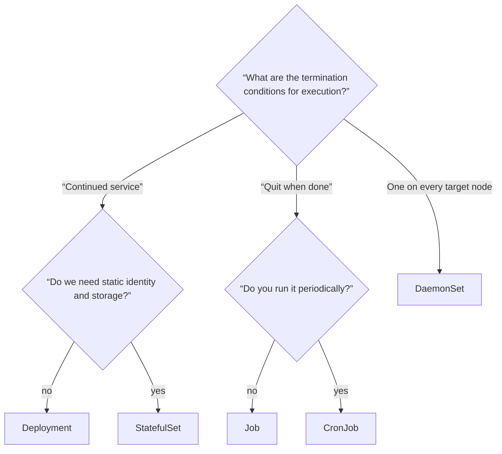
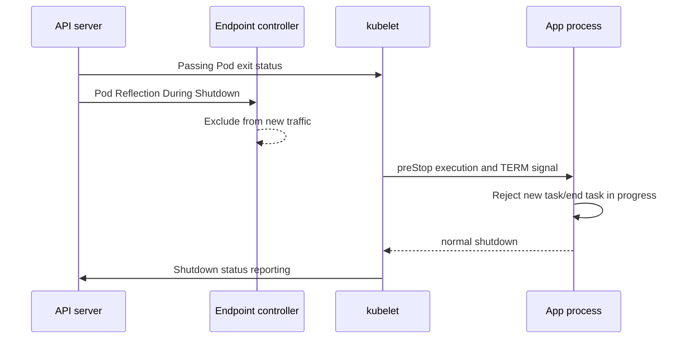
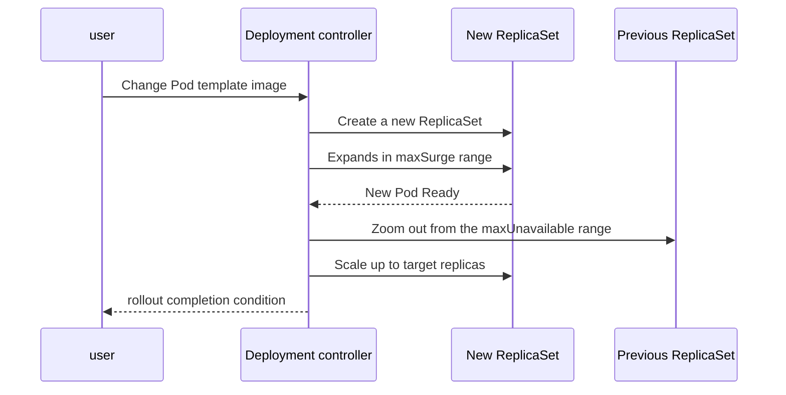

# 04. Pods and workloads

A Pod is the smallest deployment unit that Kubernetes can create and manage. However, in operation, rather than creating a Pod directly, the life cycle of the Pod is left to **workload controllers such as Deployment, StatefulSet, and Job**. Pods can be replaced, and the controller provides persistence.

## Pods are not small virtual machines

Containers within a pod share the same network context and volume and are always placed together on the same node. They can communicate with each other using `localhost`, but CPU/memory limits and file systems may differ for each container.

The criterion for putting multiple containers in one Pod is not for organizational reasons such as “same application”, but whether they should be deployed together and die together. It is suitable when there is strong sharing of life and network, such as a log forwarding sidecar or local proxy. If you need to scale or deploy independently, divide it into separate workloads.



## Separate life cycle signals

| device | question to answer | If you fail |
|---|---|---|
| init container | Are any preceding tasks completed before the app starts? | App container startup is delayed |
| startup probe | Is slow initialization still in progress? | Postponing judgment of liveness/readiness before success |
| readiness probe | Can I start accepting new traffic now? | Excluded from Service's prepared endpoints |
| liveness probe | Does it only recover after a restart? | Restart the container |

If you put liveness as the reason why the DB is temporarily slow, the normal process can be serially restarted. Readiness refers to the ability to accept traffic, and liveness refers only to internal failures that require a restart, such as deadlocks.

## Closing is the timeline for completing work minus traffic.

When Pod deletion is requested, the ready state and endpoint are changed so that no new requests are received, and a termination signal is sent to the container. The application must close the listener in `terminationGracePeriodSeconds` and clean up ongoing requests, messages, and telemetry. If it is not completed in time, it may be forced to end.



Endpoint propagation and external load balancer updates are not assumed to be completed atomically immediately. Test application drain, client retry, idempotency, and shutdown grace time together.

## Workload Controller Selection Table

| resources | contract to provide | representative example |
|---|---|---|
| Deployment | Swappable Pod Replication and Rolling Updates | Web API, stateless worker |
| StatefulSet | Ordered names, stable identity, and Pod-specific PVC | database, broker |
| DaemonSet | One Pod on each selected node | Log·network·security agent |
| Job | Retry until specified number of completions | migration, batch calculation |
| CronJob | Job creation according to schedule | Regular reports, cleaning work |

StatefulSet does not automatically solve database replication, consensus, and backup. It only provides a fixed identity and storage connection, and application-level safety is separate.

## Actual objects in the Deployment rollout



A new rollout begins when `spec.template` changes. Deployment creates a new ReplicaSet and adjusts the size of the new and old ReplicaSet within the `maxSurge` and `maxUnavailable` budgets. If Ready does not reflect actual service availability, rollout success does not guarantee user success.

## Running example: probe and safe rollout

Make `workload.yaml`.

```yaml
apiVersion: apps/v1
kind: Deployment
metadata:
  name: web
spec:
  replicas: 3
  strategy:
    rollingUpdate:
      maxSurge: 1
      maxUnavailable: 0
  selector:
    matchLabels:
      app: web
  template:
    metadata:
      labels:
        app: web
    spec:
      terminationGracePeriodSeconds: 30
      containers:
        - name: web
          image: nginx:1.27-alpine
          ports:
            - name: http
              containerPort: 80
          readinessProbe:
            httpGet:
              path: /
              port: http
            periodSeconds: 5
            failureThreshold: 2
          livenessProbe:
            httpGet:
              path: /
              port: http
            periodSeconds: 10
            failureThreshold: 3
          resources:
            requests:
              cpu: 50m
              memory: 32Mi
            limits:
              memory: 128Mi
```

```bash
kubectl apply -f workload.yaml
kubectl rollout status deployment/web
kubectl get deployment,rs,pods -l app=web
kubectl set image deployment/web web=nginx:does-not-exist
kubectl rollout status deployment/web --timeout=60s
kubectl get pods -l app=web
kubectl describe deployment web
kubectl rollout undo deployment/web
kubectl rollout status deployment/web
```

If you intentionally apply the wrong image, image fetch failure will occur in the new Pod. If `maxUnavailable: 0`, the previous Ready Pod is maintained as long as resources allow, and rollback returns to the previous Pod template revision.

## Narrowing down failures from symptoms to causes

| symptoms | Check | analysis |
|---|---|---|
| Stuck at `Init:...` | init container log·event | Preceding task is not finished |
| `ImagePullBackOff` | Image name, registry authentication, event | Image step fails before container starts |
| `CrashLoopBackOff` | `logs --previous`, exit code | End of iteration and backoff after execution |
| Running but `0/1 Ready` | readiness results and app logs | Traffic acceptance condition failed |
| Rollout does not proceed | New ReplicaSet, Deployment condition | New Pod Fails to Become Available |
| Request lost when terminated | Endpoint change, TERM processing, grace period | drain timeline mismatch |

```bash
kubectl get pods -l app=web -o wide
kubectl describe pod <pod-name>
kubectl logs <pod-name> -c web --previous
kubectl get deployment web -o jsonpath='{.status.conditions}'
```

## Example results

Illustrative rolling-update transcript:

```text
# Initial rollout
deployment "web" successfully rolled out
# After nginx:does-not-exist
error: timed out waiting for the condition
# New Pod state
0/1  ImagePullBackOff
# kubectl rollout undo deployment/web
deployment.apps/web rolled back
# Rollout verification
deployment "web" successfully rolled out
```

Healthy old replicas can continue serving during the failed rollout. Pass recovery only after the current Deployment's image and readiness are restored. `logs --previous` requires a previous terminated container; an image that never started has no such log. Delete the lab resources with `kubectl delete -f workload.yaml` after recording the observations.

## Explain it in your own words

1. Why is Deployment better for recovery than creating Pods directly?
2. What kind of cascading failures are possible if we put the same dependency check on readiness and liveness?
3. Why is a separate database backup required even when using StatefulSet?
4. What costs will `maxSurge: 1`, `maxUnavailable: 0` create in capacity and availability during rollout?

[← Cluster Architecture](03-cluster-architecture.md) · [Service and Networking →](05-services-and-networking.md)

<!-- source: https://kubernetes.io/ko/docs/concepts/workloads/pods/ | checked: 2026-09-03 -->
<!-- source: https://kubernetes.io/ko/docs/concepts/workloads/controllers/ | checked: 2026-09-03 -->
<!-- source: https://kubernetes.io/ko/docs/concepts/workloads/controllers/deployment/ | checked: 2026-09-03 -->
<!-- source: https://kubernetes.io/ko/docs/concepts/workloads/pods/pod-lifecycle/ | checked: 2026-09-03 -->
<!-- source: https://kubernetes.io/ko/docs/concepts/workloads/pods/pod-lifecycle/#pod-termination-flow | checked: 2026-09-03 -->
