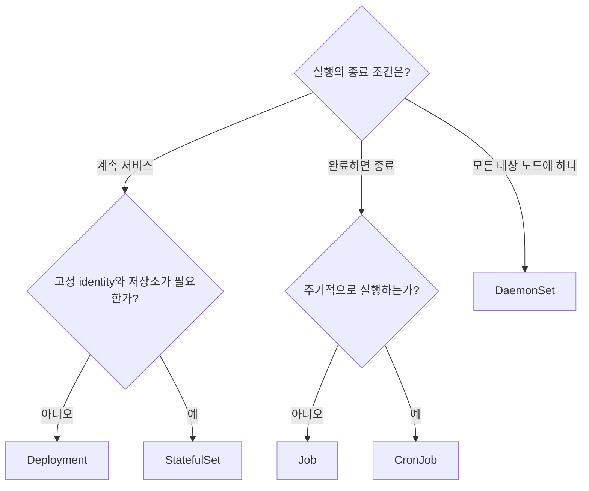
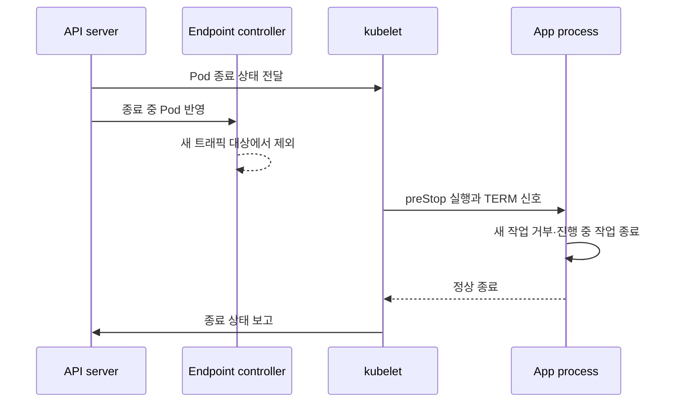
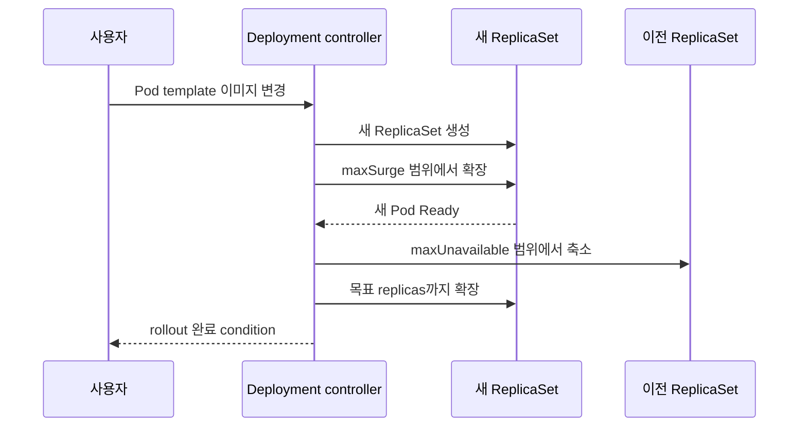

# 04. Pod와 워크로드

Pod는 쿠버네티스가 생성하고 관리할 수 있는 가장 작은 배포 단위다. 그러나 운영에서는 Pod를 직접 만들기보다 Deployment, StatefulSet, Job 같은 **워크로드 컨트롤러에 Pod의 수명주기를 맡긴다**. Pod는 교체될 수 있고, 컨트롤러가 지속성을 제공한다.

## Pod는 작은 가상 머신이 아니다

Pod 안의 컨테이너는 같은 네트워크 문맥과 볼륨을 공유하고 항상 같은 노드에 함께 배치된다. 서로 `localhost`로 통신할 수 있지만, CPU·메모리 제한과 파일시스템은 컨테이너별로 다를 수 있다.

한 Pod에 여러 컨테이너를 넣는 기준은 “같은 애플리케이션”이라는 조직적 이유가 아니라 **같이 배치되고 같이 죽어야 하는가**다. 로그 전달 sidecar나 로컬 프록시처럼 수명과 네트워크를 강하게 공유할 때 적합하다. 독립적으로 확장하거나 배포해야 하면 별도 워크로드로 나눈다.



## 수명주기 신호를 분리한다

| 장치 | 답하는 질문 | 실패하면 |
|---|---|---|
| init container | 앱 시작 전에 선행 작업이 끝났는가? | 앱 컨테이너 시작이 지연됨 |
| startup probe | 느린 초기화가 아직 진행 중인가? | 성공 전 liveness/readiness 판단을 미룸 |
| readiness probe | 지금 새 트래픽을 받아도 되는가? | Service의 준비된 endpoint에서 제외 |
| liveness probe | 재시작해야만 회복되는가? | 해당 컨테이너 재시작 |

DB가 잠시 느리다는 이유를 liveness에 넣으면 정상 프로세스가 연쇄 재시작할 수 있다. readiness는 트래픽 수락 능력, liveness는 교착처럼 재시작이 필요한 내부 고장만 표현한다.

## 종료는 트래픽을 빼고 일을 마치는 시간선이다

Pod 삭제가 요청되면 새 요청을 더 받지 않도록 준비 상태와 endpoint가 바뀌고, 컨테이너에는 종료 신호가 전달된다. 애플리케이션은 `terminationGracePeriodSeconds` 안에 listener를 닫고 진행 중 요청·메시지·telemetry를 정리해야 한다. 시간 안에 끝나지 않으면 강제 종료될 수 있다.



endpoint 전파와 외부 로드밸런서 갱신은 즉시 원자적으로 끝난다고 가정하지 않는다. 애플리케이션 drain, 클라이언트 재시도와 멱등성, 종료 유예 시간을 함께 시험한다.

## 워크로드 컨트롤러 선택표

| 리소스 | 제공하는 계약 | 대표 사례 |
|---|---|---|
| Deployment | 교체 가능한 Pod 복제와 롤링 업데이트 | 웹 API, stateless worker |
| StatefulSet | 순서 있는 이름과 안정적 identity, Pod별 PVC | 데이터베이스, broker |
| DaemonSet | 선택된 각 노드에 Pod 하나 | 로그·네트워크·보안 agent |
| Job | 지정된 완료 횟수까지 재시도 | migration, batch 계산 |
| CronJob | 스케줄에 따라 Job 생성 | 정기 리포트, 청소 작업 |

StatefulSet이 데이터베이스의 복제·합의·백업을 자동으로 해결하지는 않는다. 고정된 identity와 저장소 연결을 제공할 뿐, 애플리케이션 수준의 안전성은 별도다.

## Deployment 롤아웃의 실제 오브젝트



새 롤아웃은 `spec.template`이 바뀔 때 시작한다. Deployment는 새 ReplicaSet을 만들고 `maxSurge`와 `maxUnavailable` 예산 안에서 새·이전 ReplicaSet의 크기를 조절한다. Ready가 실제 서비스 가능 상태를 반영하지 못하면 롤아웃 성공도 사용자 성공을 보장하지 못한다.

## 실행 예제: probe와 안전한 롤아웃

`workload.yaml`을 만든다.

```yaml
apiVersion: apps/v1
kind: Deployment
metadata:
  name: web
spec:
  replicas: 3
  strategy:
    rollingUpdate:
      maxSurge: 1
      maxUnavailable: 0
  selector:
    matchLabels:
      app: web
  template:
    metadata:
      labels:
        app: web
    spec:
      terminationGracePeriodSeconds: 30
      containers:
        - name: web
          image: nginx:1.27-alpine
          ports:
            - name: http
              containerPort: 80
          readinessProbe:
            httpGet:
              path: /
              port: http
            periodSeconds: 5
            failureThreshold: 2
          livenessProbe:
            httpGet:
              path: /
              port: http
            periodSeconds: 10
            failureThreshold: 3
          resources:
            requests:
              cpu: 50m
              memory: 32Mi
            limits:
              memory: 128Mi
```

```bash
kubectl apply -f workload.yaml
kubectl rollout status deployment/web
kubectl get deployment,rs,pods -l app=web
kubectl set image deployment/web web=nginx:does-not-exist
kubectl rollout status deployment/web --timeout=60s
kubectl get pods -l app=web
kubectl describe deployment web
kubectl rollout undo deployment/web
kubectl rollout status deployment/web
```

일부러 잘못된 이미지를 적용하면 새 Pod에서 이미지 가져오기 실패가 발생한다. `maxUnavailable: 0`이면 자원이 허용하는 한 이전 Ready Pod를 유지하며, rollback은 이전 Pod template revision으로 되돌린다.

## 실패를 증상에서 원인으로 좁히기

| 증상 | 확인할 것 | 해석 |
|---|---|---|
| `Init:...`에서 멈춤 | init container 로그·event | 선행 작업이 끝나지 않음 |
| `ImagePullBackOff` | 이미지 이름, registry 인증, event | 컨테이너 시작 전 이미지 단계 실패 |
| `CrashLoopBackOff` | `logs --previous`, 종료 코드 | 실행 후 반복 종료와 backoff |
| Running이지만 `0/1 Ready` | readiness 결과와 앱 로그 | 트래픽 수락 조건 실패 |
| rollout이 진행되지 않음 | 새 ReplicaSet, Deployment condition | 새 Pod가 Available이 되지 못함 |
| 종료 때 요청 유실 | endpoint 변화, TERM 처리, grace period | drain 시간선 불일치 |

```bash
kubectl get pods -l app=web -o wide
kubectl describe pod <pod-name>
kubectl logs <pod-name> -c web --previous
kubectl get deployment web -o jsonpath='{.status.conditions}'
```

## 스스로 설명해 보기

1. Pod를 직접 생성하는 것보다 Deployment가 복구에 유리한 이유는 무엇인가?
2. readiness와 liveness에 같은 dependency check를 넣으면 어떤 연쇄 장애가 가능한가?
3. StatefulSet을 사용해도 데이터베이스 백업이 별도로 필요한 이유는 무엇인가?
4. 롤아웃 중 `maxSurge: 1`, `maxUnavailable: 0`은 용량과 가용성에 어떤 비용을 만드는가?

[← 클러스터 아키텍처](03-cluster-architecture.md) · [Service와 네트워킹 →](05-services-and-networking.md)

<!-- source: https://kubernetes.io/ko/docs/concepts/workloads/pods/ | checked: 2026-09-03 -->
<!-- source: https://kubernetes.io/ko/docs/concepts/workloads/controllers/ | checked: 2026-09-03 -->
<!-- source: https://kubernetes.io/ko/docs/concepts/workloads/controllers/deployment/ | checked: 2026-09-03 -->
<!-- source: https://kubernetes.io/ko/docs/concepts/workloads/pods/pod-lifecycle/ | checked: 2026-09-03 -->
<!-- source: https://kubernetes.io/ko/docs/concepts/workloads/pods/pod-lifecycle/#pod-termination-flow | checked: 2026-09-03 -->
