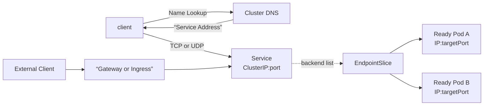
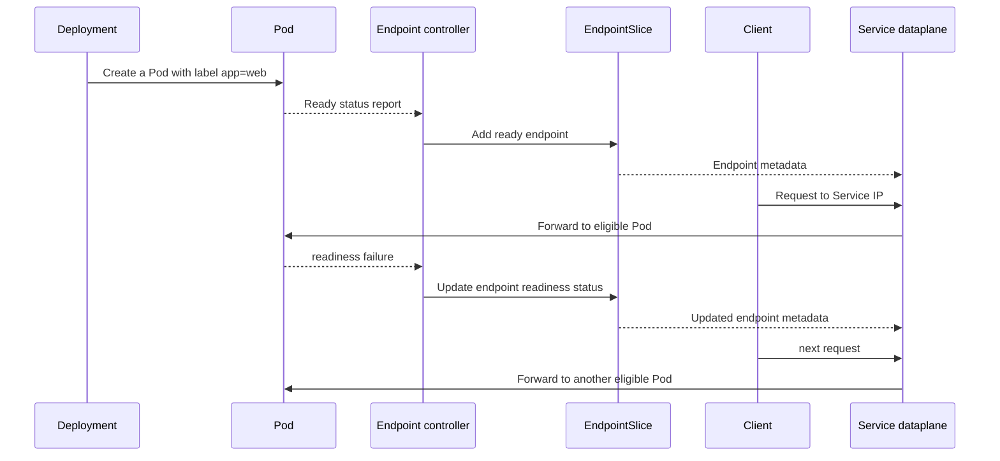

# 05. Service and networking

<!-- source: https://kubernetes.io/docs/concepts/services-networking/endpoint-slices/ | checked: 2026-09-10 | endpoint metadata and readiness -->

When a Pod is replaced, its IP may change. If the client remembers individual Pod addresses, connection information will be broken during each recovery and rollout. Service puts a stable name and virtual access point in front of a changing set of Pods, and EndpointSlice represents a list of currently connectable backends.

## Divide the request path into tiers



When solving a problem, we do not call this layer “network failure” all at once.

1. Does DNS translate service names into addresses?
2. Are `port` and `targetPort` in Service the intended ports?
3. Does the selector match the Pod label and an EndpointSlice is created?
4. Is the endpoint Ready?
5. Is the actual Pod process listening on the target port?
6. Does the NetworkPolicy or node dataplane allow the flow?

## Relationship between Service and EndpointSlice

Service selector defines “which Pod is the backend” as a label. The controller finds matching Pods and updates the EndpointSlice. Since the Service does not own the Pod, deleting the Service or changing the selector does not affect the Pod lifespan.



EndpointSlice is API metadata consumed by the dataplane, not a packet-forwarding component. A not-ready address can remain in a slice with `ready: false`; distinguish no addresses from no eligible addresses. Readiness failure does not restart the container. Endpoint propagation, existing connections, and `publishNotReadyAddresses` require separate interpretation.

## Criteria for selecting service type

| type | reach | Main use |
|---|---|---|
| `ClusterIP` | Basically inside the cluster | Inter-service communication |
| `NodePort` | Fixed port on each node | The basis of a higher load balancer than direct exposure |
| `LoadBalancer` | External load balancer provided by the implementation | External L4 entry point |
| `ExternalName` | DNS CNAME method | Reference external name to Service name |
| headless | Direct discovery of endpoint without ClusterIP | StatefulSet, client-side discovery |

Using the `LoadBalancer` type does not automatically generate an external address in all environments. Cloud integration or separate load balancer implementation is required. If `EXTERNAL-IP` is still Pending, this implementation boundary is checked before the application.

## DNS names contain Namespace boundaries

In the same namespace, you can use a short service name such as `web`. For other namespaces, use the form `web.shop`, and if you need the complete cluster name, use the form `web.shop.svc.cluster.local`. The actual cluster domain may vary depending on installation settings.

Even if the DNS is normal, if there is no endpoint in the service, the connection will fail. Conversely, if a connection is made to the Service IP but only the name fails, check the DNS, search domain, and Pod's DNS policy.

## Running example: Tracing from Service to Pod

Make `network.yaml`.

```yaml
apiVersion: apps/v1
kind: Deployment
metadata:
  name: web
spec:
  replicas: 2
  selector:
    matchLabels:
      app: web
  template:
    metadata:
      labels:
        app: web
    spec:
      containers:
        - name: web
          image: nginx:1.27-alpine
          ports:
            - name: http
              containerPort: 80
          readinessProbe:
            httpGet:
              path: /
              port: http
---
apiVersion: v1
kind: Service
metadata:
  name: web
spec:
  selector:
    app: web
  ports:
    - name: http
      port: 8080
      targetPort: http
```

```bash
kubectl apply -f network.yaml
kubectl rollout status deployment/web
kubectl get service web
kubectl get endpointslice -l kubernetes.io/service-name=web -o wide
kubectl run netcheck --restart=Never --image=curlimages/curl --command -- sleep 3600
kubectl wait --for=condition=Ready pod/netcheck --timeout=90s
kubectl exec netcheck -- curl --connect-timeout 3 --max-time 5 -fsS http://web:8080/
```

Here, the Service receives 8080 and forwards it to the Pod's named port `http`, i.e. 80. By referring to port names instead of numbers, you can maintain the service contract even if the container port changes in a new Pod version.

Practice the diagnosis sequence by intentionally breaking the selector.

```bash
kubectl patch service web -p '{"spec":{"selector":{"app":"wrong"}}}'
kubectl get endpointslice -l kubernetes.io/service-name=web
kubectl get pods -l app=web --show-labels
kubectl apply -f network.yaml
```

## External HTTP: Put a routing layer on top of Service

Ingress and Gateway API are not competing substitutes for Service. The Service provides an L4 access point for the backend set, and the Ingress or Gateway implementation adds external L7 routing such as host·path·TLS.

- Even if you only create an Ingress object, it will not work if there is no controller to handle the traffic.
- Gateway API is good for dividing ownership of infrastructure and application routing into GatewayClass, Gateway, and Route.
- It must be checked end-to-end, including DNS, certificate issuance, external load balancer, and controller status.

## NetworkPolicy is the union of selected permission rules

NetworkPolicy is effective when there is a network plugin that implements it. If a policy isolates a Pod in the ingress or egress direction, only flows allowed in that direction will pass through. If both the egress of the source and the ingress of the destination are isolated, both should be allowed.

Rather than just checking that the policy file exists, verify the flows that should be allowed and the flows that should be blocked with actual connections, respectively. It is also common for name resolution itself to fail by blocking DNS egress.

## Narrowing down the failure from DNS to a process

```bash
kubectl get pod -o wide
kubectl get service web -o yaml
kubectl get endpointslice -l kubernetes.io/service-name=web -o yaml
kubectl describe pod <web-pod>
kubectl logs <web-pod>
kubectl exec netcheck -- curl --connect-timeout 3 --max-time 5 -v http://web:8080/
```

Verbose curl output separates name lookup, selected address, connection, and HTTP response without assuming the client image contains `nslookup`. Keep this client Pod alive for the diagnostics above. At the end run `kubectl delete pod netcheck` and `kubectl delete -f network.yaml` in the disposable cluster.

| symptoms | First floor to see |
|---|---|
| Can't find name | DNS and Namespace |
| The name is resolved but the connection refused | targetPort and Pod listener |
| timeout | endpoint, NetworkPolicy, CNI and node path |
| EndpointSlice is empty | selector-label and readiness |
| The inside of the cluster succeeds, only the outside fails. | Gateway/Ingress controller, LB, DNS, TLS |
| Only some requests fail | Differences in readiness, version, and node by endpoint |

## Example results

Illustrative excerpts for an in-cluster client. Endpoint addresses and failure wording depend on the network implementation.

```text
# kubectl exec netcheck -- curl ... http://web:8080/
<!DOCTYPE html>
...
<title>Welcome to nginx!</title>
# After selector app=wrong: EndpointSlice has no matching backend addresses
ENDPOINTS: <none>
# Client result can be a refusal or a bounded timeout, not an HTTP success.
# After kubectl apply -f network.yaml: ready backend addresses return.
```

The Service ClusterIP can remain unchanged during all three phases. Pass only when the matching Pod labels, ready EndpointSlice addresses, and successful client request agree. Repeat the bounded curl after restoring the selector; endpoint recovery alone is insufficient.

## Explain it in your own words

1. Why do I need an EndpointSlice even if the Service provides a static IP?
2. When the Service selector is incorrect, the Pod is normal, but why does the request fail?
3. What is the difference between readiness failure and liveness failure on network paths?
4. Why can communication fail even if only NetworkPolicy's destination ingress is allowed?

[← Pods and workloads](04-pods-and-workloads.md) · [Storage and application configuration →](06-storage-and-configuration.md)

<!-- source: https://kubernetes.io/ko/docs/concepts/services-networking/service/ | checked: 2026-09-03 -->
<!-- source: https://kubernetes.io/ko/docs/concepts/services-networking/endpoint-slices/ | checked: 2026-09-03 -->
<!-- source: https://kubernetes.io/ko/docs/concepts/services-networking/dns-pod-service/ | checked: 2026-09-03 -->
<!-- source: https://kubernetes.io/ko/docs/concepts/services-networking/ingress/ | checked: 2026-09-03 -->
<!-- source: https://kubernetes.io/ko/docs/concepts/services-networking/network-policies/ | checked: 2026-09-03 -->
