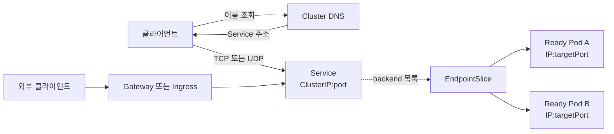
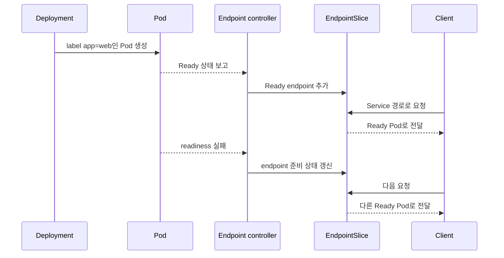

# 05. Service와 네트워킹

Pod는 교체될 때 IP가 달라질 수 있다. 클라이언트가 개별 Pod 주소를 기억하면 복구와 롤아웃 때마다 연결 정보가 깨진다. Service는 변화하는 Pod 집합 앞에 안정적인 이름과 가상 접근점을 두고, EndpointSlice는 현재 연결 가능한 backend 목록을 표현한다.

## 요청 경로를 층으로 나누기



문제를 풀 때 이 층을 한꺼번에 “네트워크 장애”라고 부르지 않는다.

1. DNS가 Service 이름을 주소로 바꾸는가?
2. Service의 `port`와 `targetPort`가 의도한 포트인가?
3. selector가 Pod label과 일치해 EndpointSlice가 생겼는가?
4. endpoint가 Ready인가?
5. 실제 Pod 프로세스가 target port에서 듣고 있는가?
6. NetworkPolicy나 노드 dataplane이 흐름을 허용하는가?

## Service와 EndpointSlice의 관계

Service selector는 “어떤 Pod가 backend인가”를 label로 정의한다. 컨트롤러는 일치하는 Pod를 찾아 EndpointSlice를 갱신한다. Service가 Pod를 소유하는 것은 아니므로 Service 삭제나 selector 변경은 Pod 수명에 영향을 주지 않는다.



readiness 실패는 컨테이너 재시작 명령이 아니다. 새로운 Service 트래픽의 후보에서 빠지는 신호다. 이미 열린 연결과 외부 로드밸런서의 갱신 시점은 별개일 수 있다.

## Service 타입을 선택하는 기준

| 타입 | 도달 범위 | 주 용도 |
|---|---|---|
| `ClusterIP` | 기본적으로 클러스터 내부 | 서비스 간 통신 |
| `NodePort` | 각 노드의 고정 포트 | 직접 노출보다 상위 로드밸런서의 기반 |
| `LoadBalancer` | 구현이 제공하는 외부 로드밸런서 | 외부 L4 진입점 |
| `ExternalName` | DNS CNAME 방식 | 외부 이름을 Service 이름으로 참조 |
| headless | ClusterIP 없이 endpoint 직접 발견 | StatefulSet, client-side discovery |

`LoadBalancer` 타입을 쓴다고 모든 환경에서 외부 주소가 자동 생성되는 것은 아니다. 클라우드 통합이나 별도 load balancer 구현이 필요하다. `EXTERNAL-IP`가 계속 Pending이면 애플리케이션보다 이 구현 경계를 먼저 확인한다.

## DNS 이름은 Namespace 경계를 포함한다

같은 Namespace에서는 `web` 같은 짧은 Service 이름을 사용할 수 있다. 다른 Namespace라면 `web.shop`, 완전한 클러스터 이름이 필요하면 `web.shop.svc.cluster.local`과 같은 형태를 사용한다. 실제 cluster domain은 설치 설정에 따라 달라질 수 있다.

DNS가 정상이어도 Service에 endpoint가 없으면 연결은 실패한다. 반대로 Service IP로는 연결되는데 이름만 실패하면 DNS, search domain, Pod의 DNS 정책을 조사한다.

## 실행 예제: Service에서 Pod까지 추적하기

`network.yaml`을 만든다.

```yaml
apiVersion: apps/v1
kind: Deployment
metadata:
  name: web
spec:
  replicas: 2
  selector:
    matchLabels:
      app: web
  template:
    metadata:
      labels:
        app: web
    spec:
      containers:
        - name: web
          image: nginx:1.27-alpine
          ports:
            - name: http
              containerPort: 80
          readinessProbe:
            httpGet:
              path: /
              port: http
---
apiVersion: v1
kind: Service
metadata:
  name: web
spec:
  selector:
    app: web
  ports:
    - name: http
      port: 8080
      targetPort: http
```

```bash
kubectl apply -f network.yaml
kubectl rollout status deployment/web
kubectl get service web
kubectl get endpointslice -l kubernetes.io/service-name=web -o wide
kubectl run netcheck --rm -it --restart=Never --image=curlimages/curl -- \
  curl -fsS http://web:8080/
```

여기서 Service는 8080을 받고 Pod의 이름 있는 포트 `http`, 즉 80으로 전달한다. 숫자 대신 포트 이름을 참조하면 새 Pod 버전에서 container port가 달라져도 Service 계약을 유지할 수 있다.

selector를 일부러 깨뜨려 진단 순서를 연습한다.

```bash
kubectl patch service web -p '{"spec":{"selector":{"app":"wrong"}}}'
kubectl get endpointslice -l kubernetes.io/service-name=web
kubectl get pods -l app=web --show-labels
kubectl apply -f network.yaml
```

## 외부 HTTP: Service 위에 라우팅 계층을 둔다

Ingress와 Gateway API는 Service와 경쟁하는 대체물이 아니다. Service가 backend 집합의 L4 접근점을 제공하고, Ingress나 Gateway 구현은 host·path·TLS 같은 외부 L7 라우팅을 더한다.

- Ingress 오브젝트만 생성해도 트래픽을 처리할 controller가 없으면 동작하지 않는다.
- Gateway API는 GatewayClass, Gateway, Route로 인프라와 애플리케이션 라우팅 소유권을 나누기 좋다.
- DNS, 인증서 발급, 외부 load balancer, controller 상태까지 포함해 end-to-end로 확인해야 한다.

## NetworkPolicy는 선택된 허용 규칙의 합집합이다

NetworkPolicy는 이를 구현하는 네트워크 플러그인이 있을 때 효과가 있다. 어떤 policy가 Pod를 ingress 또는 egress 방향으로 격리하면, 해당 방향에서 허용된 흐름만 통과한다. source의 egress와 destination의 ingress가 모두 격리됐다면 양쪽 모두 허용돼야 한다.

정책 파일이 존재한다는 사실만 검사하지 말고, 허용되어야 할 흐름과 차단되어야 할 흐름을 각각 실제 연결로 검증한다. DNS egress를 막아 이름 해석 자체가 실패하는 경우도 흔하다.

## 실패를 DNS에서 프로세스까지 좁히기

```bash
kubectl get pod -o wide
kubectl get service web -o yaml
kubectl get endpointslice -l kubernetes.io/service-name=web -o yaml
kubectl describe pod <web-pod>
kubectl logs <web-pod>
kubectl exec netcheck -- nslookup web
kubectl exec netcheck -- curl -v http://web:8080/
```

| 증상 | 가장 먼저 볼 층 |
|---|---|
| 이름을 찾지 못함 | DNS와 Namespace |
| 이름은 해석되지만 connection refused | targetPort와 Pod listener |
| timeout | endpoint, NetworkPolicy, CNI와 노드 경로 |
| EndpointSlice가 비어 있음 | selector-label과 readiness |
| 클러스터 내부는 성공, 외부만 실패 | Gateway/Ingress controller, LB, DNS, TLS |
| 일부 요청만 실패 | endpoint별 readiness·버전·노드 차이 |

## 스스로 설명해 보기

1. Service가 고정 IP를 제공해도 EndpointSlice가 필요한 이유는 무엇인가?
2. Service selector가 틀렸을 때 Pod는 정상인데 요청이 실패하는 이유는 무엇인가?
3. readiness 실패와 liveness 실패가 네트워크 경로에 미치는 차이는 무엇인가?
4. NetworkPolicy의 destination ingress만 허용해도 통신이 실패할 수 있는 이유는 무엇인가?

[← Pod와 워크로드](04-pods-and-workloads.md) · [스토리지와 애플리케이션 구성 →](06-storage-and-configuration.md)

<!-- source: https://kubernetes.io/ko/docs/concepts/services-networking/service/ | checked: 2026-09-03 -->
<!-- source: https://kubernetes.io/ko/docs/concepts/services-networking/endpoint-slices/ | checked: 2026-09-03 -->
<!-- source: https://kubernetes.io/ko/docs/concepts/services-networking/dns-pod-service/ | checked: 2026-09-03 -->
<!-- source: https://kubernetes.io/ko/docs/concepts/services-networking/ingress/ | checked: 2026-09-03 -->
<!-- source: https://kubernetes.io/ko/docs/concepts/services-networking/network-policies/ | checked: 2026-09-03 -->
