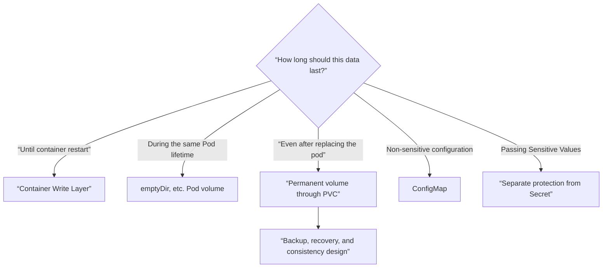
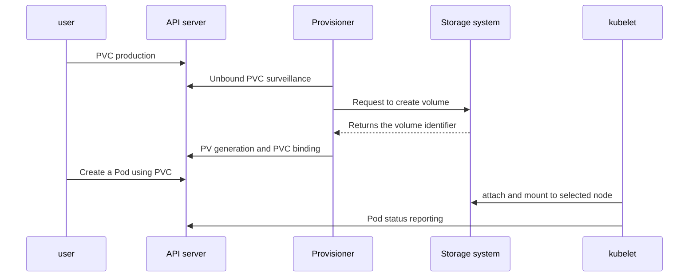

# 06. Storage and application configuration

Executable code and default values ​​are placed in the container image, and environment-specific settings and data that must be persisted are separated into external resources. The key to this chapter is to first decide **whose life the data should follow** rather than “where should it be stored?”

## Select storage by lifespan



- Files in the container's write layer can disappear when the container is replaced.
- `emptyDir` is shared by containers of the same Pod, but disappears when the Pod is deleted.
- PersistentVolume represents a storage resource independent of the Pod, and PersistentVolumeClaim represents the storage demand of the workload.
- ConfigMap and Secret are application configuration delivery vehicles, not file stores.

## Role of PV, PVC, StorageClass, CSI

| Resources/Components | responsibility |
|---|---|
| PVC | Capacity, access mode, and class requested by the user |
| StorageClass | Define which provisioner and policy will create the volume |
| CSI driver | Implementation of creation, connection, and mounting operations of actual storage system |
| PV | Represents prepared or dynamically created volume resources |
| Pod | Use bound PVC by mounting it as a volume |



Depending on the volume binding mode of the StorageClass, you can create a volume right away or wait to see which node the Pod will be placed on. In storage with topology constraints, the pod location and volume location must be determined together.

## The access mode does not guarantee concurrent application writes.

Access modes such as `ReadWriteOnce`, `ReadOnlyMany`, `ReadWriteMany`, and `ReadWriteOncePod` express how the volume can be mounted on a node or pod. It does not guarantee file locking, transactions, or data consistency across multiple writers. Check the storage driver's support range and the application's concurrent access model.

The reclaim policy determines what to do with the underlying volume after the PVC disappears. `Delete` is convenient for automatic cleanup, but the impact of mistakes is large, and `Retain` preserves data, but requires an administrator to perform a retrieval procedure. Don't make assumptions just by looking at the name, but check the actual StorageClass and PV values.

## Commonalities and differences between ConfigMap and Secret

| item | ConfigMap | Secret |
|---|---|---|
| use | Non-sensitive settings | Sensitive values ​​such as passwords, tokens, keys, etc. |
| Pod delivery | Environment variables, arguments, volume files | Environment variables, volume files, image pull, etc. |
| Basic security implications | Not a secret repository | It is only an API object separation and does not guarantee automatic encryption |

The base64 used in Secret's `data` is encoding, not encryption. API/RBAC minimum privileges, encryption of etcd stored data, limitation of exposure to specific containers, and prevention of log and crash dump leaks are designed separately.

Values ​​injected as environment variables do not change automatically during execution. The ConfigMap·Secret file projected as a volume can be updated by the kubelet, but it is not a signal that guarantees immediate reflection, and there are exceptions such as the `subPath` mount. You must also decide whether the application will reread the file or safely reload it.

## Running example: Separating configuration, secret, and persistent data

Make `storage.yaml`. In clusters without a default StorageClass, the PVC may remain Pending.

```yaml
apiVersion: v1
kind: ConfigMap
metadata:
  name: app-config
data:
  APP_MODE: study
  message.txt: |
    configuration comes from a mounted file
---
apiVersion: v1
kind: Secret
metadata:
  name: app-secret
type: Opaque
stringData:
  API_TOKEN: replace-me-for-local-practice
---
apiVersion: v1
kind: PersistentVolumeClaim
metadata:
  name: app-data
spec:
  accessModes:
    - ReadWriteOnce
  resources:
    requests:
      storage: 1Gi
---
apiVersion: v1
kind: Pod
metadata:
  name: storage-demo
spec:
  containers:
    - name: app
      image: busybox:1.36
      command: ["sh", "-c"]
      args:
        - echo "$APP_MODE"; cat /config/message.txt; sleep 3600
      env:
        - name: APP_MODE
          valueFrom:
            configMapKeyRef:
              name: app-config
              key: APP_MODE
        - name: API_TOKEN
          valueFrom:
            secretKeyRef:
              name: app-secret
              key: API_TOKEN
      volumeMounts:
        - name: config
          mountPath: /config
          readOnly: true
        - name: data
          mountPath: /data
  volumes:
    - name: config
      configMap:
        name: app-config
    - name: data
      persistentVolumeClaim:
        claimName: app-data
```

```bash
kubectl apply -f storage.yaml
kubectl get pvc,pv
kubectl describe pvc app-data
kubectl wait --for=condition=Ready pod/storage-demo --timeout=90s
kubectl logs storage-demo
kubectl exec storage-demo -- sh -c 'printf "written-before-pod-replacement\n" > /data/state'
kubectl exec storage-demo -- cat /data/state
kubectl delete pod storage-demo
kubectl apply -f storage.yaml
kubectl wait --for=condition=Ready pod/storage-demo --timeout=90s
kubectl exec storage-demo -- cat /data/state
```

The second Pod must read `written-before-pod-replacement` without writing the marker again. Record different Pod UIDs and the same PVC UID across the replacement. Writing a constant file during every startup would make the experiment pass even if persistence failed. This proves only the tested Pod/PVC lifecycle, not backup recovery. After finishing, inspect the PV reclaim policy, then delete only the disposable lab resources with `kubectl delete -f storage.yaml`; a Retain volume needs separate cleanup.

Avoid labs that print Secret values ​​on the screen. Only check which container is referenced and its permissions as follows.

```bash
kubectl get pod storage-demo -o jsonpath='{.spec.containers[*].env[*].valueFrom}'
kubectl auth can-i get secrets --as=system:serviceaccount:default:default
```

## Backup is a bigger problem than volume copy

Even if a volume snapshot preserves the state of blocks or files at a specific point in time, whether application transactions are consistent is separate. Database flush/quiesce, ordering between multiple volumes, encryption keys, Kubernetes objects to be restored, and external dependencies must be handled.

The success condition for a backup is not “files created” but restoration to an isolated environment and the application passing verification queries. Practice recovery scenarios such as PVC deletion, zone loss, and incorrect schema migration.

## Narrowing down failures from symptoms to causes

| symptoms | check | common causes |
|---|---|---|
| PVC is Pending | PVC event, StorageClass | No default class, provisioner failure, topology mismatch |
| Pod is ContainerCreating | Pod event | attach·mount failure, permissions, node and volume location |
| Mounted, but write failed | access mode, file permission, securityContext | read-only or UID/GID mismatch |
| ConfigMap changes not visible in app | env or volume, reload method | env requires restart, app caches files |
| Secret leaked | Log, environment, permissions, Git history | Delivery path and least privilege not designed |
| App error after restoration | Data·key·schema·setting version | Only snapshots and no consistent restore procedure |

```bash
kubectl get storageclass
kubectl describe pvc app-data
kubectl describe pod storage-demo
kubectl get events --sort-by=.metadata.creationTimestamp
```

## Example results

Expected marker content, with illustrative PVC state:

```text
# PVC after successful dynamic provisioning and Pod scheduling
app-data   Bound   pvc-<generated-id>
# cat /data/state before Pod deletion
written-before-pod-replacement
# cat /data/state after recreating the Pod
written-before-pod-replacement
```

Record the Pod UID before and after deletion; it must change while the PVC identity stays the same. The recreated process never writes this marker, so identical content demonstrates survival across this Pod replacement. A Pending PVC or a missing file is a failed exercise. This does not prove backup recovery or cross-node access for every storage driver.

## Explain it in your own words

1. How are `emptyDir` and PVC different in container restart and pod regeneration?
2. Why can a Pod fail to mount even if the PVC is bound?
3. Why is the base64 value of Secret not a security control?
4. Why is the success of creating a volume snapshot different from the success of application recovery?

[← Service and Networking](05-services-and-networking.md) · [Scheduling and Resources·Autoscaling →](07-scheduling-and-autoscaling.md)

<!-- source: https://kubernetes.io/ko/docs/concepts/storage/volumes/ | checked: 2026-09-03 -->
<!-- source: https://kubernetes.io/ko/docs/concepts/storage/persistent-volumes/ | checked: 2026-09-03 -->
<!-- source: https://kubernetes.io/ko/docs/concepts/storage/storage-classes/ | checked: 2026-09-03 -->
<!-- source: https://kubernetes.io/ko/docs/concepts/configuration/configmap/ | checked: 2026-09-03 -->
<!-- source: https://kubernetes.io/ko/docs/concepts/configuration/secret/ | checked: 2026-09-03 -->
