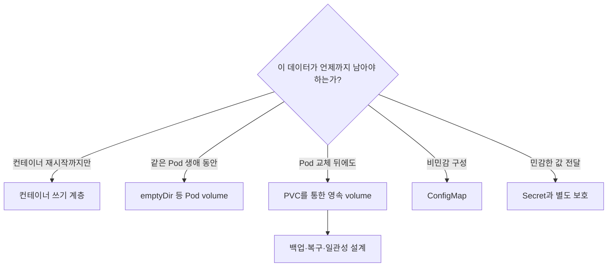
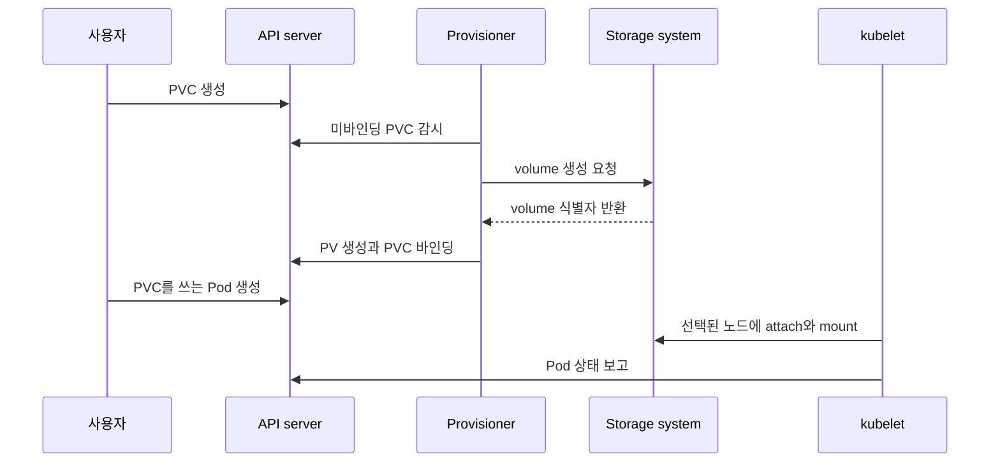

# 06. 스토리지와 애플리케이션 구성

컨테이너 이미지에는 실행 코드와 기본값을 넣고, 환경별 설정과 지속돼야 할 데이터는 외부 자원으로 분리한다. 이 장의 핵심은 “어디에 저장할까?”보다 **데이터가 누구의 생애를 따라가야 하는가**를 먼저 결정하는 것이다.

## 수명으로 저장소를 선택한다



- 컨테이너 쓰기 계층의 파일은 컨테이너가 교체되면 사라질 수 있다.
- `emptyDir`은 같은 Pod의 컨테이너가 공유하지만 Pod가 삭제되면 함께 사라진다.
- PersistentVolume은 Pod와 독립적인 스토리지 자원을 표현하고, PersistentVolumeClaim은 워크로드의 저장소 요구를 표현한다.
- ConfigMap과 Secret은 파일 저장소가 아니라 애플리케이션 구성 전달 수단이다.

## PV, PVC, StorageClass, CSI의 역할

| 리소스·구성요소 | 책임 |
|---|---|
| PVC | 사용자가 요청하는 용량, 접근 모드, class |
| StorageClass | 어떤 provisioner와 정책으로 volume을 만들지 정의 |
| CSI driver | 실제 스토리지 시스템의 생성·연결·마운트 작업 구현 |
| PV | 준비되거나 동적으로 생성된 volume 자원을 표현 |
| Pod | 바인딩된 PVC를 volume으로 마운트해 사용 |



StorageClass의 volume binding mode에 따라 volume을 바로 만들거나 Pod가 어느 노드에 배치될지 기다릴 수 있다. topology 제약이 있는 스토리지에서는 Pod 위치와 volume 위치를 함께 결정해야 한다.

## access mode는 애플리케이션 동시 쓰기 보장이 아니다

`ReadWriteOnce`, `ReadOnlyMany`, `ReadWriteMany`, `ReadWriteOncePod` 같은 접근 모드는 volume을 어떤 방식으로 노드나 Pod에 마운트할 수 있는지 표현한다. 파일 잠금, 트랜잭션, 여러 writer의 데이터 일관성까지 보장하지는 않는다. 스토리지 드라이버의 지원 범위와 애플리케이션의 동시 접근 모델을 함께 확인한다.

reclaim policy는 PVC가 사라진 뒤 기반 volume을 어떻게 처리할지 결정한다. `Delete`는 자동 정리에 편하지만 실수의 영향이 크고, `Retain`은 데이터를 보존하지만 관리자가 회수 절차를 수행해야 한다. 이름만 보고 가정하지 말고 실제 StorageClass와 PV의 값을 확인한다.

## ConfigMap과 Secret의 공통점과 차이

| 항목 | ConfigMap | Secret |
|---|---|---|
| 용도 | 비민감 설정 | 비밀번호·토큰·키 등 민감 값 |
| Pod 전달 | 환경 변수, 인수, volume 파일 | 환경 변수, volume 파일, image pull 등 |
| 기본 보안 의미 | 비밀 저장소가 아님 | API 객체 분리일 뿐 자동 암호화 보장은 아님 |

Secret의 `data`에 쓰는 base64는 인코딩이며 암호화가 아니다. API·RBAC 최소 권한, etcd 저장 데이터 암호화, 특정 컨테이너로의 노출 제한, 로그와 crash dump 유출 방지를 별도로 설계한다.

환경 변수로 주입한 값은 실행 중 자동으로 바뀌지 않는다. volume으로 투영한 ConfigMap·Secret 파일은 kubelet이 갱신할 수 있지만 즉시 반영을 보장하는 신호가 아니며, `subPath` 마운트 같은 예외도 있다. 애플리케이션이 파일을 다시 읽는지, 안전하게 reload하는지까지 정해야 한다.

## 실행 예제: 구성·비밀·영속 데이터를 분리하기

`storage.yaml`을 만든다. 기본 StorageClass가 없는 클러스터에서는 PVC가 Pending으로 남을 수 있다.

```yaml
apiVersion: v1
kind: ConfigMap
metadata:
  name: app-config
data:
  APP_MODE: study
  message.txt: |
    configuration comes from a mounted file
---
apiVersion: v1
kind: Secret
metadata:
  name: app-secret
type: Opaque
stringData:
  API_TOKEN: replace-me-for-local-practice
---
apiVersion: v1
kind: PersistentVolumeClaim
metadata:
  name: app-data
spec:
  accessModes:
    - ReadWriteOnce
  resources:
    requests:
      storage: 1Gi
---
apiVersion: v1
kind: Pod
metadata:
  name: storage-demo
spec:
  containers:
    - name: app
      image: busybox:1.36
      command: ["sh", "-c"]
      args:
        - echo "$APP_MODE"; cat /config/message.txt; echo ready > /data/state; sleep 3600
      env:
        - name: APP_MODE
          valueFrom:
            configMapKeyRef:
              name: app-config
              key: APP_MODE
        - name: API_TOKEN
          valueFrom:
            secretKeyRef:
              name: app-secret
              key: API_TOKEN
      volumeMounts:
        - name: config
          mountPath: /config
          readOnly: true
        - name: data
          mountPath: /data
  volumes:
    - name: config
      configMap:
        name: app-config
    - name: data
      persistentVolumeClaim:
        claimName: app-data
```

```bash
kubectl apply -f storage.yaml
kubectl get pvc,pv
kubectl describe pvc app-data
kubectl wait --for=condition=Ready pod/storage-demo --timeout=90s
kubectl logs storage-demo
kubectl exec storage-demo -- cat /data/state
kubectl delete pod storage-demo
kubectl apply -f storage.yaml
kubectl exec storage-demo -- cat /data/state
```

두 번째 Pod에서도 `/data/state`가 보이면 Pod 수명과 PVC 수명이 분리된 것을 확인한 것이다. 단, PVC가 남았다는 사실은 백업이 있다는 뜻이 아니다.

Secret 값을 화면에 출력하는 실습은 피한다. 다음처럼 어느 컨테이너에 참조됐는지와 권한만 확인한다.

```bash
kubectl get pod storage-demo -o jsonpath='{.spec.containers[*].env[*].valueFrom}'
kubectl auth can-i get secrets --as=system:serviceaccount:default:default
```

## 백업은 volume 복사보다 큰 문제다

volume snapshot이 특정 시점의 블록이나 파일 상태를 보존해도 애플리케이션 트랜잭션이 일관된지는 별도다. 데이터베이스 flush·quiesce, 여러 volume 사이의 순서, 암호화 키, 복원할 Kubernetes 오브젝트와 외부 의존성을 함께 다뤄야 한다.

백업의 성공 조건은 “파일이 생성됨”이 아니라 격리된 환경에 복원하고 애플리케이션이 검증 쿼리를 통과하는 것이다. PVC 삭제, zone 상실, 잘못된 schema migration 같은 복구 시나리오를 나눠 연습한다.

## 실패를 증상에서 원인으로 좁히기

| 증상 | 확인 | 흔한 원인 |
|---|---|---|
| PVC가 Pending | PVC event, StorageClass | 기본 class 없음, provisioner 장애, topology 불일치 |
| Pod가 ContainerCreating | Pod event | attach·mount 실패, 권한, node와 volume 위치 |
| mount는 됐지만 쓰기 실패 | access mode, 파일 권한, securityContext | read-only 또는 UID/GID 불일치 |
| ConfigMap 변경이 앱에 안 보임 | env인지 volume인지, reload 방식 | env는 재시작 필요, 앱이 파일을 캐시함 |
| Secret이 유출됨 | 로그·환경·권한·Git 이력 | 전달 경로와 최소 권한 미설계 |
| 복원 뒤 앱 오류 | 데이터·키·schema·설정 버전 | snapshot만 있고 일관된 복원 절차 없음 |

```bash
kubectl get storageclass
kubectl describe pvc app-data
kubectl describe pod storage-demo
kubectl get events --sort-by=.metadata.creationTimestamp
```

## 스스로 설명해 보기

1. `emptyDir`과 PVC는 컨테이너 재시작, Pod 재생성에서 각각 어떻게 다른가?
2. PVC가 Bound여도 Pod가 마운트에 실패할 수 있는 이유는 무엇인가?
3. Secret의 base64 값이 보안 통제가 아닌 이유는 무엇인가?
4. volume snapshot 생성 성공과 애플리케이션 복구 성공이 왜 다른가?

[← Service와 네트워킹](05-services-and-networking.md) · [스케줄링과 리소스·오토스케일링 →](07-scheduling-and-autoscaling.md)

<!-- source: https://kubernetes.io/ko/docs/concepts/storage/volumes/ | checked: 2026-09-03 -->
<!-- source: https://kubernetes.io/ko/docs/concepts/storage/persistent-volumes/ | checked: 2026-09-03 -->
<!-- source: https://kubernetes.io/ko/docs/concepts/storage/storage-classes/ | checked: 2026-09-03 -->
<!-- source: https://kubernetes.io/ko/docs/concepts/configuration/configmap/ | checked: 2026-09-03 -->
<!-- source: https://kubernetes.io/ko/docs/concepts/configuration/secret/ | checked: 2026-09-03 -->
