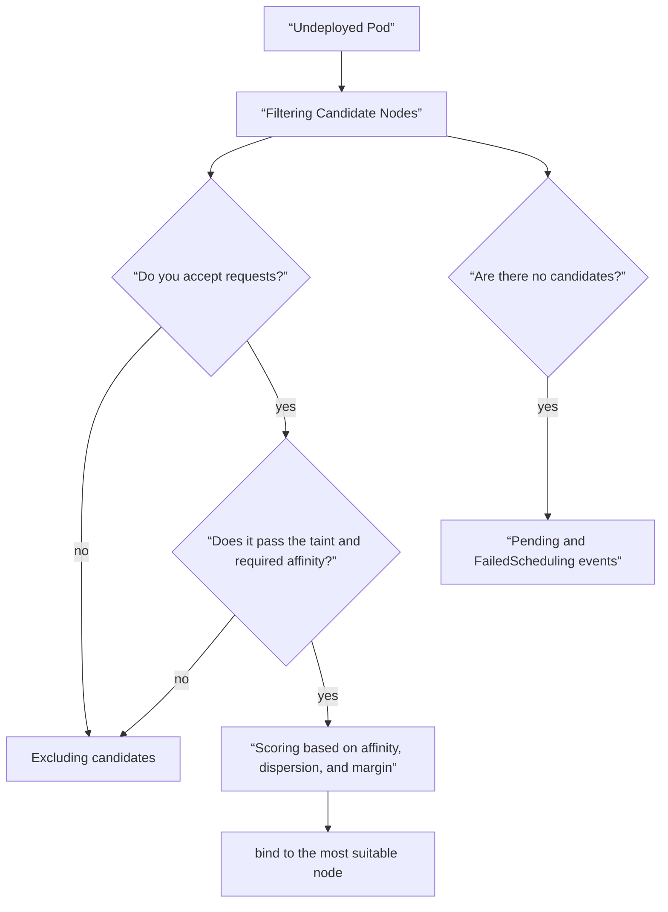
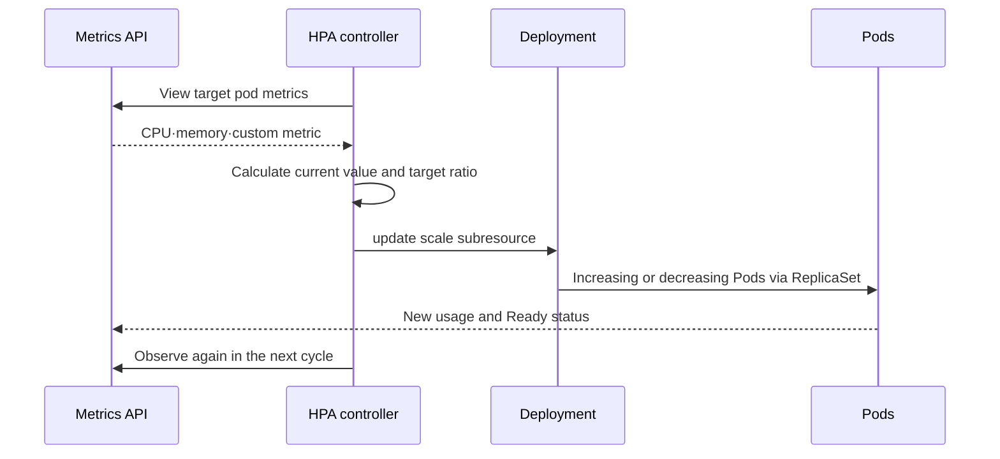

# 07. Scheduling and resource/autoscaling

Scheduling is not a simple matter of choosing “the node that currently has low CPU utilization.” This is the process of finding a node that satisfies the resources and constraints requested by the Pod, and selecting one by reflecting the failure domain and preference. After deployment, the kubelet and runtime enforce limits, and control loops such as HPA look at observations and change the number of replicas.

## First distinguish between requests and limits

| setting | Mainly used subject | meaning |
|---|---|---|
| CPU request | scheduler, runtime during CPU contention | How much CPU to reserve for a batch and its relative weight |
| memory request | scheduler | Amount of memory to reserve for your deployment |
| CPU limit | runtime and kernel | Upper limit on available CPU time, possible throttling if exceeded |
| memory limit | runtime and kernel | Memory upper limit, OOM can be terminated when exceeded |

request is not a cost tag. Even if actual usage is low, if the sum of requests exceeds the node's allocatable, new Pods are not deployed. Conversely, if the request is set too low, the scheduler will be overcrowded, and the denominator of HPA based on CPU utilization will also be distorted.

`400m` CPU means 0.4 CPU, but `400m` memory is a completely different value of 0.4 byte. The memory specifies the unit as `400Mi`.

## Scheduler decision flow



`nodeSelector` and required node affinity are conditions that must be satisfied. Preferred affinity is a preference to follow if possible. Pod anti-affinity and topology spread distribute replicas across nodes and zones, but if the constraints are too strict, they cannot be placed on remaining nodes in the event of a failure.

A taint is a condition where a node pushes out a Pod, and toleration indicates that the taint can **be tolerated**. Since toleration alone does not select the node, it must be used together with affinity or selector to achieve dedicated node placement.

## Deployment failure, preemption, and eviction occur at different times.

- **Pending** includes unscheduled Pods and Pods whose containers are not yet prepared. Diagnose scheduling only after checking `nodeName`, `PodScheduled`, and events.
- **preemption** is a scheduler operation that considers removing low-priority Pods in order to place high-priority Pods.
- **node-pressure eviction** is an operation in which the kubelet evicts a Pod due to pressure on the memory, disk, etc. of the running node.
- **API-initiated eviction** is when management tasks such as drain use the eviction API.
- **PodDisruptionBudget** limits the number of available Pods that can be simultaneously reduced in voluntary disruption, but does not prevent all involuntary failures, such as node failures.

## Running example: Visualizing a batch contract

Make `schedule.yaml`. `kubernetes.io/os: linux` is a common standard node label, but check the actual cluster label first.

```yaml
apiVersion: apps/v1
kind: Deployment
metadata:
  name: compute-demo
spec:
  replicas: 3
  selector:
    matchLabels:
      app: compute-demo
  template:
    metadata:
      labels:
        app: compute-demo
    spec:
      affinity:
        nodeAffinity:
          requiredDuringSchedulingIgnoredDuringExecution:
            nodeSelectorTerms:
              - matchExpressions:
                  - key: kubernetes.io/os
                    operator: In
                    values: ["linux"]
      topologySpreadConstraints:
        - maxSkew: 1
          topologyKey: kubernetes.io/hostname
          whenUnsatisfiable: ScheduleAnyway
          labelSelector:
            matchLabels:
              app: compute-demo
      containers:
        - name: app
          image: nginx:1.27-alpine
          resources:
            requests:
              cpu: 100m
              memory: 64Mi
            limits:
              cpu: 500m
              memory: 128Mi
```

```bash
kubectl get nodes --show-labels
kubectl apply --dry-run=server -f schedule.yaml
kubectl apply -f schedule.yaml
kubectl get pods -l app=compute-demo -o wide
kubectl describe pod -l app=compute-demo
kubectl describe nodes
```

If a node label that does not exist intentionally is placed in the required condition, the Pod becomes Pending. At this time, read from `FailedScheduling` of the Pod event, not from the container log.

## HPA is a delayed feedback controller

HPA periodically reads metrics and adjusts the scale of targets such as Deployment or StatefulSet. The basic calculation is the following ratio:

`desired replicas = ceil(current replicas × current metric / target metric)`

For example, if the average CPU of the current 3 Pods is 80% of the request and the target is 50%, `ceil(3 × 80 / 50) = 5` is suggested. Actual calculations can operate more conservatively by reflecting unprepared Pods, missing metrics, tolerance, minimum/maximum replicas, stabilization policy, etc.



It takes time to collect metrics, HPA reconcile, Pod scheduling, image pull, startup and readiness. HPA is not a buffer that immediately absorbs instantaneous spikes. Queue, concurrency limit, timeout and backpressure are also needed.

## HPA example

Add the resource below after `schedule.yaml`. To use CPU resource metrics, the resource metrics API must be provided in the cluster.

```yaml
apiVersion: autoscaling/v2
kind: HorizontalPodAutoscaler
metadata:
  name: compute-demo
spec:
  scaleTargetRef:
    apiVersion: apps/v1
    kind: Deployment
    name: compute-demo
  minReplicas: 2
  maxReplicas: 10
  behavior:
    scaleDown:
      stabilizationWindowSeconds: 300
  metrics:
    - type: Resource
      resource:
        name: cpu
        target:
          type: Utilization
          averageUtilization: 60
```

```bash
kubectl apply -f schedule.yaml
kubectl get hpa compute-demo
kubectl describe hpa compute-demo
kubectl top pods -l app=compute-demo
```

When HPA displays `unknown`, check the CPU request, metrics API, and selector of the target Pod. When HPA manages replicas, it sets ownership so that it does not conflict with automation, which continues to overwrite `spec.replicas` in the Git manifest.

Use separate YAML documents with `---` when appending the HPA. No load generator is supplied here, so reading the HPA is not a demonstrated scale-up. To complete the optional load exercise, record the metric ratio, replica recommendation, resulting Ready replicas, and downstream latency; stop at the declared load cap. Delete the lab HPA and Deployment with `kubectl delete -f schedule.yaml` afterward. Exit code 137 alone means SIGKILL, not proof of OOM; corroborate with the container termination reason and node memory evidence.

## Which scaler changes what

| method | Adjustable target | What can't be solved |
|---|---|---|
| HPA | Pod replica count | Workload capable of only one pod, downstream fixed bottleneck |
| VPA | Pod request/limit recommendations or changes | Number of replicas and lack of nodes themselves |
| node autoscaling | Number of nodes or node resources | Incorrect Pod constraints, bottlenecks inside the app |

Using the three control loops together requires testing for observation windows and change conflicts. Even if the number of pods increases, if the DB connection limit, queue partition, and external API quota are fixed, the bottleneck will only move.

## Narrowing down failures from symptoms to causes

| symptoms | evidence | next judgment |
|---|---|---|
| Pending + Insufficient cpu | Pod event, Node allocatable | Adjust request or add capacity |
| Pending + taint | event, node taint | Toleration after checking whether it is the intended dedicated node |
| OOMKilled | `describe pod`, exit code 137 | After measuring leakage/peak, review request and limit |
| CPU is high and lag increases | throttling metric, limit | Check CPU limit and app concurrency together |
| HPA target unknown | `describe hpa`, metrics API | Missing requests or failing to collect metrics |
| Replica keeps fluctuating | HPA condition and metric time series | Review noise metrics, startup, stabilization |

## Example results

Illustrative scheduling and HPA observations. The manifest does not generate sustained CPU load.

```text
# If placement constraints cannot be met
PodScheduled=False
Warning  FailedScheduling  ... didn't match Pod's node affinity/selector
# HPA without working resource metrics
TARGETS
<unknown>/50%
# Worksheet only: 3 replicas, measured utilization 80%, target 50%
ceil(3 * 80 / 50) = 5 proposed replicas
```

An unknown metric is not zero utilization. The calculated five replicas is a simplified example, not a promised live result: readiness, missing metrics, tolerance, limits, and stabilization affect the controller. Record the actual scheduling reason before changing constraints.

## Explain it in your own words

1. Why can a Pod be Pending at `Insufficient cpu` even though the actual CPU utilization is low?
2. Why doesn't adding toleration necessarily result in placement on a dedicated node?
3. Why do containers without CPU requests create problems with CPU utilization-based HPA?
4. What is an example of a downstream bottleneck where response latency does not improve even when HPA increases replicas?

[← Storage and Configuration](06-storage-and-configuration.md) · [Security and Policy →](08-security-and-policy.md)

<!-- source: https://kubernetes.io/ko/docs/concepts/configuration/manage-resources-containers/ | checked: 2026-09-03 -->
<!-- source: https://kubernetes.io/ko/docs/concepts/scheduling-eviction/assign-pod-node/ | checked: 2026-09-03 -->
<!-- source: https://kubernetes.io/ko/docs/concepts/scheduling-eviction/taint-and-toleration/ | checked: 2026-09-03 -->
<!-- source: https://kubernetes.io/docs/tasks/run-application/horizontal-pod-autoscale/ | checked: 2026-09-03 -->
<!-- source: https://kubernetes.io/ko/docs/concepts/workloads/pods/disruptions/ | checked: 2026-09-03 -->
