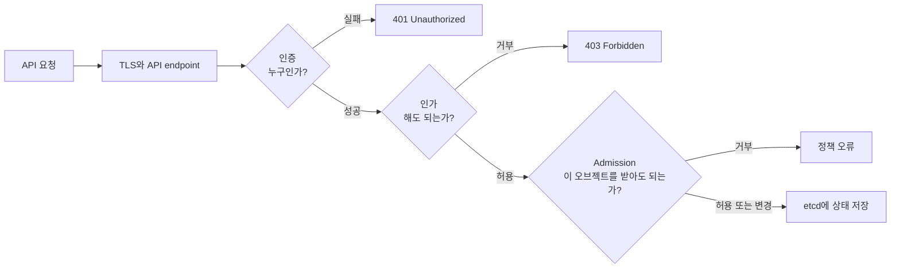
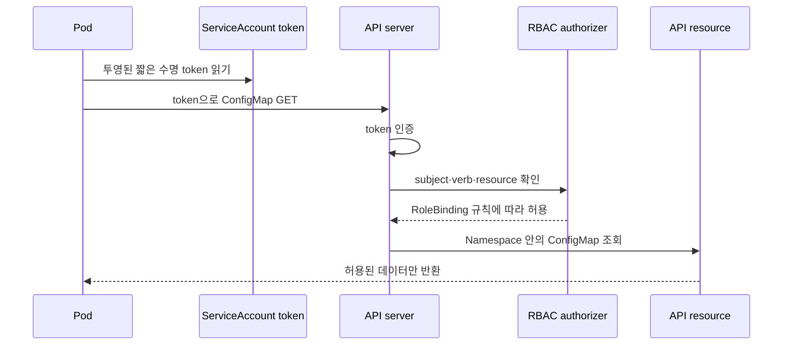

# 08. 보안과 정책

쿠버네티스 보안은 하나의 옵션이 아니라 여러 독립된 경계의 조합이다. API 요청자의 신원을 확인하는 것, 그 신원에 동작을 허용하는 것, 생성될 오브젝트를 정책으로 검사하는 것, 실행 중 프로세스와 네트워크를 제한하는 것은 서로 다른 문제다.

## API 요청이 통과하는 보안 단계



- **인증**은 인증서, 토큰 등으로 요청 주체를 정한다.
- **인가**는 그 주체가 특정 resource·verb·Namespace에서 행동할 수 있는지 판단한다.
- **admission**은 인가된 요청의 오브젝트를 기본값으로 바꾸거나 정책에 따라 검증한다.
- **audit**은 누가 언제 무엇을 요청했는지 추적할 근거를 남긴다.

인가가 허용됐다고 안전한 Pod라는 뜻은 아니다. admission과 runtime 제한이 이어져야 한다.

## 사용자와 ServiceAccount

사람 사용자 계정은 외부 identity 체계나 인증서 등으로 인증한다. ServiceAccount는 Namespace에 속하는 Kubernetes API 주체이며 Pod와 자동화가 API를 호출할 때 사용한다.

모든 Pod에 API 접근이 필요한 것은 아니다. 필요하지 않으면 service account token 자동 마운트를 끄고, 필요한 경우 전용 ServiceAccount와 최소 RBAC을 만든다. 장기 정적 토큰을 이미지나 Git에 넣지 않는다.



## RBAC을 문장으로 읽기

RBAC 규칙은 “누가(subject) 어디에서(scope) 어떤 리소스(resource)에 어떤 동작(verb)을 할 수 있는가”다.

| 객체 | 범위 | 역할 |
|---|---|---|
| Role | Namespace | 허용할 규칙 묶음 |
| ClusterRole | 클러스터 | 클러스터 리소스 또는 재사용 가능한 규칙 묶음 |
| RoleBinding | Namespace | subject에 Role 또는 ClusterRole 규칙을 해당 Namespace에서 부여 |
| ClusterRoleBinding | 클러스터 | subject에 ClusterRole을 클러스터 전체로 부여 |

`get`, `list`, `watch`는 서로 다른 verb다. controller가 watch하려면 보통 list와 watch가 함께 필요하지만, 단일 이름만 읽는 앱에 list를 줄 필요는 없다. 와일드카드는 미래에 추가되는 리소스까지 예상치 못하게 포함할 수 있어 피한다.

## 실행 예제: 한 Namespace의 ConfigMap만 읽기

`rbac.yaml`을 만든다.

```yaml
apiVersion: v1
kind: Namespace
metadata:
  name: secure-demo
---
apiVersion: v1
kind: ServiceAccount
metadata:
  name: config-reader
  namespace: secure-demo
automountServiceAccountToken: true
---
apiVersion: rbac.authorization.k8s.io/v1
kind: Role
metadata:
  name: config-reader
  namespace: secure-demo
rules:
  - apiGroups: [""]
    resources: ["configmaps"]
    resourceNames: ["app-settings"]
    verbs: ["get"]
---
apiVersion: rbac.authorization.k8s.io/v1
kind: RoleBinding
metadata:
  name: config-reader
  namespace: secure-demo
subjects:
  - kind: ServiceAccount
    name: config-reader
    namespace: secure-demo
roleRef:
  apiGroup: rbac.authorization.k8s.io
  kind: Role
  name: config-reader
```

```bash
kubectl apply -f rbac.yaml
kubectl auth can-i get configmap/app-settings \
  -n secure-demo --as=system:serviceaccount:secure-demo:config-reader
kubectl auth can-i list configmaps \
  -n secure-demo --as=system:serviceaccount:secure-demo:config-reader
kubectl auth can-i get secrets \
  -n secure-demo --as=system:serviceaccount:secure-demo:config-reader
```

의도한 결과는 특정 ConfigMap `get`만 yes이고 list와 Secret 읽기는 no인 것이다. 실제 요청은 admission이나 별도 authorizer 구성에 따라 추가 제한을 받을 수 있다.

## Pod 실행 권한을 줄이는 securityContext

다음은 일반 애플리케이션 Pod의 출발점 예시다. 이미지가 non-root 실행과 read-only root filesystem을 지원해야 하므로 무조건 복사하지 말고 실행 테스트를 한다.

```yaml
apiVersion: v1
kind: Pod
metadata:
  name: restricted-web
  namespace: secure-demo
spec:
  automountServiceAccountToken: false
  securityContext:
    runAsNonRoot: true
    seccompProfile:
      type: RuntimeDefault
  containers:
    - name: web
      image: nginxinc/nginx-unprivileged:1.27-alpine
      securityContext:
        allowPrivilegeEscalation: false
        readOnlyRootFilesystem: true
        capabilities:
          drop: ["ALL"]
      volumeMounts:
        - name: cache
          mountPath: /tmp
  volumes:
    - name: cache
      emptyDir: {}
```

Pod Security Standards는 Privileged, Baseline, Restricted라는 정책 수준을 정의한다. Pod Security Admission은 Namespace label을 이용해 이 정책을 enforce·audit·warn 모드로 적용할 수 있다. 먼저 audit/warn으로 영향 범위를 보고, 호환되지 않는 workload를 분리·수정한 뒤 enforce로 전환하는 흐름이 안전하다.

## NetworkPolicy는 API 권한과 다른 축이다

RBAC이 “API 오브젝트를 읽을 수 있는가”를 제어한다면 NetworkPolicy는 “어떤 네트워크 흐름이 가능한가”를 제어한다. 둘 중 하나만으로 애플리케이션 권한이 완성되지 않는다.

default deny로 시작할 때 DNS, telemetry, 인증서, 외부 API 같은 필수 egress를 함께 식별한다. policy는 구현 CNI가 지원해야 하고, 허용해야 할 연결과 차단해야 할 연결을 실제 probe로 모두 검증한다.

## Secret 보호는 객체 생성 이후가 중요하다

Secret은 민감 값을 Pod 명세와 이미지에서 분리하지만 base64는 암호화가 아니다. 다음 경계를 함께 설계한다.

- Secret 읽기 RBAC을 최소화하고 list/watch 권한을 함부로 주지 않는다.
- etcd 저장 데이터 암호화를 구성하고 키 접근과 회전 절차를 분리한다.
- 필요한 컨테이너에만 volume으로 노출하고 가능하면 환경 변수·명령 인수 노출을 줄인다.
- 로그, debug endpoint, crash dump, 지원 번들에 값이 포함되지 않는지 검사한다.
- Git에 들어간 비밀은 파일 삭제만으로 해결되지 않으므로 즉시 폐기·회전한다.

## 실패를 보안 단계별로 좁히기

| 증상 | 경계 | 확인 |
|---|---|---|
| `Unauthorized` | 인증 | kubeconfig context, 인증서·token 유효성 |
| `Forbidden` | 인가 | `kubectl auth can-i`, binding subject와 scope |
| 정책 메시지와 함께 생성 거부 | admission | Namespace 정책 label, webhook과 Pod 필드 |
| Pod는 생성됐지만 permission denied | runtime | UID/GID, volume 권한, read-only filesystem |
| 연결 timeout | 네트워크 | 양쪽 NetworkPolicy, DNS egress, CNI 지원 |
| Secret이 평문으로 노출 | 데이터 경로 | RBAC, etcd encryption, 로그·env·Git 이력 |

권한 문제를 해결할 때 바로 `cluster-admin`을 주면 원인과 최소 권한을 잃는다. 먼저 정확한 subject와 verb를 재현하고 필요한 규칙 한 줄만 추가한다.

## 스스로 설명해 보기

1. 인증에 성공한 요청이 admission에서 거부될 수 있는 이유는 무엇인가?
2. Role과 ClusterRole보다 Binding의 범위를 함께 봐야 하는 이유는 무엇인가?
3. `automountServiceAccountToken: false`가 유용한 Pod는 어떤 Pod인가?
4. RBAC, NetworkPolicy, securityContext가 각각 막는 공격 경로는 어떻게 다른가?

[← 스케줄링과 오토스케일링](07-scheduling-and-autoscaling.md) · [관측과 트러블슈팅 →](09-observability-and-troubleshooting.md)

<!-- source: https://kubernetes.io/docs/concepts/security/controlling-access/ | checked: 2026-09-03 -->
<!-- source: https://kubernetes.io/docs/reference/access-authn-authz/rbac/ | checked: 2026-09-03 -->
<!-- source: https://kubernetes.io/ko/docs/concepts/security/service-accounts/ | checked: 2026-09-03 -->
<!-- source: https://kubernetes.io/ko/docs/concepts/security/pod-security-standards/ | checked: 2026-09-03 -->
<!-- source: https://kubernetes.io/ko/docs/concepts/services-networking/network-policies/ | checked: 2026-09-03 -->
<!-- source: https://kubernetes.io/ko/docs/concepts/configuration/secret/ | checked: 2026-09-03 -->
