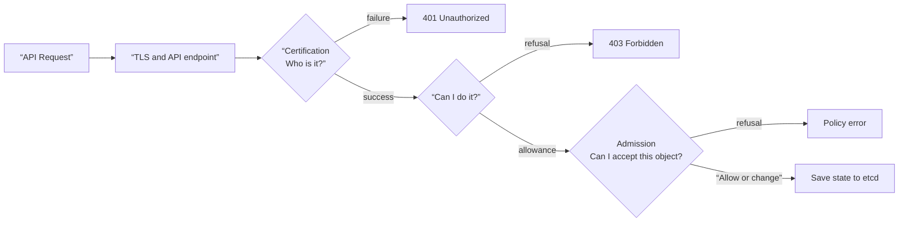
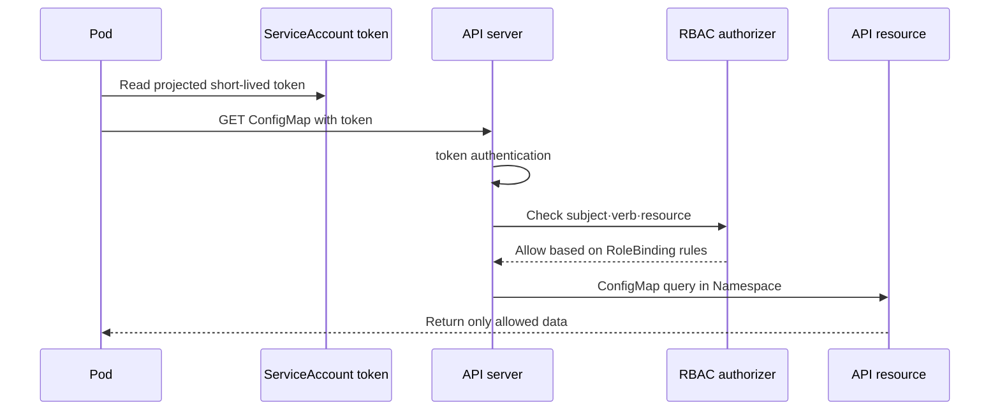

# 08. Security and policy

Kubernetes security is not a single option, but a combination of multiple independent boundaries. Verifying the identity of the API requester, allowing operations on that identity, checking the objects to be created with policies, and restricting processes and networks during execution are different problems.

## Security steps an API request goes through



- **Authentication** determines the requesting entity using a certificate, token, etc.
- **Authorization** determines whether the subject can act in a specific resource·verb·namespace.
- **admission** changes the object of the approved request to the default value or verifies it according to the policy.
- **audit** leaves evidence to track who requested what and when.

Just because authorization is granted does not mean that the Pod is safe. Admission and runtime limits must follow.

## User and ServiceAccount

Human user accounts are authenticated using an external identity system or certificate. ServiceAccount is a Kubernetes API subject belonging to the Namespace and is used when Pods and Automation call the API.

Not all Pods require API access. Turn off automatic mounting of service account tokens if not needed, and create a dedicated ServiceAccount and minimum RBAC if necessary. Do not put long-term static tokens in images or Git.



## Read RBAC as a sentence

RBAC rules are “who (subject), where (scope), what action (verb) can be performed on what resource (resource).”

| object | range | role |
|---|---|---|
| Role | Namespace | Set of rules to allow |
| ClusterRole | cluster | Cluster resources or reusable rule sets |
| RoleBinding | Namespace | Grant a Role or ClusterRole rule to the subject in the namespace |
| ClusterRoleBinding | cluster | Grant ClusterRole to subject as a whole cluster |

`get`, `list`, and `watch` are different verbs. A list and watch are usually needed together for a controller to watch, but there is no need to give a list to an app that only reads a single name. Avoid wildcards as they may unexpectedly include resources added in the future.

## Running example: Reading only the ConfigMap from one Namespace

Make `rbac.yaml`.

```yaml
apiVersion: v1
kind: Namespace
metadata:
  name: secure-demo
---
apiVersion: v1
kind: ServiceAccount
metadata:
  name: config-reader
  namespace: secure-demo
automountServiceAccountToken: true
---
apiVersion: rbac.authorization.k8s.io/v1
kind: Role
metadata:
  name: config-reader
  namespace: secure-demo
rules:
  - apiGroups: [""]
    resources: ["configmaps"]
    resourceNames: ["app-settings"]
    verbs: ["get"]
---
apiVersion: rbac.authorization.k8s.io/v1
kind: RoleBinding
metadata:
  name: config-reader
  namespace: secure-demo
subjects:
  - kind: ServiceAccount
    name: config-reader
    namespace: secure-demo
roleRef:
  apiGroup: rbac.authorization.k8s.io
  kind: Role
  name: config-reader
```

```bash
kubectl apply -f rbac.yaml
kubectl auth can-i get configmap/app-settings \
  -n secure-demo --as=system:serviceaccount:secure-demo:config-reader
kubectl auth can-i list configmaps \
  -n secure-demo --as=system:serviceaccount:secure-demo:config-reader
kubectl auth can-i get secrets \
  -n secure-demo --as=system:serviceaccount:secure-demo:config-reader
```

The intended result is that only the specific ConfigMap `get` is yes and list and secret reading are no. Actual requests may be subject to additional restrictions depending on admission or separate authorizer configuration.

## securityContext to reduce Pod execution permissions

The following is an example starting point for a typical application Pod. Since the image must support non-root execution and a read-only root filesystem, do not copy it unconditionally but test its execution.

```yaml
apiVersion: v1
kind: Pod
metadata:
  name: restricted-web
  namespace: secure-demo
spec:
  automountServiceAccountToken: false
  securityContext:
    runAsNonRoot: true
    seccompProfile:
      type: RuntimeDefault
  containers:
    - name: web
      image: nginxinc/nginx-unprivileged:1.27-alpine
      securityContext:
        allowPrivilegeEscalation: false
        readOnlyRootFilesystem: true
        capabilities:
          drop: ["ALL"]
      volumeMounts:
        - name: cache
          mountPath: /tmp
  volumes:
    - name: cache
      emptyDir: {}
```

Pod Security Standards define policy levels called Privileged, Baseline, and Restricted. Pod Security Admission can apply this policy in enforce·audit·warn mode using a namespace label. It is safe to first check the scope of influence with audit/warn, isolate and modify incompatible workloads, and then switch to enforce.

## NetworkPolicy is a different axis from API permissions.

While RBAC controls “whether API objects can be read,” NetworkPolicy controls “what network flows are possible.” Application permissions are not complete with just one of the two.

When starting with default deny, it also identifies required egress such as DNS, telemetry, certificates, and external APIs. The policy must be supported by the implementation CNI, and both connections to be allowed and connections to be blocked are verified with actual probes.

## Secret protection is important after object creation

Secret separates sensitive values ​​from the Pod specification and image, but base64 is not encryption. Design the next boundary together.

- Minimize Read Secret RBAC and do not grant list/watch permissions carelessly.
- Configure etcd data-at-rest encryption and separate key access and rotation procedures.
- Expose only necessary containers as a volume, and reduce exposure of environment variables and command arguments if possible.
- Check that logs, debug endpoints, crash dumps, and support bundles do not contain values.
- Secrets in Git cannot be resolved simply by deleting the file, so discard and rotate it immediately.

## Narrow down failures to security steps

| symptoms | boundary | check |
|---|---|---|
| `Unauthorized` | certification | kubeconfig context, certificate/token validity |
| `Forbidden` | impression | `kubectl auth can-i`, binding subject and scope |
| Deny creation with policy message | admission | Namespace policy label, webhook and Pod fields |
| Pod was created but permission denied | runtime | UID/GID, volume permission, read-only filesystem |
| connection timeout | network | Supports both NetworkPolicy, DNS egress, and CNI |
| Secret is exposed as plain text | data path | RBAC, etcd encryption, log·env·Git history |

If you immediately give `cluster-admin` when solving a permission problem, you will lose the cause and minimum permissions. First, reproduce the exact subject and verb and add only one line of the necessary rules.

## Explain it in your own words

1. Why might a request that successfully authenticated be rejected by admission?
2. Why should we look at the scope of Binding rather than Role and ClusterRole?
3. Which Pod is `automountServiceAccountToken: false` useful for?
4. How are the attack paths blocked by RBAC, NetworkPolicy, and securityContext different?

[← Scheduling and Autoscaling](07-scheduling-and-autoscaling.md) · [Observation and Troubleshooting →](09-observability-and-troubleshooting.md)

<!-- source: https://kubernetes.io/docs/concepts/security/controlling-access/ | checked: 2026-09-03 -->
<!-- source: https://kubernetes.io/docs/reference/access-authn-authz/rbac/ | checked: 2026-09-03 -->
<!-- source: https://kubernetes.io/ko/docs/concepts/security/service-accounts/ | checked: 2026-09-03 -->
<!-- source: https://kubernetes.io/ko/docs/concepts/security/pod-security-standards/ | checked: 2026-09-03 -->
<!-- source: https://kubernetes.io/ko/docs/concepts/services-networking/network-policies/ | checked: 2026-09-03 -->
<!-- source: https://kubernetes.io/ko/docs/concepts/configuration/secret/ | checked: 2026-09-03 -->
