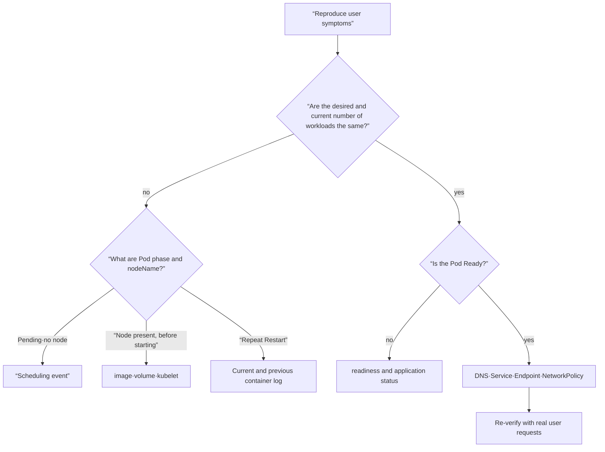
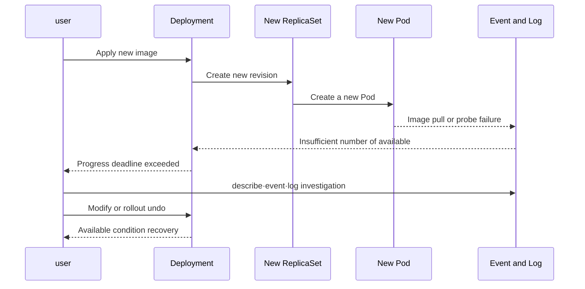

# 09. Observation and troubleshooting

Good troubleshooting is not about knowing a lot of commands, but about reproducing symptoms and quickly dividing the failure hierarchy in half. First, check user influence, find the difference between the desired state and the current state, and then connect event·log·metric in chronological order.

## Each tool answers different questions

| evidence | question to answer | representative order |
|---|---|---|
| `get` | Which resources are now in what summary state? | `kubectl get deploy,rs,pod` |
| YAML·jsonpath | What source fields does the API know about? | `kubectl get pod -o yaml` |
| `describe` | What are the condition, container state, and recent events? | `kubectl describe pod` |
| event | What did scheduler·kubelet·controller try? | `kubectl get events` |
| log | What did your applications and containers log? | `kubectl logs --previous` |
| metric | Since when and how much have resources and delays changed? | `kubectl top`, observation system |

The event is not a permanent audit log and repeated events may be merged. If a failure timeline is necessary, centrally collect logs and metrics and prepare time synchronization and retention policies.

## Moving from Symptoms to Failure Hierarchy



It always goes down from the top controller. If you try to fix just one Pod, Deployment will overwrite it again or replace it with a new Pod. Conversely, if it is not a cluster-wide failure but the node is involved, the scope of investigation becomes unnecessarily large.

## Basic diagnostic loop

```bash
kubectl config current-context
kubectl get namespace
kubectl get deployment,replicaset,pod -n <namespace> -o wide
kubectl describe deployment <name> -n <namespace>
kubectl describe pod <pod-name> -n <namespace>
kubectl get events -n <namespace> --sort-by=.metadata.creationTimestamp
kubectl logs <pod-name> -n <namespace> -c <container-name>
kubectl logs <pod-name> -n <namespace> -c <container-name> --previous
```

The reason for checking the context and namespace in the first line is because the conclusion drawn from looking at the wrong cluster is useless even if it is technologically perfect. Starts with a read command and preserves the current YAML and change diff before modification.

## Accurately read frequently encountered conditions

### Pending

The pod may not have been placed on the node by the scheduler, or it may have been placed but in a pre-start stage, such as volume preparation. Check `spec.nodeName` and event. If it is `FailedScheduling`, you can see requests, taint, affinity, and PVC topology.

### ImagePullBackOff

Check image name·tag·digest, registry DNS and network, imagePullSecret, and pull rate limit. BackOff is not the cause, but the failure retry interval has increased. The specific cause lies in the event.

### CrashLoopBackOff

The container starts, terminates, and restarts repeatedly. If you only look at the current log, it may be an empty log of a new instance, so check `--previous`, termination reason and code, command·args·environment·mount. If OOMKilled, you can see not only the memory limit, but also leaks, startup peak, and tmpfs usage.

### Running but NotReady

The process is running but has not passed the readiness condition. It can be left out of service endpoints and user traffic. Check the probe path·port·timeout and the actual app preparation status together.

## Running example: Diagnosing a failed rollout

Make `broken.yaml`.

```yaml
apiVersion: apps/v1
kind: Deployment
metadata:
  name: broken-web
spec:
  replicas: 2
  progressDeadlineSeconds: 60
  selector:
    matchLabels:
      app: broken-web
  template:
    metadata:
      labels:
        app: broken-web
    spec:
      containers:
        - name: web
          image: nginx:this-tag-does-not-exist
          ports:
            - containerPort: 80
          readinessProbe:
            httpGet:
              path: /
              port: 80
```

```bash
kubectl apply -f broken.yaml
kubectl rollout status deployment/broken-web --timeout=75s
kubectl get deployment,replicaset,pod -l app=broken-web
kubectl describe deployment broken-web
kubectl describe pod -l app=broken-web
kubectl get events --sort-by=.metadata.creationTimestamp
```

The diagnostic hypothesis should not be “the application crashed” but “image retrieval failed before the container was started.” So event comes before log.

```bash
kubectl set image deployment/broken-web web=nginx:1.27-alpine
kubectl rollout status deployment/broken-web
kubectl get pods -l app=broken-web
kubectl delete deployment broken-web
```

## Timeline of rollout failure



The rollout status is whether progress is made from the controller's perspective. After recovery, do not just look at `Available=True`, but send a request to the actual user path and check whether the error rate and latency have recovered.

## Service path diagnosis

```bash
kubectl get service <service> -o yaml
kubectl get endpointslice -l kubernetes.io/service-name=<service> -o wide
kubectl get pods -l <selector> -o wide --show-labels
kubectl run netcheck --rm -it --restart=Never --image=curlimages/curl -- \
  curl -v http://<service>:<port>/health
```

If there is no endpoint in the service, first selector and readiness. There is an endpoint, but if it times out, it moves to targetPort, Pod listener, NetworkPolicy, CNI, and node path. Direct testing with one Pod IP is only a diagnosis of dividing the layers, not an operational solution to bypass the service.

## distroless image and `kubectl debug`

There is no need to force a shell and package manager into the operating image. If your image doesn't have the tools or the process crashes too quickly, you can use an ephemeral debug container or a replication Pod.

```bash
kubectl debug -it <pod-name> --image=busybox:1.36 --target=<container-name>
kubectl debug <pod-name> -it --copy-to=<pod-name>-debug --container=<container-name> -- sh
```

This feature may come with strong privileges and the risk of exposing sensitive data. Limit who can create debug containers and when with RBAC and audit policies, and organize created debug pods.

## Connecting metrics, logs, and traces to user impact

The cause of the failure cannot be determined simply by the fact that the CPU is high. Signals such as user request volume, error rate, latency, queue waiting, and saturation are placed on the same time axis.

- **metric** quickly finds scope and change points.
- **log** finds the context and values ​​of a specific failure.
- **trace** finds where time is spent among various services and sections.
- **Kubernetes state·event** describes the decisions of the orchestration layer.

Consistently leave connection keys such as request ID, workload, namespace, Pod UID, and revision in the signal label, but control high cardinality and personal information.

## Common Mistakes During Investigations

- Pods are erased before reproduction and evidence preservation, losing their previous state.
- We only look at the latest event line and miss earlier causes.
- `Running` is interpreted as service normal.
- You only look at average CPU and miss OOM, throttling, queue and p99 delays.
- Restore to temporary `kubectl edit` and do not update Git source of truth.
- The cause is unclear, but restarting only clears the symptoms.

## Explain it in your own words

1. Why does the event come before `kubectl logs` in ImagePullBackOff?
2. What are two paths through which Running Pod may never receive a user request?
3. Why is `logs --previous` important in CrashLoopBackOff?
4. Why do we need to verify actual user requests even after the controller condition is restored?

[← Security and Policy](08-security-and-policy.md) · [Production Operations and Expansion →](10-production-and-extension.md)

<!-- source: https://kubernetes.io/ko/docs/tasks/debug/debug-application/ | checked: 2026-09-03 -->
<!-- source: https://kubernetes.io/ko/docs/tasks/debug/debug-application/debug-running-pod/ | checked: 2026-09-03 -->
<!-- source: https://kubernetes.io/ko/docs/tasks/debug/debug-cluster/ | checked: 2026-09-03 -->
<!-- source: https://kubernetes.io/ko/docs/concepts/workloads/pods/pod-lifecycle/ | checked: 2026-09-03 -->
<!-- source: https://kubernetes.io/ko/docs/concepts/cluster-administration/system-logs/ | checked: 2026-09-03 -->
