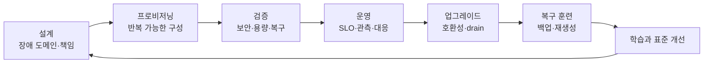
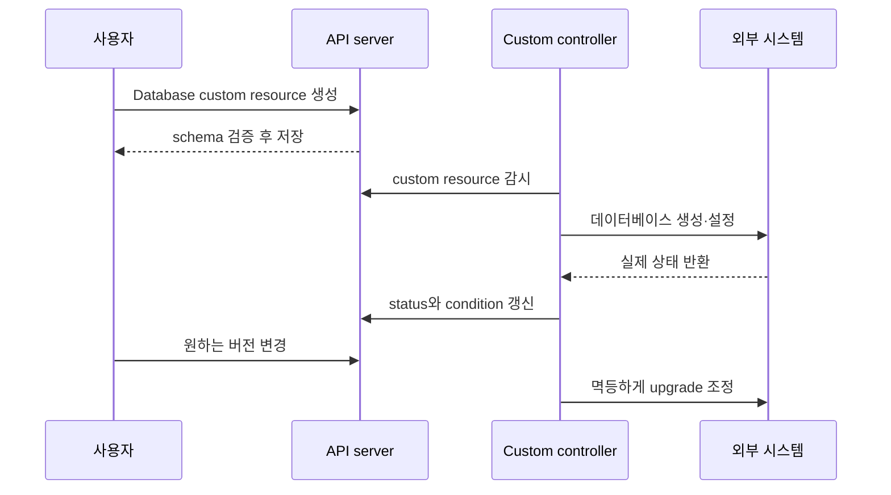

# 10. 프로덕션 운영과 확장

프로덕션 쿠버네티스의 목표는 “클러스터가 오늘 떠 있다”가 아니다. 장애·업그레이드·인증서 만료·운영자 실수 뒤에도 **예측 가능한 시간 안에 서비스를 복구하고 변경을 계속할 수 있는가**가 기준이다. 플랫폼의 책임 경계를 먼저 정하고, 자동화와 복구 훈련으로 그 계약을 검증한다.

## 학습 클러스터와 프로덕션 클러스터의 차이

| 질문 | 학습 환경 | 프로덕션 환경 |
|---|---|---|
| 장애 | 다시 만들 수 있음 | 장애 도메인 분리와 복구 목표 필요 |
| 상태 | 샘플 데이터 | 백업·복원·키·일관성 검증 필요 |
| 접근 | 개인 관리자 | identity, 최소 권한, 감사와 비상 접근 필요 |
| 변경 | 수동 명령 가능 | review, diff, rollout gate, rollback 필요 |
| 용량 | 현재 실습만 고려 | peak, 장애 여유, quota와 비용 필요 |
| 버전 | 하나의 도구만 맞으면 됨 | API·컴포넌트·애드온 호환성 계획 필요 |

관리형 Kubernetes는 컨트롤 플레인 일부 운영을 공급자에게 맡기지만 애플리케이션 RBAC, workload 보안, 데이터 백업, CNI·CSI·Ingress 선택, 업그레이드 검증, 비용과 SLO까지 자동으로 책임져 주지는 않는다. 계약서와 실제 서비스 범위로 책임을 명시한다.

## 운영 수명주기를 하나의 루프로 보기



복구 훈련이 설계의 마지막 단계인 이유는 문서상 가정이 실제로 작동하는지 검증하기 때문이다. 복원에 필요한 키나 외부 DNS가 백업에서 빠졌다면 snapshot 파일의 존재는 성공이 아니다.

## 프로덕션 준비 체크리스트

### 아키텍처와 장애 도메인

- API endpoint와 컨트롤 플레인의 단일 실패 지점을 식별했다.
- etcd quorum과 백업 위치가 같은 장애 도메인에 몰리지 않았다.
- worker를 zone·rack에 분산하고 workload topology 정책을 시험했다.
- CNI, CSI, DNS, Ingress 또는 Gateway controller의 소유자와 복구 절차가 있다.

### 보안과 접근

- 사람과 workload identity를 분리하고 일상적으로 cluster-admin을 사용하지 않는다.
- audit, 비상 접근, 인증서·token·encryption key 회전 절차가 있다.
- Pod Security, admission, image 정책과 NetworkPolicy를 단계적으로 검증한다.
- secret이 Git·이미지·로그·지원 번들에 남는 경로를 검사한다.

### 신뢰성과 운영

- 사용자 SLO와 연결된 metric, alert, runbook이 있다.
- requests, limits, quota, PDB, topology와 scale 상한을 실제 부하로 검증했다.
- 노드 drain, zone 상실, API 일시 중단, registry·DNS·storage 장애를 연습했다.
- 백업은 격리된 환경에서 정기적으로 복원 검증한다.

## 업그레이드는 호환성 변경 프로젝트다

컨트롤 플레인만 새 버전으로 올리는 명령이 아니다. API 제거, kubelet과 kube-proxy 버전 차이, CNI·CSI·Ingress·metrics·admission webhook, CRD conversion, 클라이언트와 자동화까지 영향을 받는다. 정확한 허용 버전 차이는 대상 릴리스의 현재 정책을 확인한다.

안전한 흐름은 다음과 같다.

1. 사용 중인 API와 deprecated API를 inventory한다.
2. 애드온과 CRD 공급자의 대상 버전 지원을 확인한다.
3. 백업과 복원 절차를 새로 검증한다.
4. staging에서 실제 workload와 정책을 시험한다.
5. 컨트롤 플레인과 노드를 지원되는 순서로 점진 업그레이드한다.
6. 노드마다 cordon·drain 뒤 업그레이드하고 다시 검증한다.
7. API, DNS, network, storage, admission과 사용자 경로를 확인한다.

`kubectl drain`은 단순 정지가 아니다. DaemonSet, local storage, PDB, long-running connection, StatefulSet quorum 때문에 중단될 수 있다. 강제 옵션을 먼저 쓰기보다 왜 eviction이 막혔는지 조사한다.

## 백업과 복원에서 반드시 함께 볼 것

- etcd 또는 관리형 control-plane 상태
- PV 데이터와 애플리케이션 일관성
- 외부 secret manager와 암호화 키
- DNS, load balancer, certificate, identity provider 같은 외부 자원
- 배포 artifact와 이미지 digest
- 복원할 순서, RPO·RTO, 검증 쿼리와 담당자

etcd snapshot은 Kubernetes API 상태를 보존하지만 외부 volume 데이터까지 포함하지 않는다. PV snapshot만으로 Deployment, Secret, CRD가 복원되는 것도 아니다. 두 상태의 같은 복구 시점을 설계해야 한다.

## Kubernetes API를 확장하는 두 조각

CustomResourceDefinition은 새 API 종류와 schema를 추가한다. custom resource만 만들면 데이터는 저장되지만 외부 시스템이 저절로 바뀌지는 않는다. **controller가 그 resource를 감시하고 실제 상태를 조정해야** Operator 패턴이 된다.



좋은 controller는 같은 reconcile을 반복해도 안전하고, transient error를 backoff하며, `observedGeneration`과 condition으로 어느 spec까지 반영했는지 보여준다. 삭제 시 외부 자원을 정리해야 하면 finalizer를 쓸 수 있지만, controller가 죽으면 삭제가 멈출 수 있으므로 탈출 절차도 필요하다.

### CRD를 설계할 때 묻는 질문

- 이 개념은 선언적 desired state로 표현할 가치가 있는가?
- schema 기본값과 validation이 버전 사이에서 호환되는가?
- spec과 status의 책임이 분리됐는가?
- controller가 외부 API 중복 호출과 부분 실패에 멱등한가?
- 새로운 리소스의 RBAC, admission, audit, backup이 준비됐는가?
- CRD와 controller 제거 때 기존 custom resource는 어떻게 되는가?

## Helm과 Kustomize를 문제에 맞게 선택하기

| 도구 | 강점 | 잘 맞는 경우 | 주의점 |
|---|---|---|---|
| Helm | template, values, chart 의존성과 release 수명주기 | 재사용 가능한 애플리케이션 패키지 배포 | 렌더 결과와 values 조합을 검토해야 함 |
| Kustomize | 원본 YAML을 base로 두고 overlay·patch 적용 | 조직 내부 환경별 변형 | overlay가 많아지면 patch 상호작용 관리 필요 |

둘은 배타적이지 않지만 무작정 겹치면 최종 매니페스트가 어떻게 생성됐는지 추적하기 어렵다. 어느 단계가 package를 렌더하고 어느 단계가 환경 차이를 적용하는지 단방향 pipeline으로 정한다.

## 실행 예제: Kustomize base와 production overlay

다음 구조를 만든다고 가정한다.

```text
k8s/
├── base/
│   ├── deployment.yaml
│   └── kustomization.yaml
└── overlays/
    └── production/
        └── kustomization.yaml
```

`base/deployment.yaml`에는 공통 Deployment를 둔다.

```yaml
apiVersion: apps/v1
kind: Deployment
metadata:
  name: study-web
spec:
  replicas: 2
  selector:
    matchLabels:
      app.kubernetes.io/name: study-web
  template:
    metadata:
      labels:
        app.kubernetes.io/name: study-web
    spec:
      containers:
        - name: web
          image: nginx:1.26-alpine
          resources:
            requests:
              cpu: 50m
              memory: 32Mi
```

`base/kustomization.yaml`은 공통 리소스를 묶는다.

```yaml
apiVersion: kustomize.config.k8s.io/v1beta1
kind: Kustomization
resources:
  - deployment.yaml
```

`overlays/production/kustomization.yaml`:

```yaml
apiVersion: kustomize.config.k8s.io/v1beta1
kind: Kustomization
resources:
  - ../../base
namePrefix: prod-
images:
  - name: nginx
    newTag: 1.27-alpine
patches:
  - target:
      kind: Deployment
      name: study-web
    patch: |-
      - op: replace
        path: /spec/replicas
        value: 4
```

적용 전에 최종 결과를 렌더하고 서버 검증과 diff를 거친다.

```bash
kubectl kustomize k8s/overlays/production
kubectl apply --dry-run=server -k k8s/overlays/production
kubectl diff -k k8s/overlays/production
kubectl apply -k k8s/overlays/production
kubectl rollout status deployment/prod-study-web
```

실습에서는 공개 이미지를 사용했지만 운영에서는 검증한 registry와 immutable digest를 사용하고, 렌더 결과를 policy와 review의 입력으로 삼는다.

## 운영 실패를 예방하는 검증 매트릭스

| 변경 | 적용 전 | 적용 중 | 적용 후 |
|---|---|---|---|
| 클러스터 업그레이드 | API·애드온 호환, 복원 시험 | control-plane·node 상태, drain | 사용자 경로, DNS·network·storage |
| CRD 버전 변경 | schema·conversion·백업 | controller error와 webhook | 기존·신규 resource reconcile |
| Helm/Kustomize 배포 | render·server dry-run·diff | rollout과 event | smoke test, SLO, drift |
| 노드 유지보수 | PDB·용량·quorum | eviction과 재배치 | topology와 성능 |
| secret·인증서 회전 | 신·구 공존과 rollback | 양쪽 버전 관측 | 구 버전 사용 0, 폐기 |

## 스스로 설명해 보기

1. 관리형 Kubernetes를 사용해도 팀에 남는 운영 책임은 무엇인가?
2. etcd snapshot과 PV snapshot을 각각 성공시켜도 복구가 실패할 수 있는 이유는 무엇인가?
3. CRD만 설치하고 controller가 없으면 어떤 상태가 되는가?
4. Helm이나 Kustomize 적용 전 최종 렌더 결과를 검토해야 하는 이유는 무엇인가?

[← 관측과 트러블슈팅](09-observability-and-troubleshooting.md) · [전체 로드맵으로 돌아가기](00-roadmap.md)

<!-- source: https://kubernetes.io/ko/docs/setup/production-environment/ | checked: 2026-09-03 -->
<!-- source: https://kubernetes.io/ko/docs/setup/production-environment/tools/kubeadm/create-cluster-kubeadm/ | checked: 2026-09-03 -->
<!-- source: https://kubernetes.io/ko/releases/version-skew-policy/ | checked: 2026-09-03 -->
<!-- source: https://kubernetes.io/ko/docs/concepts/extend-kubernetes/api-extension/custom-resources/ | checked: 2026-09-03 -->
<!-- source: https://kubernetes.io/ko/docs/tasks/manage-kubernetes-objects/kustomization/ | checked: 2026-09-03 -->
<!-- source: https://kubernetes.io/docs/tasks/manage-kubernetes-objects/kustomization/ | checked: 2026-09-03 -->
<!-- source: https://etcd.io/docs/v3.6/op-guide/recovery/ | checked: 2026-09-03 -->
