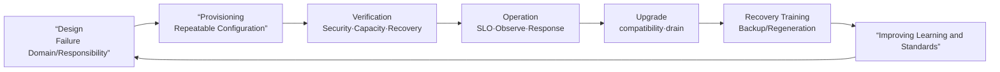
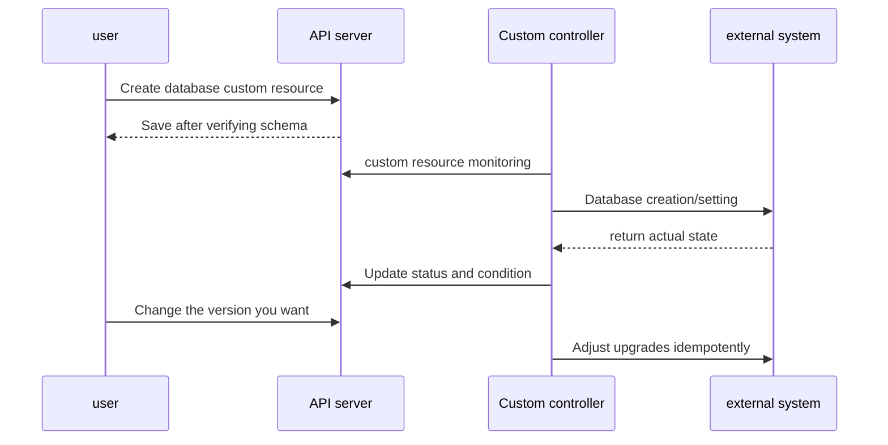

# 10. Production operations and expansion

The goal of production Kubernetes is not “the cluster is floating today.” The standard is whether service can be restored and changes can continue within a predictable time even after a failure, upgrade, certificate expiration, or operator error. First define the platform's responsibility boundaries and verify the contract through automation and recovery exercises.

## Differences between training and production clusters

| question | learning environment | production environment |
|---|---|---|
| obstacle | can be recreated | Requires fault domain separation and recovery goals |
| situation | sample data | Backup, restoration, key, and consistency verification required |
| access | personal manager | Requires identity, least privilege, auditing and emergency access |
| change | Manual command possible | Review, diff, rollout gate, rollback required |
| volume | Only consider current lab | Peak, fault margin, quota and cost required |
| version | All you need is one tool | API/component/add-on compatibility plan required |

Managed Kubernetes leaves some control plane operations to the provider, but does not automatically take responsibility for application RBAC, workload security, data backup, CNI/CSI/Ingress selection, upgrade verification, costs, and SLO. Responsibilities are specified in the contract and actual service scope.

## View the operations life cycle as a loop



The reason recovery exercises are the final step in design is to verify that the assumptions on paper work in practice. If the key or external DNS required for restoration is missing from the backup, the existence of the snapshot file is not successful.

## Production Readiness Checklist

### Architecture and Fault Domains

- Identified single points of failure in API endpoints and control plane.
- etcd quorum and backup location are not clustered in the same fault domain.
- Workers were distributed across zones and racks and workload topology policies were tested.
- There is an owner and recovery procedure for the CNI, CSI, DNS, Ingress or Gateway controller.

### Security and Access

- Separate people and workload identities and do not routinely use cluster-admin.
- There are audit, emergency access, and certificate·token·encryption key rotation procedures.
- Verify Pod Security, admission, image policy and NetworkPolicy step by step.
- Check the path where the secret is left in Git, image, log, and support bundle.

### Reliability and Operations

- There are metrics, alerts, and runbooks linked to user SLO.
- Requests, limits, quota, PDB, topology and scale upper limits were verified with actual load.
- We practiced node drain, zone loss, API suspension, and registry·DNS·storage failure.
- Backups are regularly restored and verified in an isolated environment.

## Upgrades are compatibility change projects.

This is not a command to upgrade only the control plane to a new version. API removal, kubelet and kube-proxy version differences, CNI·CSI·Ingress·metrics·admission webhook, CRD conversion, clients, and automation are all affected. Check the current policy of the target release for the exact permitted version differences.

The safe flow is:

1. Inventory APIs in use and deprecated APIs.
2. Check target version support from add-ons and CRD providers.
3. Re-verify backup and restore procedures.
4. Staging tests actual workloads and policies.
5. Progressively upgrade control planes and nodes in the supported order.
6. After cordon·drain each node, upgrade and verify again.
7. Check API, DNS, network, storage, admission and user path.

`kubectl drain` is not a simple stop. It may be interrupted due to DaemonSet, local storage, PDB, long-running connection, or StatefulSet quorum. Investigate why eviction is blocked rather than using the forced option first.

## Must see together in backup and restore

- etcd or managed control-plane state
- PV data and application consistency
- External secret manager and encryption key
- External resources such as DNS, load balancer, certificate, and identity provider
- Deployment artifacts and image digest
- Restoration order, RPO/RTO, verification query and person in charge

etcd snapshot preserves the Kubernetes API state but does not include external volume data. Deployment, Secret, and CRD cannot be restored through PV snapshot alone. You must design the same recovery point for both states.

## Two pieces that extend the Kubernetes API

CustomResourceDefinition adds a new API type and schema. If you just create a custom resource, the data will be saved, but the external system will not change automatically. **The controller monitors the resource and adjusts the actual state** to become the Operator pattern.



A good controller makes it safe to repeat the same reconcile, backs off transient errors, and shows to what extent the spec has been reflected using `observedGeneration` and conditions. If you need to clean up external resources during deletion, you can use a finalizer, but since deletion may stop when the controller dies, an escape procedure is also necessary.

### Questions to ask when designing a CRD

- Is this concept worth expressing as a declarative desired state?
- Are schema defaults and validation compatible between versions?
- Are the responsibilities of spec and status separated?
- Is the controller idempotent against duplicate calls to external APIs and partial failures?
- Are new resources ready for RBAC, admission, audit, and backup?
- What happens to existing custom resources when CRD and controller are removed?

## Choosing Helm and Kustomize to suit your problem

| equipment | strength | If it fits well | Things to note |
|---|---|---|---|
| Helm | Template, values, chart dependencies and release lifecycle | Reusable application package deployment | Render results and values ​​combination must be reviewed |
| Kustomize | Apply overlay/patch using the original YAML as a base | Variations by organization's internal environment | As the number of overlays increases, patch interaction management becomes necessary. |

The two are not exclusive, but if they overlap haphazardly, it is difficult to trace how the final manifest was created. A one-way pipeline determines which stage renders the package and which stage applies environment differences.

## Running example: Kustomize base and production overlay

Assume you create the following structure:

```text
k8s/
├── base/
│   ├── deployment.yaml
│   └── kustomization.yaml
└── overlays/
    └── production/
        └── kustomization.yaml
```

`base/deployment.yaml` has a common deployment.

```yaml
apiVersion: apps/v1
kind: Deployment
metadata:
  name: study-web
spec:
  replicas: 2
  selector:
    matchLabels:
      app.kubernetes.io/name: study-web
  template:
    metadata:
      labels:
        app.kubernetes.io/name: study-web
    spec:
      containers:
        - name: web
          image: nginx:1.26-alpine
          resources:
            requests:
              cpu: 50m
              memory: 32Mi
```

`base/kustomization.yaml` bundles common resources.

```yaml
apiVersion: kustomize.config.k8s.io/v1beta1
kind: Kustomization
resources:
  - deployment.yaml
```

`overlays/production/kustomization.yaml`:

```yaml
apiVersion: kustomize.config.k8s.io/v1beta1
kind: Kustomization
resources:
  - ../../base
namePrefix: prod-
images:
  - name: nginx
    newTag: 1.27-alpine
patches:
  - target:
      kind: Deployment
      name: study-web
    patch: |-
      - op: replace
        path: /spec/replicas
        value: 4
```

Before application, the final result is rendered and goes through server verification and diff.

```bash
kubectl kustomize k8s/overlays/production
kubectl apply --dry-run=server -k k8s/overlays/production
kubectl diff -k k8s/overlays/production
kubectl apply -k k8s/overlays/production
kubectl rollout status deployment/prod-study-web
```

In the lab, public images were used, but in operation, a verified registry and immutable digest are used, and the render results are used as input for policy and review.

## Verification matrix to prevent operational failures

| change | Before application | Applying | After applying |
|---|---|---|---|
| Cluster Upgrade | API/add-on compatibility, restoration test | control-plane·node status, drain | User path, DNS·network·storage |
| CRD version change | schema·conversion·backup | controller error and webhook | Reconcile existing/new resources |
| Helm/Kustomize deployment | render·server dry-run·diff | rollout and event | smoke test, SLO, drift |
| Node maintenance | PDB·capacity·quorum | eviction and relocation | topology and performance |
| secret·certificate rotation | New and old coexistence and rollback | Observation of both versions | Use old version 0, discarded |

## Explain it in your own words

1. What operational responsibilities will remain with my team if I use managed Kubernetes?
2. Why can recovery fail even if etcd snapshot and PV snapshot are successful?
3. What happens if only the CRD is installed but there is no controller?
4. Why should I review the final render results before applying Helm or Kustomize?

[← Observation and Troubleshooting](09-observability-and-troubleshooting.md) · [Back to full roadmap](00-roadmap.md)

<!-- source: https://kubernetes.io/ko/docs/setup/production-environment/ | checked: 2026-09-03 -->
<!-- source: https://kubernetes.io/ko/docs/setup/production-environment/tools/kubeadm/create-cluster-kubeadm/ | checked: 2026-09-03 -->
<!-- source: https://kubernetes.io/ko/releases/version-skew-policy/ | checked: 2026-09-03 -->
<!-- source: https://kubernetes.io/ko/docs/concepts/extend-kubernetes/api-extension/custom-resources/ | checked: 2026-09-03 -->
<!-- source: https://kubernetes.io/ko/docs/tasks/manage-kubernetes-objects/kustomization/ | checked: 2026-09-03 -->
<!-- source: https://kubernetes.io/docs/tasks/manage-kubernetes-objects/kustomization/ | checked: 2026-09-03 -->
<!-- source: https://etcd.io/docs/v3.6/op-guide/recovery/ | checked: 2026-09-03 -->
