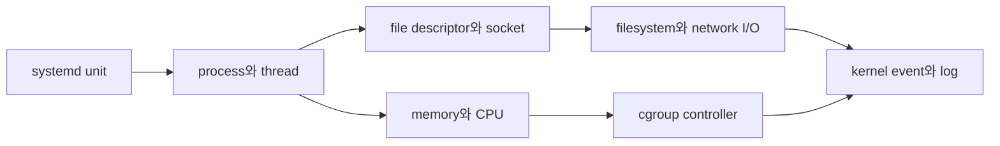

# Linux 시스템 운영 로드맵

## 처음 보는 사람을 위한 출발점

인터넷 서비스도 처음에는 실행 중인 프로그램 하나다. 예를 들어 웹 애플리케이션을 실행했는데 주소를 열어도 응답이 없다면 먼저 “프로그램이 실행됐는가?”, “요청을 받을 문이 열렸는가?”, “CPU나 메모리가 부족한가?”를 차례로 확인해야 한다. Linux는 이 질문에 답할 수 있는 실제 상태를 제공한다.

처음부터 명령어를 많이 외울 필요는 없다. 이 과정에서는 작은 웹 서버 하나를 기준으로 프로그램을 실행하고, 요청을 보내고, 일부러 실패시킨 뒤, 운영체제가 남긴 증거를 읽는다.

| 처음 만나는 말 | 학습용 쉬운 뜻 |
|---|---|
| 운영체제(OS) | 프로그램과 CPU·메모리·디스크 사이에서 자원을 나누는 기본 소프트웨어 |
| 프로세스(process) | 저장된 프로그램이 실제로 실행되고 있는 한 개의 작업 |
| 서비스(service) | 프로세스를 시작하고 실패하면 다시 시작하도록 운영 이름을 붙인 단위 |
| 포트(port) | 네트워크 요청을 어떤 프로그램이 받을지 구분하는 번호 |
| 커널(kernel) | 프로세스의 자원 요청을 실제 하드웨어와 연결하는 운영체제의 핵심 부분 |

이 다섯 단어를 실제 명령 출력과 연결하는 것이 첫 목표다. 그다음에 file descriptor, cgroup, OOM 같은 더 세밀한 개념으로 들어간다.

Linux 운영의 출발점은 명령어 암기가 아니라 **한 workload가 어떤 process로 실행되고 어떤 kernel resource를 소비하는지 연결하는 것**이다. Kubernetes Pod와 AWS EC2도 결국 이 경계 위에서 실행된다.

## 이 과정이 답하는 질문

- service가 실행되지 않을 때 unit, process, socket 중 어디부터 확인하는가?
- CPU 사용률, load average와 runnable task는 어떻게 다른가?
- memory 사용량이 늘 때 process RSS, page cache와 cgroup limit을 어떻게 구분하는가?
- disk가 찼을 때 block 여유, inode, 열린 삭제 파일 중 무엇이 원인인가?
- container resource limit이 Linux cgroup에서 어떤 상태로 보이는가?

## 한 문장 모델

> Linux 운영은 `service manager → process/thread → file descriptor/socket → memory·CPU·I/O → kernel event` 순서로 실제 상태를 좁히는 일이다.

## 읽는 순서

1. [Process와 resource의 연결](01-process-and-resource-model.md): PID, unit, `/proc`, file descriptor, cgroup의 책임을 연결한다.
2. [Service 장애 진단 실습](02-service-failure-lab.md): 정상 기준을 기록한 뒤 start failure, port 충돌과 resource pressure를 증거로 구분한다.

## Kubernetes와 이어지는 지점

| Linux | Kubernetes |
|---|---|
| process와 signal | container process와 Pod 종료 |
| cgroup CPU·memory | requests·limits와 runtime 격리 |
| namespace | container가 보는 PID·mount·network 범위 |
| socket·route | Pod IP, Service와 CNI datapath |
| filesystem·mount | volume, PV/PVC와 node storage |
| systemd·journal | kubelet·container runtime node service |

이 과정은 container runtime 내부 구현이나 eBPF 심화를 별도 topic으로 확장하지 않는다. 장애를 kernel 경계까지 추적할 수 있는 운영 기초에 집중한다.

## 완료 기준

이 주제는 한 번 읽고 끝내지 않는다. 먼저 용어 표를 자신의 말로 바꾸고, 개념 장에서 한 요청의 흐름을 따라간다. 실습에서는 정상 상태를 먼저 기록한 뒤 조건 하나만 바꿔 실패를 만들고, 증거로 원인을 설명한 뒤 복구한다. 마지막으로 아래 운영 판단 질문에 답하면서 더 복잡한 환경으로 확장한다.

- service 이름에서 main PID, 열린 socket, cgroup과 최근 log를 찾는다.
- CPU·memory·disk 증상을 하나의 `top` 출력으로 단정하지 않고 서로 다른 관찰값으로 확인한다.
- process 종료가 signal, OOM kill, service restart policy 중 무엇 때문인지 증거를 제시한다.
- 다음 과정인 [네트워크와 요청 경로](../networking/00-roadmap.md)에서 process의 listening socket부터 요청 추적을 시작할 수 있다.

## 처음 이해했는지 확인

1. 저장돼 있지만 실행되지 않은 program과 지금 실행 중인 process는 어떻게 다른가?
2. service가 `active`인 것과 사용자의 HTTP 요청이 성공하는 것은 왜 같은 확인이 아닌가?

**확인 기준:** process는 실행 중인 instance이고 service는 그 process의 수명을 관리하는 운영 단위라고 설명할 수 있으면 된다. HTTP 성공에는 process뿐 아니라 listening port와 application 응답도 필요하다.

## 운영 판단으로 확장하기

1. service가 `active`인데 요청이 실패할 수 있는 이유를 세 가지 말해 보자.
2. container의 memory limit과 host의 free memory가 서로 다른 질문인 이유는 무엇인가?
3. disk 사용률이 100%가 아닌데 새 파일 생성이 실패할 수 있는 이유는 무엇인가?

<!-- source: https://docs.kernel.org/admin-guide/cgroup-v2.html | checked: 2026-09-03 -->
<!-- source: https://www.freedesktop.org/software/systemd/man/latest/systemd.service.html | checked: 2026-09-03 | retrieval-warning: direct page unavailable; implementation claims limited to stable unit/process model -->
