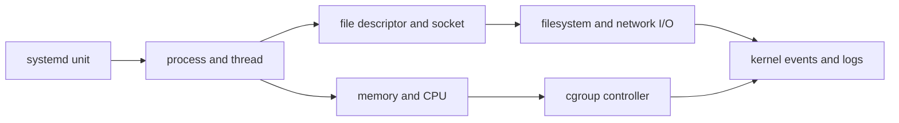

# Linux system operation roadmap

## Starting point for beginners

Internet service is initially a running program. For example, if you run a web application and there is no response even when you open the address, you must first check “Has the program been executed?”, “Has the door to receive requests been opened?”, and “Is there a shortage of CPU or memory?” Linux provides the real state to answer this question.

There is no need to memorize many commands from the beginning. In this process, a program is executed on a small web server, a request is sent, an error is made on purpose, and the evidence left by the operating system is read.

| New term | Plain-language meaning |
|---|---|
| Operating system (OS) | Basic software that divides resources between programs and CPU, memory, and disk |
| process | One task in which the stored program is actually running |
| service | A unit named Operation that starts a process and restarts it if it fails. |
| port | A number that identifies which program will receive the network request |
| kernel | A core part of the operating system that connects a process's resource requests with the actual hardware. |

The first goal is to connect these five words with actual command output. Then we go into more detailed concepts such as file descriptor, cgroup, and OOM.

The starting point of Linux operation is not memorizing commands, but connecting which process a workload runs and what kernel resources it consumes. Kubernetes Pods and AWS EC2 eventually also run on top of this boundary.

## Questions this course answers

- When a service is not running, where should you check first: unit, process, or socket?
- What is the difference between CPU utilization, load average, and runnable tasks?
- How do I distinguish between process RSS, page cache, and cgroup limits when memory usage increases?
- When the disk is full, what is the cause: free blocks, inodes, or open deleted files?
- What does the container resource limit look like in a Linux cgroup?

## The model in one sentence

> Linux operation is about narrowing down the actual state in the order `service manager → process/thread → file descriptor/socket → memory·CPU·I/O → kernel event`.

## Reading order

1. [Connection of process and resource](01-process-and-resource-model.md): Connects the responsibilities of PID, unit, `/proc`, file descriptor, and cgroup.
2. [Service failure diagnosis lab](02-service-failure-lab.md): After recording normal standards, start failure, port conflict, and resource pressure are classified as evidence.

## Connection to Kubernetes

| Linux | Kubernetes |
|---|---|
| process and signal | Terminating container processes and pods |
| cgroup CPU·memory | requests·limits and runtime isolation |
| namespace | PID·mount·network range seen by container |
| socket·route | Pod IP, Service and CNI datapath |
| filesystem·mount | volume, PV/PVC and node storage |
| systemd·journal | kubelet·container runtime node service |

This course does not expand container runtime internal implementation or eBPF in-depth into a separate topic. Focuses on operational fundamentals that allow faults to be traced to kernel boundaries.

## Completion criteria

This topic is not something you read once and then stop. First, convert the terminology table into your own words and follow the flow of requests made in the concepts chapter. In the lab, the normal state is first recorded, then a failure is created by changing only one condition, and the cause is explained with evidence before recovery. Finally, expand to more complex environments by answering the operational judgment questions below.

- Find the main PID, open socket, cgroup, and recent log in the service name.
- CPU·memory·disk symptoms are not determined based on a single `top` output, but are confirmed through different observation values.
- Provide evidence that process termination is due to signal, OOM kill, or service restart policy.
- In the next process [Network and Request Path](../networking/00-roadmap.md), you can start tracking requests from the listening socket of the process.

## Check your understanding

1. What is the difference between a saved but not executed program and a currently running process?
2. Why aren't service being `active` and the user's HTTP request successful being the same confirmation?

**Verification criteria:** It can be explained that a process is a running instance and a service is an operating unit that manages the life of the process. HTTP success requires not only a process but also a listening port and application response.

## Develop operational judgment

1. Let's name three reasons why the request may fail when the service is `active`.
2. Why are container's memory limit and host's free memory different questions?
3. Why might new file creation fail if disk utilization is not 100%?

<!-- source: https://docs.kernel.org/admin-guide/cgroup-v2.html | checked: 2026-09-03 -->
<!-- source: https://www.freedesktop.org/software/systemd/man/latest/systemd.service.html | checked: 2026-09-03 | retrieval-warning: direct page unavailable; implementation claims limited to stable unit/process model -->
