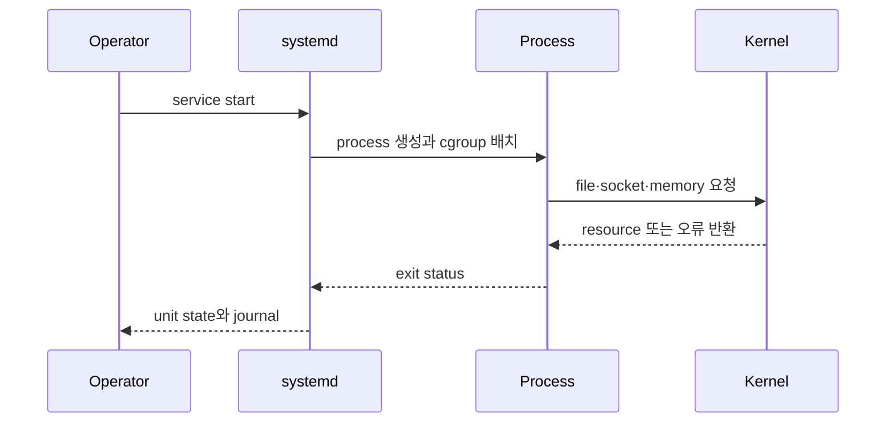

# Process와 resource의 연결

## 먼저 구분할 다섯 상태

| 상태 | 대표 질문 | 관찰 위치 |
|---|---|---|
| unit | 누가 process를 시작·재시작하는가? | `systemctl`, unit file, journal |
| process | 어떤 PID와 command가 실행 중인가? | `ps`, `/proc/<pid>/status` |
| descriptor | 어떤 file·socket을 잡고 있는가? | `/proc/<pid>/fd`, `lsof`, `ss` |
| resource | CPU·memory·I/O를 얼마나 쓰는가? | `pidstat`, `vmstat`, `iostat`, cgroup files |
| event | 언제 무엇 때문에 상태가 바뀌었는가? | journal, kernel log, service exit status |

service 이름과 PID를 같은 것으로 보면 재시작 직후 PID가 바뀌었을 때 추적이 끊긴다. unit은 desired lifecycle을, process는 지금 실행 중인 instance를 나타낸다.



## 관찰 순서

```bash
systemctl status sshd --no-pager
systemctl show sshd -p MainPID -p ActiveState -p SubState -p ControlGroup
journalctl -u sshd --since "15 minutes ago" --no-pager

pid="$(systemctl show sshd -p MainPID --value)"
ps -o pid,ppid,stat,%cpu,%mem,rss,vsz,etime,cmd -p "$pid"
cat "/proc/$pid/status"
ls -l "/proc/$pid/fd" | sed -n '1,20p'
```

`systemctl status`는 요약이고 journal은 시간축이다. `ps`의 순간값만으로 원인을 확정하지 말고, unit state와 exit status가 바뀐 시각을 먼저 맞춘다.

## cgroup은 resource 분배 경계다

cgroup v2는 process를 계층으로 조직하고 CPU·memory·I/O 같은 resource를 그 계층에 배분한다. 모든 process는 하나의 cgroup에 속하고 상위 제한을 하위에서 넘어설 수 없다.

```bash
cat "/proc/$pid/cgroup"
systemctl show sshd -p ControlGroup --value
systemd-cgls --unit sshd
```

container가 host와 같은 kernel을 사용해도 cgroup membership과 namespace가 다르면 관찰되는 resource 범위가 달라진다. 따라서 container 안의 `free`와 node 전체 memory를 같은 값으로 비교하면 안 된다.

## CPU, memory, disk를 섞지 않는다

```bash
uptime
vmstat 1 5
pidstat -p "$pid" 1 5
df -h
df -i
```

- 높은 load는 CPU 사용률 하나가 아니라 실행을 기다리거나 일부 I/O를 기다리는 task와 함께 해석한다.
- process RSS가 커지는 것과 host page cache가 커지는 것은 다른 현상이다.
- `df -h`는 block, `df -i`는 inode를 본다. 삭제했지만 열린 파일은 `lsof +L1`로 찾는다.

## 운영 판단

- limit을 늘리기 전에 실제 병목과 workload의 정상 상한을 측정한다.
- restart policy는 원인을 없애지 않는다. restart 횟수와 마지막 exit reason을 함께 alert한다.
- journal retention과 rotation이 너무 짧으면 장애 직후 증거가 사라지고, 너무 길면 disk pressure를 만든다.

## 스스로 설명해 보기

1. unit state, process state와 application health가 각각 다를 수 있는 예를 들어 보자.
2. cgroup 상위 제한이 하위 workload에 미치는 영향을 어떻게 관찰할 것인가?
3. `df -h`만 정상일 때도 확인할 disk 관련 증거는 무엇인가?

<!-- source: https://docs.kernel.org/admin-guide/cgroup-v2.html | checked: 2026-09-03 -->
<!-- source: https://man7.org/linux/man-pages/man5/proc_pid_status.5.html | checked: 2026-09-03 -->
<!-- source: https://www.freedesktop.org/software/systemd/man/latest/systemctl.html | checked: 2026-09-03 -->
