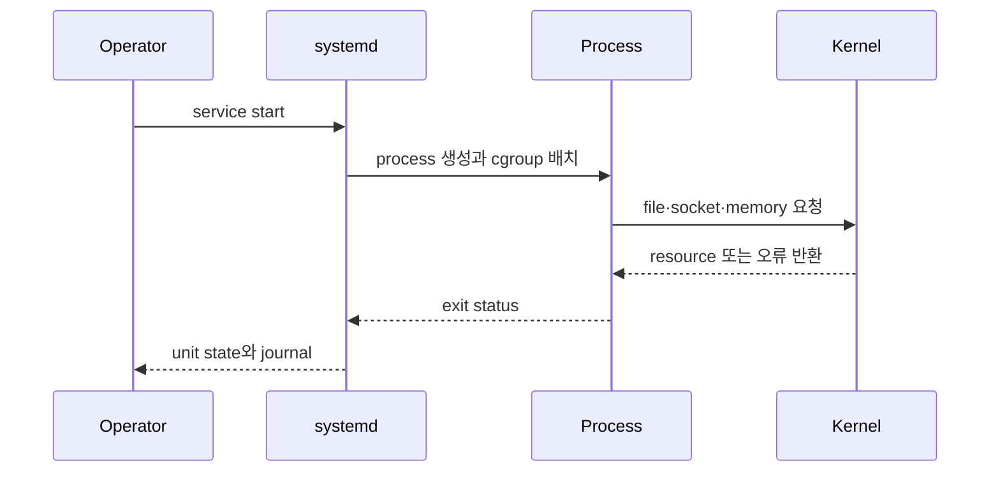

# Process와 resource의 연결

## 이 장에서 처음 쓰는 말

- **PID**: 실행 중인 process를 Linux가 구분하기 위해 붙이는 번호다. 재시작하면 보통 달라진다.
- **file descriptor**: process가 열린 file이나 network connection을 가리키는 작은 번호다.
- **socket**: 두 process가 network로 데이터를 주고받기 위해 사용하는 통신 끝점이다.
- **cgroup**: 여러 process를 묶어 CPU·memory 같은 자원의 사용량과 한도를 관리하는 Linux 기능이다.
- **RSS**: process가 현재 실제 memory에 올려 사용 중인 영역의 대략적인 크기다.

처음 읽을 때는 “service 이름 → 현재 PID → 그 PID의 socket과 자원” 세 연결만 잡으면 된다. 세부 수치는 뒤의 명령에서 실제 출력과 함께 확인한다.

## 먼저 이해하기

웹 서버가 느려졌다고 가정하자. 사용자는 “서버가 느리다”고 말하지만 Linux가 실제로 관리하는 대상은 하나의 `server`라는 덩어리가 아니다. 실행 중인 process, 그 process가 연 file descriptor와 socket, 할당받은 CPU 시간과 memory page, filesystem을 거친 I/O가 따로 존재한다. 원인을 찾으려면 서비스 이름을 이 실제 자원으로 번역해야 한다.

| 용어 | 뜻 | 운영할 때 확인할 것 |
|---|---|---|
| program | disk에 저장된 실행 파일 | 경로, owner, permission, version |
| process | program이 실행되어 PID와 자원을 가진 상태 | PID, parent, state, open file, memory |
| thread | process 안에서 CPU scheduling을 받는 실행 단위 | runnable 수, CPU time, lock wait |
| service | systemd 같은 manager가 process 수명주기에 붙인 운영 이름 | start 조건, restart policy, main PID |
| cgroup | process 집합에 CPU·memory·I/O 규칙을 적용하는 경계 | limit, usage, pressure, kill event |

예를 들어 `api.service`가 `active`여도 main process가 `127.0.0.1`에만 bind했다면 외부 요청은 실패한다. socket은 열려 있어도 cgroup memory limit에 계속 닿으면 process가 재시작될 수 있다. service 상태는 출발점이며 실제 요청 성공과 자원 여유를 대신하지 않는다.

## 웹 서버가 실행되는 과정을 한 단계씩 보기

1. 사용자가 `systemctl start`로 service 시작을 요청한다.
2. systemd가 unit 파일의 실행 명령을 읽고 새 process를 만든다.
3. Linux가 process에 PID를 붙이고 service의 cgroup에 넣는다.
4. process가 file을 열고 IP 주소와 port에 socket을 연다.
5. 요청이 오면 kernel이 socket을 통해 process에 데이터를 전달한다.
6. process가 종료되면 exit status와 시간이 journal에 남고 systemd가 재시작 정책을 판단한다.

각 단계는 다른 증거를 남긴다. 그래서 “웹 서버가 안 된다”를 고칠 때 마지막 결과만 보지 않고 어느 단계까지 성공했는지 확인한다.

## 먼저 구분할 다섯 상태

| 상태 | 대표 질문 | 관찰 위치 |
|---|---|---|
| unit | 누가 process를 시작·재시작하는가? | `systemctl`, unit file, journal |
| process | 어떤 PID와 command가 실행 중인가? | `ps`, `/proc/<pid>/status` |
| descriptor | 어떤 file·socket을 잡고 있는가? | `/proc/<pid>/fd`, `lsof`, `ss` |
| resource | CPU·memory·I/O를 얼마나 쓰는가? | `pidstat`, `vmstat`, `iostat`, cgroup files |
| event | 언제 무엇 때문에 상태가 바뀌었는가? | journal, kernel log, service exit status |

service 이름과 PID를 같은 것으로 보면 재시작 직후 PID가 바뀌었을 때 추적이 끊긴다. unit은 desired lifecycle을, process는 지금 실행 중인 instance를 나타낸다.



## 관찰 순서

```bash
systemctl status sshd --no-pager
systemctl show sshd -p MainPID -p ActiveState -p SubState -p ControlGroup
journalctl -u sshd --since "15 minutes ago" --no-pager

pid="$(systemctl show sshd -p MainPID --value)"
ps -o pid,ppid,stat,%cpu,%mem,rss,vsz,etime,cmd -p "$pid"
cat "/proc/$pid/status"
ls -l "/proc/$pid/fd" | sed -n '1,20p'
```

`systemctl status`는 요약이고 journal은 시간축이다. `ps`의 순간값만으로 원인을 확정하지 말고, unit state와 exit status가 바뀐 시각을 먼저 맞춘다.

## cgroup은 resource 분배 경계다

cgroup v2는 process를 계층으로 조직하고 CPU·memory·I/O 같은 resource를 그 계층에 배분한다. 모든 process는 하나의 cgroup에 속하고 상위 제한을 하위에서 넘어설 수 없다.

```bash
cat "/proc/$pid/cgroup"
systemctl show sshd -p ControlGroup --value
systemd-cgls --unit sshd
```

container가 host와 같은 kernel을 사용해도 cgroup membership과 namespace가 다르면 관찰되는 resource 범위가 달라진다. 따라서 container 안의 `free`와 node 전체 memory를 같은 값으로 비교하면 안 된다.

## CPU, memory, disk를 섞지 않는다

```bash
uptime
vmstat 1 5
pidstat -p "$pid" 1 5
df -h
df -i
```

- 높은 load는 CPU 사용률 하나가 아니라 실행을 기다리거나 일부 I/O를 기다리는 task와 함께 해석한다.
- process RSS가 커지는 것과 host page cache가 커지는 것은 다른 현상이다.
- `df -h`는 block, `df -i`는 inode를 본다. 삭제했지만 열린 파일은 `lsof +L1`로 찾는다.

## 운영 판단

- limit을 늘리기 전에 실제 병목과 workload의 정상 상한을 측정한다.
- restart policy는 원인을 없애지 않는다. restart 횟수와 마지막 exit reason을 함께 alert한다.
- journal retention과 rotation이 너무 짧으면 장애 직후 증거가 사라지고, 너무 길면 disk pressure를 만든다.

## 스스로 설명해 보기

1. unit state, process state와 application health가 각각 다를 수 있는 예를 들어 보자.
2. cgroup 상위 제한이 하위 workload에 미치는 영향을 어떻게 관찰할 것인가?
3. `df -h`만 정상일 때도 확인할 disk 관련 증거는 무엇인가?

<!-- source: https://docs.kernel.org/admin-guide/cgroup-v2.html | checked: 2026-09-03 -->
<!-- source: https://man7.org/linux/man-pages/man5/proc_pid_status.5.html | checked: 2026-09-03 -->
<!-- source: https://www.freedesktop.org/software/systemd/man/latest/systemctl.html | checked: 2026-09-03 -->
