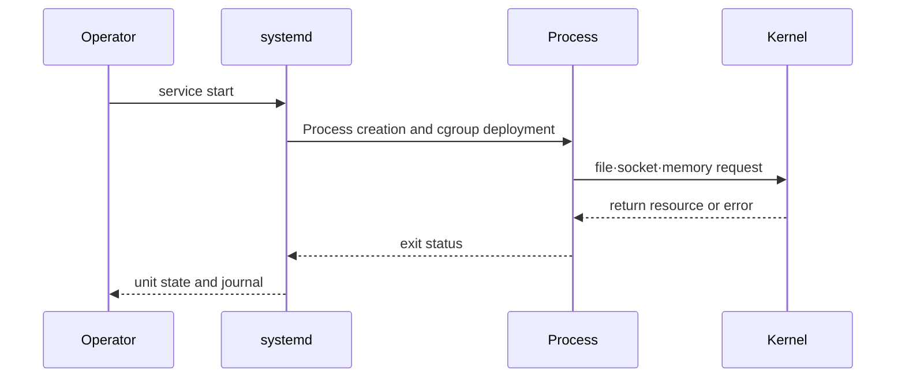

# Connection between process and resource

## Terms introduced in this chapter

- **PID**: This is the number given by Linux to identify the running process. A restart usually changes things. **Why it matters / when to use it:** Attach measurements, signals, and listener ownership to the current process, especially after restarts. **Concrete situation (illustrative):** A service restarts while an operator is inspecting it. → Resolve its current PID again. → Confirm subsequent measurements belong to the replacement process.
- **file descriptor**: A small number that indicates a file or network connection opened by a process. **Why it matters / when to use it:** Find leaked or exhausted handles when a process cannot open files or connections. **Concrete situation (illustrative):** Requests fail with too many open files. → Compare open descriptors with the process limit. → Check whether handles accumulate and remain after traffic stops.
- **socket**: A communication endpoint used by two processes to exchange data over the network. **Why it matters / when to use it:** Inspect communicating endpoints to locate missing listeners or stalled connections. **Concrete situation (illustrative):** A client connects to the wrong local listener. → Inspect socket addresses and owning processes. → Match the destination port to the intended service.
- **cgroup**: A Linux function that manages the usage and limits of resources such as CPU and memory by grouping multiple processes. **Why it matters / when to use it:** Bound a workload's resource consumption so neighboring workloads retain capacity. **Concrete situation (illustrative):** A batch job consumes resources needed by the API. → Apply reviewed cgroup limits in a test environment. → Compare API latency and job throttling.
- **RSS**: This is the approximate size of the area that the process is currently using in real memory. **Why it matters / when to use it:** Track resident-memory pressure and investigate growth before an out-of-memory failure. **Concrete situation (illustrative):** Memory usage grows after every request burst. → Record the process's RSS before and after idle periods. → Check whether resident usage returns toward baseline.

When reading for the first time, you only need to make three connections: “service name → current PID → socket and resource of that PID”. Check the detailed figures along with the actual output in the following command.

## Understand the model first

Suppose your web server becomes slow. Users say “the server is slow,” but what Linux is actually managing is not a single chunk called `server`. The running process, the file descriptor and socket opened by the process, the allocated CPU time and memory pages, and I/O through the file system exist separately. To find the cause, we need to translate the service name into this actual resource.

| Term | Meaning | Things to check when operating |
|---|---|---|
| program | Executable file stored on disk | path, owner, permission, version |
| process | The state in which the program is executed and has PID and resources. | PID, parent, state, open file, memory |
| thread | Execution unit that receives CPU scheduling within a process | Number of runnables, CPU time, lock wait |
| service | The operational name given to the process life cycle by a manager such as systemd. | start condition, restart policy, main PID |
| cgroup | Boundary that applies CPU·memory·I/O rules to the process set | limit, usage, pressure, kill event |

For example, even if `api.service` is `active`, if the main process binds only to `127.0.0.1`, the external request will fail. Even if the socket is open, the process may be restarted if the cgroup memory limit is continuously reached. Service status is a starting point and is not a substitute for actual request success and resource availability.

## View step by step how a web server runs

1. The user requests to start the service with `systemctl start`.
2. systemd reads the execution commands in the unit file and creates a new process.
3. Linux attaches a PID to the process and places it in the service cgroup.
4. The process opens a file and opens a socket to the IP address and port.
5. When a request comes, the kernel delivers data to the process through the socket.
6. When the process terminates, the exit status and time are left in the journal, and systemd determines the restart policy.

Each step leaves different evidence. So, when fixing “The web server does not work,” check to what level you succeeded rather than just looking at the final result.

## First five states to distinguish

| situation | representative question | observation location |
|---|---|---|
| unit | Who starts and restarts the process? | `systemctl`, unit file, journal |
| process | What PID and command is running? | `ps`, `/proc/<pid>/status` |
| descriptor | What file/socket are you holding? | `/proc/<pid>/fd`, `lsof`, `ss` |
| resource | How much CPU·memory·I/O do you use? | `pidstat`, `vmstat`, `iostat`, cgroup files |
| event | When and why did the state change? | journal, kernel log, service exit status |

If the service name and PID are considered the same, tracking will be lost when the PID changes immediately after restart. Unit represents the desired lifecycle, and process represents the currently running instance.



## Observation order

```bash
systemctl status sshd --no-pager
systemctl show sshd -p MainPID -p ActiveState -p SubState -p ControlGroup
journalctl -u sshd --since "15 minutes ago" --no-pager

pid="$(systemctl show sshd -p MainPID --value)"
ps -o pid,ppid,stat,%cpu,%mem,rss,vsz,etime,cmd -p "$pid"
cat "/proc/$pid/status"
ls -l "/proc/$pid/fd" | sed -n '1,20p'
```

`systemctl status` is the summary and journal is the time axis. Do not determine the cause with only the instantaneous value of `ps`, but first set the time when the unit state and exit status changed.

## cgroup is a resource distribution boundary

cgroup v2 organizes processes into layers and distributes resources such as CPU, memory, and I/O to those layers. All processes belong to one cgroup, and the upper limit cannot be exceeded by the lower level.

```bash
cat "/proc/$pid/cgroup"
systemctl show sshd -p ControlGroup --value
systemd-cgls --unit sshd
```

Even if the container uses the same kernel as the host, if the cgroup membership and namespace are different, the observed resource range varies. Therefore, you should not compare `free` in the container and the entire memory of the node as the same value.

## Do not mix CPU, memory, and disk

```bash
uptime
vmstat 1 5
pidstat -p "$pid" 1 5
df -h
df -i
```

- High load translates not just to CPU utilization, but also to tasks waiting to execute or waiting for some I/O.
- Growing the process RSS and growing the host page cache are different phenomena.
- `df -h` refers to the block, and `df -i` refers to the inode. Deleted but open files are searched for as `lsof +L1`.

## Operational judgment

- Before increasing the limit, measure the actual bottleneck and normal upper limit of the workload.
- The restart policy does not eliminate the cause. Alerts the number of restarts and the last exit reason together.
- If journal retention and rotation are too short, evidence disappears immediately after the failure, and if they are too long, they create disk pressure.

## Explain it in your own words

1. Let's look at an example where unit state, process state, and application health can be different.
2. How do we observe the impact of cgroup parent limits on child workloads?
3. Even if only `df -h` is normal, what disk-related evidence can be checked?

<!-- source: https://docs.kernel.org/admin-guide/cgroup-v2.html | checked: 2026-09-03 -->
<!-- source: https://man7.org/linux/man-pages/man5/proc_pid_status.5.html | checked: 2026-09-03 -->
<!-- source: https://www.freedesktop.org/software/systemd/man/latest/systemctl.html | checked: 2026-09-03 -->
